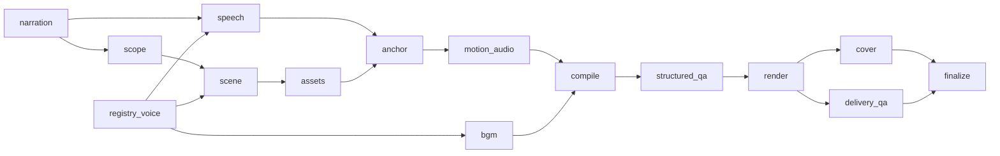

# Video Agent V4 当前架构说明

本文描述当前代码，不是未来方案。README 负责使用入口；本文负责模块边界与权威数据。

## 1. 系统边界

Video Agent V4 是唯一生产主线：冻结口播、词级 Anchor、Stage3 仓库选材、Remotion `V4Timeline` 画面合成、FFmpeg 口播/SFX 混音。

系统不包含：

- V3 Orchestrator / VisualPlan / RenderPlan / VerticalDemo；
- 封面首帧污染（`_prepend_one_frame`）；
- 运行时基于 CDP 坐标重画红框；
- 自动 Vision Critic 或项目内人工审批工作流；
- 启用中的 BGM（默认关闭，待真实 Profile）。

## 2. 不可破坏的约束

1. 每个语义 Cue 的口播短语、字幕、视觉命中和 SFX 峰值必须引用同一个词级 Anchor。
2. `SpeechTimingLock` 一旦生成，后续选材与编排不能改写语音时长真相。
3. 1080×1920、30fps 与 `douyin_portrait_v1` 安全区由契约统一管理。
4. 动效自行声明最短场景帧数与可读停留，不用全局镜头时长上限替代创作决策。
5. 进入 Stage3 Repository 的素材视为项目外已确认；程序只校验文件与关系完整性。
6. E2/E3 素材不能支持事实 Claim；严格因果展示必须来自关系组或允许的 Derivation。

## 3. 单一生产 DAG

权威入口：`V4ProductionOrchestrator`（`python main.py --script|--goal`）。

### 3.1 Narration

- `script`：`input/source_script.txt` → `FrozenNarration`
- `goal`：Goal Narration AI → 最终口播再冻结

之后两条入口共用同一 DAG。

### 3.2 Speech

原生 MiniMax → `SpeechTimingLock`（无 V3 TimingLock / Narration markup）。

### 3.3 Scope / Scene

AI Runtime 输出 `VideoScope` 与 `SceneSemanticPlan`；确定性修正与 Contract Validator 收口黄金语义。

### 3.4 Assets

Stage4 读取 Stage3 SQLite + ObjectStore；`allow_fake_derivation=false` 为生产默认。

### 3.5 Anchor / Motion / Compile / Render

Anchor Compiler 生成精确 scene spans；Motion/SFX 不得回退比例时长；Compiler 产出 `CompiledVideoTimeline`；Remotion 只注册 `V4Timeline`。

### 3.6 Cover / Outro / BGM

- Cover：独立 `final/cover.png`，不修改正文帧数。
- Outro：Scene `configured_asset`（`default_outro`）。
- BGM：DAG 节点存在，生产默认 `enabled=false`。

## 4. 权威数据

| 数据 | 位置 |
|---|---|
| 生产素材仓库 | `var/v4/assets.sqlite3` + `assets/` |
| 能力注册表 | `config/registries/v4/` |
| 运行产物 | `cases/<case>/runs/<run_id>/` |
| 成片 | `final/video.mp4`、`final/cover.png` |

## 5. 扩展位置

- 新语义能力：Contract + Registry + Prompt，不写 case 专用分支。
- 新动效/SFX：Stage5 Registry + Remotion effect，不在 Python 硬编码时间。
- 素材管理：`v4-assets` 与 admin 批处理命令，不另建第二套成片链。

完整 Stage 设计稿见 `docs/video_agent_v4_stage*_*.md`；实施状态见 `docs/v4_implementation_progress.md`。
