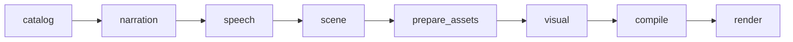

# Video Agent V3 当前架构说明

本文描述当前代码，不是未来方案。README 负责使用入口；本文负责解释模块边界、权威数据和扩展位置。

## 1. 系统边界

Video Agent V3 是一条素材驱动、词级定时、确定性编译的短视频生产链。Python 负责语义规划和时间线编译，Remotion 负责画面合成，FFmpeg 负责音频混合与最终编码。

系统不包含：

- 浏览器录屏成片链路；
- 运行时基于 CDP 坐标重画红框；
- 自动 Vision Critic 或项目内人工审批工作流；
- V2 project/keyframe/effect 兼容层；
- 由渲染器猜测素材语义的旁路。

## 2. 不可破坏的约束

1. 每个语义 Cue 的口播短语、字幕、视觉命中状态和 SFX 峰值必须引用同一个词级 Anchor。
2. `timing_lock.json` 一旦生成，后续素材派生和视觉编排不能改变语音、字幕词序或总时长。
3. 1080x1920、30 fps 和 `douyin_portrait_v1` 安全区由契约统一管理。
4. 动效自行声明最短场景帧数和可读停留，不使用全局镜头时长、图片数量或固定轮播张数替代创作决策。
5. 进入 `assets/` 的素材视为已在项目外人工确认；程序只校验文件、哈希、尺寸、方向和关系完整性。
6. E2/E3 素材不能支持事实 Claim。严格因果展示必须来自注册关系或由同一来源素材派生。

## 3. 单一生产 DAG



### 3.1 catalog

`assets/catalog.json` 是全局索引。每次运行重新扫描素材并生成完整 `asset_catalog.source.json` 快照；Scene 阶段由 AI 根据文案召回素材，不再用 Case 路径提前裁掉可能相关的素材。

Catalog 负责：

- 从中文文件名解析站点、模块、子功能、场景和素材角色；
- 读取图片尺寸、方向和 SHA256；
- 合并网站派生清单、参数序列、编辑流程和品牌媒体；
- 建立 E0-E3 证据等级和 provenance；
- 排除损坏或显式 rejected 的素材。

### 3.2 narration

有两个入口：

- `script_locked`：读取 `input/narration.json`，原文由 `script-lock` 生成或人工编辑；
- AI 文案：`ai_enabled=true` 时，由 `story_planner.py` 调用 OpenAI-compatible 文本模型生成结构化 `Narration`。

两条入口都输出同一份 `narration.json`，之后不再分叉。

### 3.3 speech

MiniMax 对完整口播进行单次合成并返回 word 字幕。`timing_lock.py` 把 Token、Beat span、phrase anchor、timeline start/end 和音频时长锁定为帧。

`timing_qa.json` 只检查词序、锚点和时间结构，不评价文案或画面审美。

### 3.4 scene

`ai/asset_selector.py` 先用低成本 Flash 模型读取完整文案和完整 Catalog，输出逐 Beat 候选、逐短语候选及候选模式。逐项结果枚举必须召回精确 `result_image`；入口、参数页和工具列表标记为 supporting。没有图片数量上限。

`ai/action_scene_planner.py` 再用 Pro 模型把 Narration、词级 Timing、候选素材和关系转换为 `ActionScenePlan`。这是整个系统的语义汇合层：AI 判断网站、入口、参数、单结果、多结果、因果流程、编辑流程或兜底场景，并给出素材绑定、精确原文 Scene 起点和派生需求。Python 只把这些精确短语编译到 MiniMax token，并验证真实 ID、时间顺序和契约，不代替 AI 猜语义。

枚举句不是按 Beat 平均切镜头。每个枚举短语生成独立 gallery item，并直接绑定该短语的词级命中 Anchor。

若具体枚举项缺少结果图，Pro 必须为每个缺口显式选择：

- `contextual_result_fill`：具体、可视觉化且有可信结果图母图时，动态生成 GPT Image instruction；
- `light_sweep_fallback`：抽象过渡、没有可信母图或生成可能误导时。

派生结果属于 E2 语义素材，不能承担事实 Claim。

### 3.5 prepare_assets

`assets/preparer.py` 在视觉编排前执行一次素材预检：

- 检查同组轮播的方向和比例离群；
- 读取 `assets/relationships.json` 中的严格因果关系；
- 缺少参考图或平面图时，从已绑定结果图生成上下文派生请求；
- 执行 Pro 为具体功能素材缺口生成的 `contextual_result_fill` 请求；
- 生成编辑工作区或统一轮播预览等派生素材；
- 按内容哈希复用 `assets/derived/generated/registry.json`；
- 输出 `resolved_scene_plan.json`，不让 Renderer 临时找图。

执行时会打印 `[素材准备]`、`[素材修复]` 和 GPT Image 相关日志。所有生成结果持久化，正常 Resume 或后续 Case 不重复调用接口。

### 3.6 visual

`planning/scene_visual.py` 将已解析场景映射为 VisualPlan：

- 根据 `config/scene_effects.json` 选择模板、动效、转场和语义音效；
- 根据图片横竖方向调整布局，而不是拉伸素材；
- 把 gallery item 的进入时刻放在对应词语开始帧；
- 为参数花字、编辑放大镜和弹窗序列写入结构化 metadata；
- 兜底只使用 `light_sweep_fallback`，不自动插入品牌 IP。

### 3.7 compile

Compiler 是确定性边界。它只接受契约化 VisualPlan，并完成：

- Anchor 到绝对帧解析；
- base/overlay 轨连续性；
- 单行字幕 Cue 和关键词强调；
- SFX onset/peak 对齐及密度 Profile；
- Claim 证据可见性；
- 抖音安全区和 Effect Registry 约束；
- RenderPlan 所需全部媒体路径冻结。

编译后唯一渲染输入是 `render_plan.json`。

### 3.8 render

`render/remotion.py` 把媒体复制到当前 Run 的不可变 public 目录，并把 RenderPlan 序列化为 Remotion Props。Remotion 渲染静音 H.264，FFmpeg 再混入口播、BGM 和 SFX。主视频完成后按 Case 配置生成单帧封面并追加固定片尾，最终输出 `final/video.mp4`。

封面和片尾默认开启：

- `cover_enabled=true`：优先读取 `cover_source`；文件不存在时根据 Case 目标、完整口播和成片实际素材生成默认封面规格。
- `outro_enabled=true`：追加 `outro_source` 指定的固定片尾。片尾不进入文案、字幕、ActionScene 或 RenderPlan 时间轴。

每次 Render 都从新生成的主体视频开始后处理，封面和片尾不会因 Resume 或重复执行而累加。

## 4. 场景分类

```text
网站：site_home / feature_entry / parameter_input
结果：result_detail / result_gallery / result_gallery_summary
因果：reference_input / reference_to_result / result_to_flat_plan
编辑：editor_workspace / editor_before_after
兜底：light_sweep_fallback
```

`light_sweep_fallback` 不是所有缺图场景的统一答案。具体设计功能优先走可追溯的 GPT Image 派生；LightSweep 只承担无需事实画面或不适合可靠派生的过渡。

场景是素材、动效和时间的共同选择键。不要在 Renderer 内根据文件名重新判断业务语义。

## 5. 素材与关系

### 5.1 素材角色

核心角色包括：

- `site_home`
- `feature_entry`
- `parameter_panel`
- `parameter_callout_frame`
- `result_image`
- `reference_image`
- `plane_result`
- `editor_workspace`
- `editor_modal`
- `brand_ip` / `brand_logo`

角色和 `semantic_path` 共同参与匹配。明确功能必须优先匹配同路径素材，不允许跨功能拿图。

### 5.2 严格关系

`assets/relationships.json` 保存明确因果：

```text
reference_asset_id -> result_asset_id -> flat_plan_asset_id
```

若关系缺失，Preflight 从当前结果图派生所需输入或输出，并登记来源 SHA、Prompt、模型、输出 SHA 和 relationship ID。文件名猜测在严格关系配置中关闭。

### 5.3 固定素材制作

网站入口、参数花字和编辑工作区是相对固定的高成本素材，使用独立 CLI 一次生成并注册：

- `site-entry-batch`
- `site-params-sequence`
- `editor-flow`

它们不属于 Case DAG，避免每条视频重复调用 GPT Image。

## 6. 动效配置

`config/scene_effects.json` 是场景到表现的默认映射，允许配置：

- `template`
- `motion`
- `transition.kind`
- `transition.duration_frames`
- `sfx`
- 字幕样式和 Callout reveal 等场景参数

`video_agent/effects.py` 是动效能力注册表，声明每个 Effect 的：

- `minimum_scene_frames`
- `readable_settle_frames`
- `requires_readable_hold`

新增动效时必须同时更新 Python Effect Registry、Render 合约、Remotion 类型和组件实现。场景配置只能引用已注册动效。

## 7. 音频与字幕

MiniMax 返回的 word timing 是共享时钟。字幕不会按固定十字机械切分，而是优先按语义和标点断句，在一行安全宽度内显示。

SFX Profile 位于 `assets/audio/sfx/catalog.json`，每个语义音效保存 trim、gain、fade、priority、sync point 和 peak offset。Compiler 允许音效提前起播，使实际峰值落在视觉 hit 帧。

## 8. Resume 与可追溯性

每个阶段指纹包含相关上游产物、源码、Prompt、配置和 Provider 标识。`run_manifest.json` 记录：

- 阶段输入指纹；
- 输入和输出 SHA256；
- Prompt 路径与 SHA；
- 阶段状态和异常；
- 最终视频路径。

API Key 不进入 Manifest 或 Git。

## 9. 模块依赖方向

```text
contracts
  <- assets / speech / planning / compiler
  <- orchestrator

planning -> ActionScene / VisualPlan
compiler -> RenderPlan
render -> Remotion + FFmpeg
```

`orchestrator.py` 是唯一正式入口。素材工具可以独立运行，但不能创建第二套成片链路。

## 10. 扩展准则

- 新业务语义先增加或复用 `SceneKind`，再定义素材关系和动效；
- 新 GPT Image 能力通过 `DerivedAssetRequest` 和 registry 接入；
- 新动效通过 Effect Registry 和 Remotion 组件接入；
- 新 Provider 只能改变结构化规划或素材生成，不拥有时间轴；
- Golden Case 暴露问题时修复通用 Planner、Compiler 或组件，不修改某个 Case 的成片帧。
