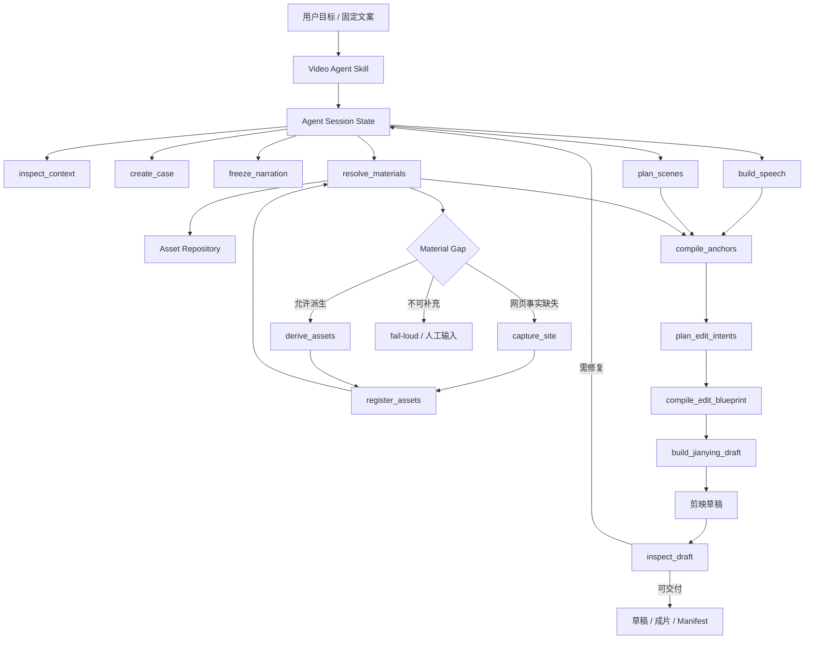

# Video Agent Agent Skill 驱动重构实施规划

状态：实施规划已起草，待确认后按 Unit 逐步落地

日期：2026-07-27

## 1. 背景与问题

当前仓库已经具备较完整的视频生产能力：

- 固定文案或目标输入；
- Scene 语义规划；
- MiniMax TTS 与词级时间事实；
- SQLite 素材仓库、关系组与 GPT Image 派生；
- 字幕、画面、SFX 共用 Phrase Anchor；
- Remotion 成片后端；
- 剪映原生草稿后端；
- Case、Run、Resume 和结构化产物。

但当前控制方式仍然是：

```text
CLI
→ V4ProductionOrchestrator.run()
→ 固定 Python DAG
→ Stage1 / Stage4 / Stage5 / Stage6
→ Remotion 或剪映后端
```

根目录虽然存在 `SKILL.md` 和 `agents/openai.yaml`，但它们只是告诉 Agent 调用
一条固定生产命令。Agent 没有真正拥有以下能力：

- 根据当前 Run 状态决定下一步；
- 在缺少网站事实时主动调用 CDP；
- 在缺少关系素材时决定查询、派生或停止；
- 检查 Scene、素材和剪映草稿，再选择性重跑；
- 根据错误码执行限定范围的恢复；
- 在多个可用工具之间进行导演层选择。

外部 `jianying-editor-skill` 当前也只是被 Python Adapter 加载，属于编辑执行依赖，
不是整个 Video Agent 的控制面。

因此当前状态应准确描述为：

```text
Program-driven pipeline with a Skill wrapper
```

目标状态是：

```text
Agent Skill-driven workflow with deterministic execution tools
```

## 2. 重构核心结论

本次重构不是删除现有 Python 能力，也不是让 Agent 自由操作剪映。

它是一场控制权迁移：

| 决策 | 当前所有者 | 目标所有者 |
|---|---|---|
| 下一步调用哪个生产能力 | `V4ProductionOrchestrator` | Video Agent Skill |
| 是否需要网页采集 | 固定 DAG 或人工 | Video Agent Skill |
| 缺素材时查询、派生还是停止 | Stage 内部固定分支 | Skill 根据结构化缺口决定 |
| 是否只重跑某个阶段 | CLI 参数或人工判断 | Skill 根据状态与指纹决定 |
| Scene、素材、动效的语义选择 | 现有 AI/规则模块 | 领域 AI 工具 + Skill 编排 |
| 词级时间、帧号和音效峰值 | 确定性程序 | 保持不变 |
| 素材完整性和因果关系校验 | 确定性程序 | 保持不变 |
| 剪映轨道和草稿写入 | Jianying Adapter | 保持不变 |

Agent 驱动不等于 AI 驱动全部细节。以下铁律继续保持：

> 口播短语、字幕 Cue、画面命中、字幕高亮和 SFX 峰值必须绑定同一个词级
> Phrase Anchor。Agent 不得猜测帧号、坐标、时长或音频峰值。

## 3. 目标与非目标

### 3.1 目标

1. 建立一个真正可被 Codex/Agent 调用的 `video-agent` Skill。
2. Skill 负责理解任务、检查上下文、调用工具、处理错误和恢复执行。
3. 将现有生产能力暴露为粒度适中的结构化工具，而不是只提供 `run-all`。
4. CDP、素材仓库、GPT Image、MiniMax、Timing Compiler 和剪映成为同级工具能力。
5. 每次决策和工具调用都落盘，可恢复、可解释、可人工接管。
6. 默认交互式生产由 Skill 驱动。
7. 保留无人值守批处理，但它只能复用相同工具和状态机，不再定义系统架构。

### 3.2 非目标

首轮不做：

- 让 Agent 直接生成剪映草稿 JSON；
- 让 Agent 直接决定精确帧号；
- 让 Agent 根据截图像素猜网站功能；
- 在 Agent Prompt 中传 Cookie、API Key 或数据库连接；
- 删除 Stage3 素材仓库或 Stage6 Timing Compiler；
- 重新引入素材审核状态；
- 自动评价视频审美质量；
- 一次性支持任意网站和任意剪辑软件；
- 立即解决剪映 11.1 自动导出兼容问题。

## 4. 目标架构



### 4.1 三层职责

#### Agent Skill 控制层

负责：

- 理解用户目标和输入；
- 选择 Script 模式或 Goal 模式；
- 决定调用顺序；
- 判断是否需要 CDP、GPT Image 或人工素材；
- 根据错误码选择重试、局部重建或停止；
- 汇总当前进度和交付路径。

#### 领域工具层

负责：

- Scene AI；
- 素材查询与关系解析；
- 网站采集；
- GPT Image 派生；
- MiniMax TTS；
- 动效和 SFX 意图分配；
- 剪映草稿构建。

工具必须返回结构化结果，不把大段日志当作协议。

#### 确定性内核

负责：

- Contract 验证；
- 素材哈希、关系与 Lineage；
- Phrase Anchor；
- Frame Compiler；
- 字幕安全区；
- SFX 峰值对齐；
- 剪映轨道、关键帧和时间换算；
- 指纹、Resume 和原子写入。

## 5. Skill 形态

### 5.1 仓库内 Skill

目标目录：

```text
SKILL.md
agents/
└── openai.yaml
scripts/
└── skill_tools/
    ├── inspect_context.py
    ├── create_case.py
    ├── run_semantics.py
    ├── resolve_materials.py
    ├── capture_site.py
    ├── derive_assets.py
    ├── compile_timing.py
    ├── build_jianying_draft.py
    └── inspect_delivery.py
references/
├── skill_workflow.md
├── tool_contracts.md
├── recovery_policy.md
├── scene_and_asset_taxonomy.md
└── jianying_capabilities.md
```

说明：

- `SKILL.md` 只保留触发条件、核心工作流、硬约束和引用导航。
- 详细 Contract、错误码和恢复策略放入 `references/`。
- `scripts/skill_tools/` 是 Agent 可调用的稳定工具外观。
- 工具内部复用 `video_agent/`，不复制业务实现。
- 不为 Skill 添加额外 README、安装指南或重复架构文档。

### 5.2 安装与发现

仓库 Skill 应支持：

1. 在当前仓库上下文中直接触发；
2. 安装或链接到本机 Codex Skill 目录后触发；
3. 记录 Skill 版本和仓库 Commit；
4. 在 Run Manifest 中记录所用 Skill 指纹。

Skill 名称统一为：

```text
video-agent
```

不再使用过时的 `video-agent-v3`。

## 6. Agent 状态机

Agent 不依赖聊天历史记住执行状态。每次 Run 新增：

```text
agent_session.json
agent_events.jsonl
```

### 6.1 `agent_session.json`

至少包含：

```json
{
  "session_id": "agent-session://...",
  "case_id": "video_...",
  "run_id": "20260727_...",
  "mode": "interactive",
  "status": "waiting_for_tool",
  "current_checkpoint": "materials",
  "completed_capabilities": [
    "narration.freeze",
    "speech.build",
    "scene.plan"
  ],
  "pending_gaps": [],
  "last_tool_call_id": "tool-call://...",
  "recoverable": true
}
```

### 6.2 状态

第一版使用封闭状态：

```text
created
inspecting
planning
waiting_for_tool
waiting_for_user
recovering
draft_ready
completed
failed
```

### 6.3 控制原则

1. Agent 每次只根据已冻结产物和最新 Tool Result 决策。
2. 工具不得通过隐藏全局状态改变后续行为。
3. 可恢复错误必须给出允许的下一步动作。
4. 不可恢复错误必须说明缺少的事实或素材。
5. Agent 不得绕过 Contract Validator。
6. Agent 不得因为“看起来接近”而忽略卡点错误。

## 7. 工具协议

### 7.1 统一 Result Envelope

所有 Skill Tool 返回：

```json
{
  "ok": true,
  "tool": "resolve_materials",
  "tool_version": "1",
  "case_id": "video_...",
  "run_id": "20260727_...",
  "status": "completed",
  "artifacts": [
    {
      "kind": "resolved_asset_plan",
      "path": "cases/.../resolved_asset_plan.json",
      "sha256": "..."
    }
  ],
  "gaps": [],
  "next_actions": [
    {
      "action": "compile_anchors",
      "reason": "speech, scene and materials are ready"
    }
  ],
  "warnings": []
}
```

失败时：

```json
{
  "ok": false,
  "tool": "resolve_materials",
  "status": "blocked",
  "error": {
    "code": "material_dependency_missing",
    "message": "编辑流程缺少 source_result",
    "recoverable": true
  },
  "next_actions": [
    {
      "action": "derive_assets",
      "capability_id": "result_to_editor_process"
    },
    {
      "action": "request_user_material"
    }
  ]
}
```

### 7.2 工具粒度

工具不应过粗，也不应退化为每个内部函数一个命令。

第一版冻结以下工具：

| Tool | 输入 | 输出 | Agent 可决定 |
|---|---|---|---|
| `inspect_context` | repo/case/run | ContextSummary | 模式和下一步 |
| `create_case` | goal/script/config | Case + Session | 是否立即执行 |
| `freeze_narration` | case | FrozenNarration | 是否接受 Goal 文案 |
| `build_speech` | narration/voice | SpeechTimingLock | 失败重试或换已注册音色 |
| `plan_scenes` | narration + registry | VideoScope + ScenePlan | 是否局部修复 |
| `resolve_materials` | scene plan | ResolvedAssetPlan/Gaps | 查询、采集、派生或停止 |
| `capture_site` | CaptureRecipe | CaptureBundle | 是否注册并重查 |
| `derive_assets` | DerivationRequest | Assets + Groups | 是否注册并重查 |
| `compile_anchors` | speech/scene/assets | AnchoredTimingPlan | 仅接受或停止 |
| `plan_edit_intents` | anchored plan/assets | MotionAudioPlan | 可选择已注册风格档 |
| `build_jianying_draft` | compiled blueprint | Draft Manifest | 是否检查或重建 |
| `inspect_delivery` | draft/video | DeliverySummary | 修复、交付或人工接管 |

### 7.3 不提供的工具

禁止提供：

- `set_frame_number_by_ai`
- `draw_callout_from_screenshot_coordinates`
- `guess_asset_relationship`
- `write_jianying_json_from_prompt`
- `ignore_validation`

## 8. 交互式与无人值守入口

### 8.1 默认：Agent Skill 交互入口

示例：

```text
使用 video-agent，根据 test.txt 创建一版柯幻熊猫文生图种草视频，
缺少网页事实时使用已登录 CDP，最后输出可编辑剪映草稿。
```

Agent 应：

1. 检查项目和本地能力；
2. 创建 Case/Run；
3. 调用必要工具；
4. 汇报关键缺口；
5. 只重跑受影响工具；
6. 返回草稿和产物路径。

### 8.2 次要：无人值守批处理

保留：

```powershell
python main.py --script .\test.txt --editor-backend jianying
```

但其定位调整为：

```text
Batch Client
→ 同一 Tool Facade
→ 同一 Agent Session State
→ 预设 Recovery Policy
```

它不是 Skill 的内部实现，也不能拥有第二套 Contract。

批处理遇到需要语义判断或人工事实的缺口时必须停止，不得猜测补齐。

## 9. CDP、GPT Image 与剪映的关系

### 9.1 CDP

CDP 是事实采集工具：

- 使用真实登录态；
- 根据 Capture Recipe 操作；
- 输出页面状态、截图、视频和交互事件；
- 注册为可追溯素材；
- 不负责最终视频动效。

### 9.2 GPT Image

GPT Image 是派生工具：

- 只处理 Registry 允许的 Derivation；
- Prompt 根据场景、父素材和能力模板生成；
- 输出必须注册 SourceKind、Lineage 和 Signature；
- 原图优先，派生图作为缺口补充；
- 不伪造网站界面事实。

### 9.3 剪映

剪映是编辑执行工具：

- 消费确定性 Edit Blueprint；
- 使用原生转场、动画、字幕、贴纸和音轨；
- 不改写文案；
- 不重新估算时间；
- 不重新选择素材；
- 当前交付物以可编辑草稿为准。

## 10. Resume 与恢复策略

### 10.1 恢复范围

Agent 可以按产物指纹恢复：

```text
Context
Narration
Speech
Scene
Materials
Capture
Derivation
Anchor
Edit Intent
Draft
Delivery
```

### 10.2 恢复决策

| 错误 | 默认动作 |
|---|---|
| Provider 临时错误 | 同工具有限重试 |
| Contract 字段可纠正 | 调用既有字段修复 |
| Scene 语义冲突 | 只重跑 Scene，不重跑 TTS |
| 素材不存在但可派生 | 调用 `derive_assets` |
| 网站事实缺失 | 调用 `capture_site` |
| 严格关系缺父素材 | fail-loud 或请求用户素材 |
| Anchor 不匹配 | 停止，禁止比例时长兜底 |
| 剪映能力不存在 | 选择 Registry 已声明的组级 fallback |
| 剪映草稿生成失败 | 保留 Blueprint，局部重建草稿 |

### 10.3 重试约束

重试次数属于执行安全配置，不是创作数量限制。

不得用以下方式掩盖失败：

- 无限重试；
- 换无关素材；
- 把严格因果场景改成普通结果图；
- 取消词级 Anchor；
- 静默更换文案；
- 静默更换音色；
- 返回不存在的成片路径。

## 11. 分阶段实施

每个 Unit 必须独立检查 Diff 并提交 Git。

### Unit 0：冻结控制权边界

目标：

- 将本规划设为实施基线；
- 明确 Skill、工具、确定性内核三层；
- 冻结首批 Tool ID、Result Envelope 和 Agent Session Contract；
- 标记现有 `V4ProductionOrchestrator` 为 Batch Controller，而非默认 Skill Controller。

改动：

```text
docs/
schemas/agent_skill/
```

验收：

- Contract 可由 Pydantic/JSON Schema 表达；
- Tool ID 无重复；
- 不改生产行为；
- 文档不再称固定 DAG 为 Agent Skill。

### Unit 1：重建 Skill 表面

目标：

- `video-agent-v3` 更名为 `video-agent`；
- 重写 `SKILL.md`；
- 更新 `agents/openai.yaml`；
- 删除或合并过时 `agent.md`；
- 增加按需加载的 Skill References。

验收：

- Skill 能被固定文案、目标、网站录制、剪映草稿请求触发；
- Skill 正文不要求无条件执行 `run-all`；
- Skill 明确先检查 Context 和 Run 状态；
- Skill 明确卡点硬合同；
- OpenAI UI 元数据与 Skill 一致。

### Unit 2：建立 Tool Facade

目标：

- 把现有 Stage 能力封装为首批结构化工具；
- 所有工具实现统一 Result Envelope；
- CLI 日志与 JSON 协议分离；
- 工具支持幂等与 Resume。

首批先实现：

```text
inspect_context
create_case
freeze_narration
build_speech
plan_scenes
resolve_materials
compile_anchors
build_jianying_draft
inspect_delivery
```

验收：

- Agent 不调用 `V4ProductionOrchestrator.run()` 也能逐步建立草稿；
- 每个工具都能单独重跑；
- 工具输出只含相对项目路径和结构化摘要；
- API Key、Cookie 和数据库连接不进入输出。

### Unit 3：Agent Session 与恢复

目标：

- 新增 `agent_session.json`；
- 新增 append-only `agent_events.jsonl`；
- 根据 Tool Result 维护状态；
- 提供 `inspect_context` 和 `resume_session`。

验收：

- 新聊天可以仅凭 Case/Run 恢复；
- Agent 不依赖上一次对话内容；
- 已完成工具不会因重复调用产生重复素材或重复草稿；
- 输入指纹变化时只失效相关下游。

### Unit 4：素材缺口循环

目标：

- 将 `MaterialGap` 暴露给 Skill；
- 增加显式的查询、CDP、派生和人工输入动作；
- 接通 `capture_site` 和 `derive_assets`；
- 新素材注册后只重跑素材解析及其下游。

验收：

- 网站入口缺失会触发 CDP，而不是无关结果图；
- 严格因果素材缺失时可通过允许的 Derivation 补齐；
- 不允许派生时明确停止；
- 派生与采集素材持久化，下一 Run 可以复用。

### Unit 5：剪映导演循环

目标：

- Agent 选择场景级编辑意图和风格档；
- Registry 决定具体剪映能力；
- Compiler 决定帧、坐标和关键帧；
- 增加草稿检查摘要；
- 支持仅重建剪映草稿。

验收：

- 同一 Gallery 使用统一转场家族；
- 横竖屏使用对应布局；
- 字幕不溢出抖音安全区；
- 口播、字幕、画面和 SFX 卡点保持不变；
- Agent 不能输出不存在的剪映效果 ID。

### Unit 6：默认入口切换

目标：

- 文档默认入口切换到 Agent Skill；
- `main.py --script/--goal` 明确标记为 Batch Client；
- README 展示交互式 Skill 和批处理两种入口；
- 生产日志标明 `controller=agent_skill|batch_client`。

正式切换边界：

```text
Unit 1–5 全部完成
+ 一个固定文案黄金 Run
+ 一个需要 CDP 的 Run
+ 一个需要 GPT Image 派生的 Run
+ 一个 Resume 后重建剪映草稿的 Run
```

Unit 1 单独完成不等于生产切换。

### Unit 7：清理重复控制面

目标：

- 合并重复入口；
- 删除只为伪 Skill 外壳存在的说明；
- 将固定 DAG 内部隐式决策移到 Tool Result/Recovery Policy；
- 保留 Batch Client 和确定性内核。

验收：

- 只有一套 Scene、Asset、Timing 和 Jianying Contract；
- Skill 与 Batch 不各自维护业务规则；
- 不存在 `agent.md` 与 `SKILL.md` 相互矛盾；
- 架构文档准确反映当前控制权。

## 12. 文件级迁移建议

| 当前 | 调整 |
|---|---|
| `SKILL.md` | 重写为 Agent 工作流 |
| `agents/openai.yaml` | 更新名称、触发说明和默认 Prompt |
| `agent.md` | 合并进 Skill References 后删除 |
| `video_agent/cli.py` | 增加 Tool Facade 命令，保留 Batch Client |
| `video_agent/v4/production.py` | 降级为 Batch Controller |
| `video_agent/v4/orchestrator.py` | 保留阶段实现，不再作为 Skill 唯一入口 |
| `video_agent/editors/jianying/*` | 保持确定性执行后端 |
| `cdp-capture/` | 通过 Capture Tool 接入 |
| `video_agent/assets/v4/*` | 保持素材仓库与解析内核 |
| `video_agent/timing/v4/*` | 保持 Timing 硬合同 |
| `docs/architecture.md` | Unit 6 时更新控制面 |
| `README.md` | Unit 6 时更新使用入口 |

## 13. 风险与防护

### 13.1 Agent 决策漂移

风险：

- 相同输入选择不同工具路径；
- 过度调用 GPT Image；
- 错误恢复循环。

防护：

- 封闭 Tool ID；
- 结构化 `next_actions`；
- Recovery Policy；
- 幂等键；
- 工具调用预算；
- 所有最终决策落盘。

### 13.2 双控制面

风险：

- Agent 和 Batch Orchestrator 各自维护一套规则。

防护：

- 两种入口共用 Tool Facade；
- Batch 只实现预设调用策略；
- Contract、Registry、Compiler 只有一份。

### 13.3 Agent 破坏 Timing

风险：

- Agent 为了视觉效果移动画面或字幕。

防护：

- Agent 只选择语义意图；
- Phrase Anchor 和 Frame Compiler 不暴露自由帧参数；
- 编译后继续执行现有 Timing Validator。

### 13.4 外部 Skill 漂移

风险：

- `jianying-editor-skill` 版本变化；
- 原生效果 ID 变化。

防护：

- 能力探针；
- Skill 版本与能力指纹；
- Registry 映射；
- 不存在的能力 fail-loud；
- 草稿 Manifest 记录实际选择。

### 13.5 本地凭证泄露

风险：

- CDP Cookie、数据库连接和 Provider Key 进入 Agent 上下文。

防护：

- 凭证只由工具读取；
- Agent 接收脱敏摘要；
- Trace 过滤；
- 本地忽略文件；
- 只读数据库账号。

## 14. 最小黄金闭环

第一条正式验收链：

```text
用户提供固定文案
→ Skill 检查上下文
→ 创建 Case/Run
→ 冻结文案
→ MiniMax TTS
→ Scene Plan
→ 查询素材
→ 发现网站入口缺口
→ CDP 获取并注册
→ 重新解析素材
→ 词级 Anchor
→ 编辑意图
→ 确定性 Edit Blueprint
→ 剪映原生草稿
→ 草稿检查
→ 返回草稿路径
```

必须验证：

1. Agent 确实调用了多个工具，不是调用单个 `run-all`；
2. 中途新增素材后只重跑受影响下游；
3. Tool Event 可解释为什么调用 CDP；
4. 草稿可由剪映打开；
5. Timing Validator 继续通过；
6. 新会话可从 `agent_session.json` 恢复；
7. 不存在原生效果时明确失败或使用 Registry fallback；
8. 不伪装自动导出成功。

## 15. 完成定义

全部满足后，项目才可以称为完整的 Agent Skill 驱动：

- [ ] `video-agent` 可被自然语言任务触发；
- [ ] Agent 默认先 Inspect，再决定工具调用；
- [ ] Agent 不以 `V4ProductionOrchestrator.run()` 作为唯一动作；
- [ ] 生产能力均有结构化 Tool Contract；
- [ ] Tool Result 提供可执行 `next_actions`；
- [ ] CDP、GPT Image 和剪映是可独立调用的工具；
- [ ] Agent Session 可跨聊天恢复；
- [ ] Batch 与 Skill 共用同一工具和 Contract；
- [ ] Phrase Anchor 硬合同未弱化；
- [ ] 剪映草稿可打开并继续人工编辑；
- [ ] 所有决策、指纹和产物可追溯；
- [ ] README、Skill 和架构文档不存在控制权描述冲突。

## 16. 推荐实施顺序

```text
Unit 0  契约与边界
→ Unit 1  Skill 表面
→ Unit 2  Tool Facade
→ Unit 3  Agent Session
→ Unit 4  素材/Capture/Derivation 循环
→ Unit 5  剪映导演循环
→ Unit 6  默认入口切换
→ Unit 7  重复控制面清理
```

不建议先改剪映动画，也不建议先删除 `V4ProductionOrchestrator`。

第一刀应是 Unit 0 和 Unit 1：让仓库先准确表达“Agent 如何工作”，随后再把现有
可靠能力逐项变成 Agent 可以安全调用的工具。
