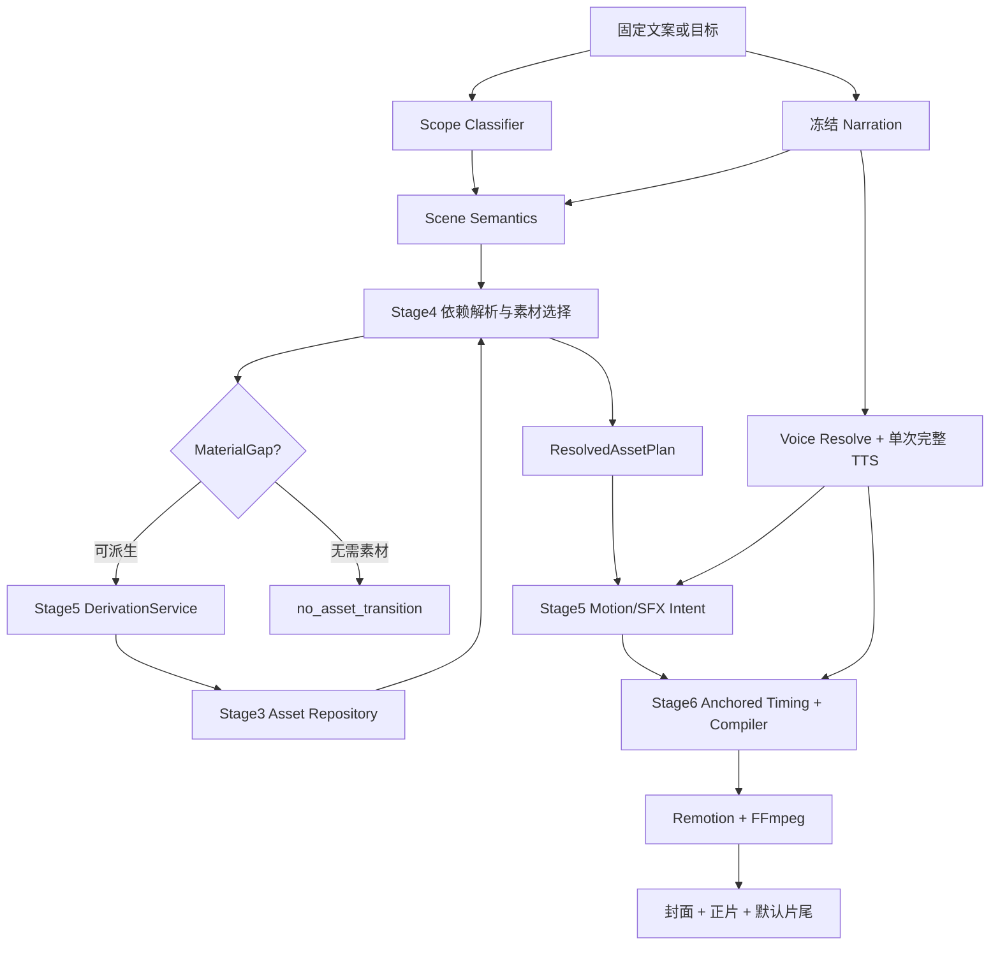

# Video Agent 工程交接上下文（供 GPT Chat 继续设计）

状态：上下文交接稿

日期：2026-07-18

## 1. 文档用途

本文用于把当前对话中已经明确的产品目标、架构决定、阶段进度和后续设计边界交给下一位 GPT Chat 模型。

使用原则：

1. 本文描述的是设计背景和已确认决策，不替代实时代码。
2. 接手时先连接 GitHub，读取 `master` 或用户指定分支的最新提交，再核对本文。
3. 当前本地有 Cursor 正在依据 Stage5 设计实施代码；这些进行中的变更后续会同步到 GitHub，不应被当成异常或要求回滚。
4. 本文不记录 API Key、Token、本地密钥内容或其他敏感配置。

## 2. 项目与核心目标

仓库：`60ke/video-agent`

当前开发分支：https://github.com/60ke/video-agent/tree/codex/parameter-frame-sequence 

产品目标：为「柯幻熊猫」网站自动生成适合抖音发布的高质量竖屏功能种草视频。输入可以是固定文案，也可以是目标描述；系统完成文案理解、素材选择、必要的 GPT Image 派生、TTS、字幕、动效、音效、精确卡点和成片渲染。

当前重点功能域是「文生图」，但架构中的分类、素材角色、动效、音效和音色必须可插拔，不能写死为某一个功能。

### 2.1 第一铁律：声音、画面、字幕和音效精确卡点

每一个语义 Cue 必须共享同一个词级时间锚点：

- 口播短语开始；
- 字幕 Cue 与关键词高亮；
- 对应图片或视觉重点出现；
- 需要时的 SFX onset/peak。

最终编译帧与实际音频峰值必须在配置容差内一致。不能只靠视觉观察认为“差不多”。

现有合理链路必须保留：

```text
TimingLock -> PhraseAnchor -> GalleryItem / Shot / Subtitle / SFX
```

Stage6 才拥有 PhraseAnchor 到帧号、字幕 Cue、Shot 边界和 SFX 峰值位置的最终解释权。

## 3. 已确认的全局工程原则

1. AI 负责语义判断；Python 负责可验证的协议、查询、去重、依赖、时间、动效执行、音效冲突和渲染。
2. 不让单个大 Agent 一次完成场景判断、选图、派生、动效和时间线。应通过小而明确的 Contract 分阶段交接。
3. `category_path` 与 `asset_role` 是两个正交维度，禁止合并成含混的 `material_tags`。
4. 素材查询、未来数据库或对象存储必须通过独立 Repository 接口，业务编排不得依赖宿主机绝对路径。
5. `assets/` 内的素材已经进入项目生产边界，不再维护 `reviewed`、`human_approved` 或 AI 视觉审核状态。
6. 原图优先于 GPT Image 派生图；派生图必须记录 lineage、派生类型、父素材和最终签名。
7. 网站截图只能来自真实页面捕获或忠实重排，禁止用 GPT Image 伪造不存在的网站 UI。
8. 缺少具体业务素材时不能一律用 LightSweep。只有语义明确为无素材承接时才用 `no_asset_transition`；应展示具体结果、关系流程或编辑流程时，优先产生 MaterialGap 并派生素材。
9. 不再使用通用熊猫 IP 作为缺图兜底。唯一官方品牌兜底为：
   `assets/brand/kehuanxiongmao/logo/柯幻熊猫_LOGO.png`。
10. 抖音画布固定为 1080x1920、30fps，并统一使用平台安全区配置；不要在组件内散落像素常量。
11. 网站截图的红框、花字或视觉强调必须是持久化派生素材或结构化 Effect 元数据，禁止渲染时从旧截图坐标重新画框。
12. 动效自己声明可读稳定时间和最短场景要求；禁止用全局“镜头不超过 4 秒”“每图至少 1.2 秒”“最多 12 张图”等粗暴规则代替质量控制。
13. 每完成一个可独立回滚的代码单元，要检查 diff 并提交 Git；不得把 API Key、Case Run、视频、缓存或无关素材改动混进提交。

## 4. 目标运行链路



### 4.1 两种输入模式最终汇合

- 固定文案：文案内容必须原样保留，不允许 Agent 擅自改写。
- 目标模式：AI 先生成 Narration，再冻结为后续输入。

二者从 Narration 冻结后进入同一套 Scene、Asset、Derivation、Motion、Timing 和 Render 链路，不能维护两套视频系统。

当前用户主要使用固定文案模式。历史 CLI 目标是：

```powershell
python main.py --script .\test.txt
python main.py --goal "柯幻熊猫文生图功能种草"
```

接手时应以 GitHub 最新 README 和 CLI 实现核验命令是否仍保持一致。

## 5. 场景语义与素材角色

场景先做语义分类，再做素材查询。当前已明确的主要视觉结构包括：

1. 网站：首页、功能入口、参数页、通用功能列表。
2. 单结果图：突出一张结果的细节。
3. 多结果图 Gallery：每个口播名词对应一张或多张结果图，并按各自词级锚点切换。
4. 因果流程：参考图 -> 生成结果；结果图 -> 平面导出。
5. 编辑流程：上一个结果 -> 编辑页面 -> 编辑后结果，必须保持叙事连续性。
6. 无素材过渡：只有确实不需要具体图片时才使用 LightSweep 等过渡。
7. 默认片尾与封面。

### 5.1 分类与角色不能混淆

示例：

```json
{
  "category_id": "文生图/文化墙",
  "asset_role": "result_image"
}
```

`文生图/文化墙` 回答“它属于哪个业务功能”，`result_image` 回答“它在叙事中扮演什么角色”。

常用角色包括但不限于：

- `site_home`
- `feature_entry`
- `parameter_panel`
- `result_image`
- `reference_image`
- `flat_plan`
- `source_result`
- `editor_page`
- `edited_result`
- `configured_asset`

角色与分类由动态 Registry 管理，后续允许增删；结构协议字段仍采用封闭枚举。

### 5.2 Gallery 的关键规则

当口播是“文化墙、门头招牌、LOGO、美陈……”时：

- 每个名词有独立 PhraseAnchor；
- 每个名词选择匹配其分类的结果图；
- 图片在该词开始时出现，而不是前一个词结束时才切；
- 同一 Gallery 组内固定动效家族、方向、容器和背景，保持视觉连贯；
- 横屏/竖屏优先延续上一张方向，但不能牺牲精确语义匹配；
- 没有明显细分类的“文化墙展示”可在合格候选中确定性随机，降低重复用图；
- 独立查询镜头避免重复素材，显式依赖和关系组连续性复用不参与普通去重。

## 6. 素材与关系组

### 6.1 素材来源

- 网站截图：`assets/sites` 及其持久化派生关键帧。
- 业务结果：`assets/results`。
- GPT Image 派生：通过 Stage3 Repository 注册，不允许业务代码直接散落写文件。
- 品牌 Logo：仅保留官方柯幻熊猫 Logo。
- SFX：独立音频资产源 `assets/audio/sfx`，不进入 Stage3 的视觉 ObjectStore。

中文业务信息优先使用中文文件名，避免中英文转换丢失；Repository 对外使用稳定 `asset_ref` 和相对 POSIX `object_key`，而不是宿主机绝对路径或难以理解的二维 rows。

### 6.2 关系组

主要关系模式：

- `process`：参数 base/stage/final；编辑 source_result/editor_page/edited_result。
- `causal`：reference_image/result_image/flat_plan。
- `comparison`：仅在源数据明确表达对比时使用，不把所有 result + edited 自动解释为 comparison。

编辑流程的权威顺序：

```text
source_result -> editor_page -> edited_result
```

`editor_modal` 可以作为可选上下文，但不是编辑 process 的必需成员。

参考图如果是根据结果反推的 GPT Image 素材，仍可用于视频表达“上传参考图 -> 网站生成结果”，但必须在 lineage 中标记其为派生图；存在真实原始关系时优先使用真实关系。

### 6.3 跨场景连续性

- 编辑场景应显式引用上一个结果镜头，不重新随机找一张图。
- 同一 `group_alias` 在整个 Run 内有效；首次绑定后，后续场景必须解析到同一个组。
- s007 的参考/结果与 s008 的平面图可以拆成不同场景，但必须复用同一个 causal group。

## 7. AI 边界

### 7.1 固定 AI 节点

当前 V4 上游固定为两个主要语义 Agent：

1. Scope Classifier：判断是单一具体功能，还是包含多个具体功能的综合宣传。
2. Scene Semantics：按原文顺序拆场景，标记 `visual_structure`、每个 slot 的 `category_id`、`asset_role`、anchor phrase、依赖和关系需求。

TTS 可与 Scope 并行；Scene Semantics 需要 Narration 与 Scope。

### 7.2 条件 AI 能力

- Semantic Ranker：默认关闭。只有槽位声明明确语义需求、程序硬筛后仍有多个合格候选时才启用。AI 只排序，不得改写查询条件或返回候选集外素材。
- Derivation Prompt Composer：仅在允许派生的 MaterialGap 出现时启用。
- Auto Voice：后续可选；当前优先固定 Voice Profile。

### 7.3 Prompt 设计原则

禁止回到“大段自然语言 + 全量路径 rows + 一次解决所有任务”的形式。每个 Prompt 必须包含：

- Role
- Goal
- Structured Inputs
- Allowed Decisions
- Forbidden Decisions
- Output Contract / JSON Schema

所有请求和响应需要保留可追踪的 prompt、input、raw response、validated output 和 repair trace。路径使用相对 object key；素材信息使用有键对象，至少包含资产引用、文件名、分类、角色、方向、来源、语义描述和关系。

## 8. TTS、字幕与音频

1. 固定文案使用一次完整 MiniMax TTS 调用，避免分段音色和节奏漂移。
2. 默认语速目前按 1.2 设计；以最新本地配置和 Voice Registry 为准，不在文档内写密钥或旧音色 ID。
3. 字幕按自然断句与词级 Anchor 生成，不是机械每 10 个字切一次。
4. 字幕优先单行；长句可缩短展示片段，但不设置无意义的最少字数。
5. Gallery 中“文化墙、门头招牌……”应分别成为独立字幕 Cue，当前名词可使用黄色高亮。
6. 标点停顿可由 TTS 供应商标签表达，但不应引入与文案节奏无关的强制 Pause 上限。

当前六类注册 SFX：

- `typing`
- `transition_whoosh`
- `camera_shutter`
- `task_complete`
- `mouse_click`
- `swish`

SFX 与动效通过配置绑定，最终同步帧和峰值补偿由 Stage6 计算。SFX 密度、冷却和冲突处理采用 Profile（如 clean/normal/energetic），不使用一套全局硬失败规则。

## 9. 视觉与动效

Remotion 是程序化视频合成与渲染层，FFmpeg 负责媒体预处理、转码、混音和最终编码。

动效由 Effect Registry 声明适用结构、方向、素材方向、可读稳定时间和最短场景要求。当前方向性配置包括：

- 网站主页：弹性单图入场、CardFlip3D、PaperCurlFlip 等。
- 横屏/竖屏结果 Gallery：SlideGallery、CardStack，必须支持不同方向素材而保持统一视觉容器。
- 同图多模块：GridReveal。
- 编辑前后：BeforeAfter，但两侧必须同方向、同尺寸且差异可辨认。
- 无素材承接：LightSweep。
- 已是 GIF/MP4 的品牌动画不要再叠 `brand_breath`；静态品牌素材可使用 LightSweep。

用户明确不喜欢或要求避免：

- `drop_bounce`（除非常明确的标题场景）
- `tile_drop`
- `radial_unfurl`
- 过度局部放大、比例失控和花哨转场

卡片舞台应允许透明或无灰色背景。横屏图在安全区内统一视觉尺寸；竖屏图不能因为 contain 产生巨大灰框。花字应与原图作为稳定图层合成后渐显，不通过两张尺寸不同的图片互相淡变；参数页花字不带箭头，避免多参数指向歧义。

## 10. V3 与 V4 的关系

截至本次交接：

- V3 仍是已经能生成成片的可执行主线，曾产出效果较好的完整视频。
- V4 是正在分阶段实施的新架构，尚未整体切换主线。
- 禁止因为 V4 设计推进而把 V3 当前实现描述成已经使用全部 V4 Contract。
- V4 不考虑旧架构兼容包袱，但切主线前必须明确 Stage7 的删除范围和迁移边界。

V3 已经积累的有效能力应在 V4 中保留其行为价值，例如：

- 固定文案入口；
- MiniMax 单次 TTS 与词级时间戳；
- Remotion 动效组件；
- GPT Image 关键帧/关系素材派生经验；
- 封面与默认片尾配置；
- 结果 Gallery 的词级卡点；
- 六类真实 SFX。

但不应原样搬运旧的单体 Planner、全局硬限制、坐标框选、review 状态和错误派生图。

## 11. V4 权威文档与阶段状态

接手时按以下顺序阅读，并以 GitHub 最新内容为准：

1. `docs/video_agent_v4_architecture_framework_rev3_20260717.md`
2. `docs/video_agent_v4_stage0_golden_scenario_rev3_20260718.md`
3. `docs/video_agent_v4_stage1_semantic_contract_and_ai_runtime_design_20260717.md`
4. `docs/video_agent_v4_stage2_capability_and_asset_contracts_20260717.md`
5. `docs/video_agent_v4_stage3_repository_sqlite_migration_20260718.md`
6. `docs/video_agent_v4_stage4_dependency_selection_derivation_design_20260718.md`
7. `docs/video_agent_v4_stage5_executable_capability_and_derivation_design_20260718.md`
8. `docs/v4_implementation_progress.md`

### 11.1 Stage0：黄金语义 Oracle

- 使用 Stage1 的正式字段名。
- 约 10 个黄金场景，覆盖首页、Gallery、功能入口、参数 process、结果、编辑 process、参考/结果 causal、平面图、no-asset 和默认片尾。
- 它是语义金标，不是另一套运行时 Contract。

### 11.2 Stage1：语义 Contract 与 AI Runtime

状态：运行时基础完成，黄金语义保真仍是 partial。

已有：Scope/Scene Contract、结构化 Prompt、trace/replay、repair、模型路由、Narration/TTS 并行骨架。

仍需持续确保：Stage0 黄金槽位不被 AI 随意合并，片尾必须使用 `default_outro`，causal 不得用 editor_page 冒充 reference。

### 11.3 Stage2：能力与资产领域 Contract

状态：完成。

已有：动态 typed registries、冻结快照、AssetRecord、Lineage、AssetGroup、Evidence、无 review 状态、动态角色/分类与封闭协议枚举。

### 11.4 Stage3：Repository / SQLite / ObjectStore / Migration

状态：完成。

已有：SQLite Repository、视觉 ObjectStore、不可变注册、supersede、lineage、group、signature、snapshot、audit、import、legacy migration。

关键边界：视觉 ObjectStore 拒绝音频；SFX 使用独立音频资产源。父素材 superseded 后，其派生子默认退出新 Run 候选。

### 11.5 Stage4：依赖解析、选材与派生请求

状态：核心实现完成；与 Stage5 的 handshake 正在继续实施。

关键决定：

- Stage4 输出 `ResolvedAssetPlan`，不分配动效、SFX 或帧号。
- Stage4 对具体槽位做硬筛、软排序、去重、组绑定和 MaterialGap 判断。
- `group_alias` 为 Run 作用域。
- s005 文化墙结果是独立 `asset_query`，不得复用开场 Gallery 的身份图。
- Stage4 只提交派生 request shape；最终 capability 绑定、Prompt/模型指纹和 signature 属于 Stage5。

### 11.6 Stage5：可执行能力注册与派生执行

状态：设计已冻结，Cursor 正在按设计分单元实施。接手时必须以 GitHub 最新提交和 `docs/v4_implementation_progress.md` 判断实际完成度。

五类 Registry：

1. Derivation Registry
2. Effect Registry
3. SFX Registry
4. SFX Profile Registry
5. Voice Registry

最重要的接口决定：

```text
Stage4 DerivationRequest shape
  -> Stage5 prepare
  -> PreparedDerivation(final signature)
  -> find_by_signature
  -> execute if miss
  -> Stage3 register
  -> Stage4 re-query
```

最终 `derivation_signature` 由 Stage5 `PreparedDerivation` 计算，包含：

- capability ID/version；
- 有序父素材与上下文素材 hash；
- Prompt 模板和 Prompt 输入 hash；
- provider profile/model；
- target size/orientation；
- execution fingerprint；
- 必要的叙事上下文指纹。

Stage4 不应提前伪造 capability/version/signature。

首批重点派生能力：

- `site_feature_entry_callout_keyframe`
- `site_faithful_reframe`
- `site_params_flower_text_frame_sequence`
- `text_to_result`
- `reference_to_result`
- `result_to_reference_mock`
- `result_to_flat_plan`
- `result_to_editor_process`
- `result_to_edited_result`
- `normalize_gallery_asset`

参数花字派生必须输出 `base/stage/final` 三成员并注册为 `parameter_callout_sequence` process group。

Stage5 还负责生成无帧号 `MotionAudioPlan`；`continuity_group_id` 由 Stage5 程序分配，不由 Scene Agent 编造。

### 11.7 Stage6：语义定时与编译

状态：尚未设计。

这是下一阶段正式设计重点之一。必须在不破坏现有卡点效果的前提下，将：

- SpeechTimingLock
- PhraseAnchor
- 字幕自然断句与关键词高亮
- Gallery 切换
- Motion hit
- SFX onset/peak
- 完整 0..duration 时间轴

编译成确定性帧级 Timeline。MotionAudioPlan 在进入 Stage6 前不能包含帧号。

### 11.8 Stage7：主线切换与旧链路删除

状态：尚未设计。

目标不是兼容双轨，而是在 V4 达到黄金场景要求后删除旧 Planner、旧 review 语义、旧坐标框选和无效兼容层。

## 12. Stage5 实施现场说明

本次交接时，本地 Cursor 正在根据冻结后的 Stage5 文档继续实施，涉及的方向包括：

- Stage4/5 `DerivationRequest -> PreparedDerivation` handshake；
- Derivation/Effect/SFX/SFX Profile/Voice typed Registry；
- Registry Hub 加载与交叉校验；
- 派生 signature 所有权迁移到 Stage5；
- 相关 Contract 与测试。

这些变更会由用户同步到 GitHub。GPT Chat 接手后：

1. 不根据本文记录的本地 dirty 状态判断实现是否完成；
2. 直接读取 GitHub 最新 commit 和 progress 文档；
3. 如果要评审 Stage5，审查实际代码是否满足 §11.6，而不是重新发明另一套架构；
4. 未确认 Stage5 完成前，不提前设计与其冲突的 Stage6 字段。

## 13. 已知素材与派生债务

1. 旧 `assets/derived/generated` 曾包含串类或语义错误的 `contextual_result_fill`、gallery preview 和 result_to_* 图，不能直接作为 V4 派生质量基线。
2. 派生 Prompt 必须按 capability 分开设计，不能复用一个万能 Prompt。
3. 活动物料、电商、文化墙等素材历史上发生过误分类；应以 Stage3 Repository 最新注册与 lineage/group 为准，不从旧文件名猜关系。
4. 编辑素材必须由上游结果与编辑页面底图共同构成，保证用户感觉是在编辑上一镜头，而不是跳到无关结果。
5. 前后图、参考/结果、结果/平面图必须保持可比较的方向、尺寸和视觉身份；不能出现一张横屏、一张缩成竖屏灰框。
6. 参数页和功能入口属于固定网站视觉，可一次派生并持久化，避免每个 Run 重复调用 GPT Image。

## 14. 封面与片尾

- 封面与默认片尾均为配置项，默认开启。
- 封面生成要参考整篇文案，而不是只取首句；品牌只能使用柯幻熊猫官方 Logo，禁止混入客户案例 Logo。
- 默认片尾属于 `configured_asset/default_outro`，不能让 Agent 用 `brand_logo` 临时替代。

## 15. 接手模型的建议工作方式

1. 拉取 GitHub 最新代码，先读 `AGENTS.md` 和 §11 的权威文档。
2. 对照 `docs/v4_implementation_progress.md` 和实际 commit/diff，区分“设计完成”“代码完成”“仅本地实施中”。
3. 当前优先任务应是复核 Cursor 的 Stage5 实施是否符合冻结设计，或在其完成后设计 Stage6；不要回头重写已经冻结的 Stage0-4。
4. 设计 Stage6 时先复盘现有 V3 卡点实现，确保新 Contract 至少保持同等准确度，再做简化。
5. 所有新设计都要给出：输入/输出 Contract、AI 与 Python 边界、失败策略、Registry 依赖、运行时顺序、持久化与 Resume 指纹。
6. 对不清楚的业务关系一次只问用户一个关键问题，不要在前一个问题未确认时连续附带多个问题。
7. 用户允许大幅重构、不要求向后兼容，但“大刀阔斧”不等于忽略已经验证有效的卡点和素材关系。

## 16. 交接时的最终判断

当前项目已经从“单体 AI Planner + 规则补丁”转向：

```text
冻结文案
-> 两个语义 Agent
-> 动态 Registry + 独立 Repository
-> 程序化素材选择和依赖
-> 条件派生
-> 程序化 Motion/SFX Intent
-> 词级锚定编译
-> Remotion/FFmpeg
```

Stage0-4 的总体架构方向已经明确，Stage5 正在落地能力控制面。下一项真正需要谨慎设计的是 Stage6：它决定 V4 是否能兑现项目最重要的标准——声音、画面、字幕和音效必须在词级锚点上精确同步，同时保持短视频的节奏、信息量、呼吸感和视觉连续性。
