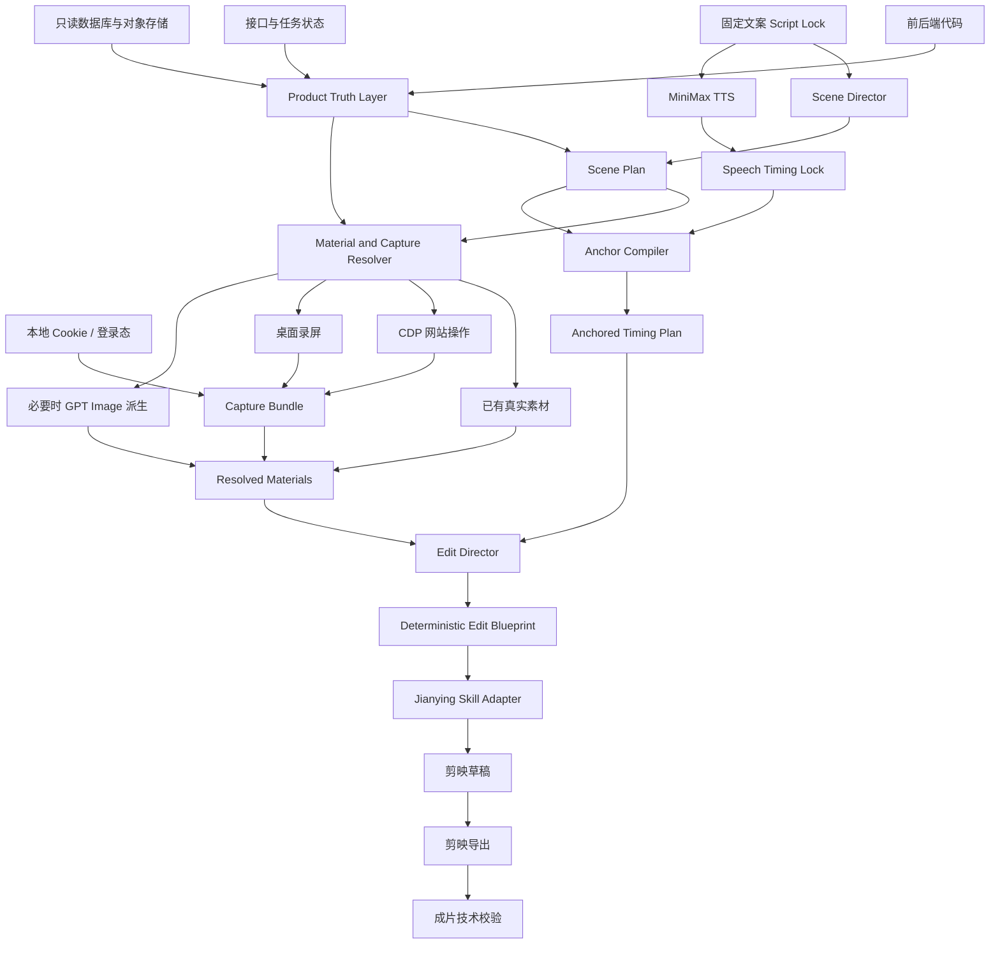

# Video Agent 剪映 Skill 驱动架构初版构想

状态：初版流程草案，仅用于方向对齐，暂不进入代码实施。

日期：2026-07-23

## 1. 背景

当前 Video Agent 已经具备文案解析、MiniMax TTS、词级时间戳、场景语义、素材注册、素材关系、字幕编译和音效卡点等基础能力，但最终画面主要依赖程序化渲染和有限的动效模板，视觉表现仍然偏机械。

下一版准备将剪映作为主要的视频编辑与导出环境，通过 Agent Skill 统一调度：

- 固定文案与场景分类；
- 产品代码、接口、数据库和真实素材关系；
- CDP 网站操作与录制；
- 桌面录屏与鼠标事件；
- MiniMax TTS 及词级卡点；
- 剪映原生关键帧、转场、特效、字幕和音频；
- 剪映草稿生成与成片导出。

本次调整不是放弃所有现有能力，而是将现有可靠的语义、素材和时间基础，连接到更适合视频剪辑的剪映执行层。

## 2. 核心目标

1. 对外提供一个完整的 Video Producer Skill，一次调用即可完成视频生产。
2. 网站画面、素材关系和功能流程以真实产品事实为准，不再依赖截图猜测。
3. 口播、字幕、画面重点、鼠标点击和音效继续共用词级时间锚点。
4. Agent 负责语义理解和导演决策，程序负责素材查询、时间编译和剪映工程执行。
5. 使用剪映原生关键帧、转场、文字动画和特效提高画面表现。
6. 每个 Run 生成可追溯的录屏素材、编辑蓝图、剪映草稿和最终视频。

## 3. 暂不包含的内容

初版不展开以下细节：

- 每一种剪映动效的具体参数；
- 完整的剪映原生素材 ID 清单；
- 所有网站功能的录制脚本；
- 面向任意产品的通用化；
- 多人协作和在线剪映工程管理；
- 自动评价视频审美质量。

初版先验证完整流程和关键边界，再逐步丰富视觉模板。

## 4. 总体原则

### 4.1 时间是硬合同

固定文案不会被剪辑阶段改写。MiniMax TTS 生成后，系统形成不可变的词级时间事实。

以下内容必须绑定同一 Phrase Anchor：

- 对应口播短语；
- 字幕出现与高亮；
- 画面或录屏片段切换；
- 鼠标点击反馈；
- 画面推近或局部聚焦；
- 对应音效峰值。

剪映只执行已经编译好的时间安排，不自行重新决定卡点。

### 4.2 产品事实与视频叙事分离

前后端代码、接口、数据库和对象存储负责回答：

- 产品有哪些功能；
- 页面如何进入；
- 参数有哪些；
- 任务何时完成；
- 哪些素材属于同一次生成；
- 参考图、结果图、编辑图和平面图是什么关系。

Agent 负责回答：

- 文案当前在讲什么；
- 应展示哪个产品能力；
- 应使用图片、录屏还是流程关系；
- 使用什么编辑表达更合适。

### 4.3 剪映是执行层

剪映 Skill 负责草稿、轨道、关键帧、特效、字幕、音频和导出，不承担产品事实判断，也不根据自然语言临时修改时间线。

## 5. 总体流程



## 6. 核心模块

### 6.1 Video Producer Skill

对外只暴露一个生产 Skill，内部编排项目能力和独立的剪映基础 Skill。

```text
video-agent-jianying-producer
├── Product Truth
├── Scene Director
├── Material and Capture Resolver
├── MiniMax Timing
├── Edit Director
├── Edit Blueprint Compiler
└── Jianying Adapter
    └── jianying-editor-skill
```

对使用者来说是一套大 Skill；在实现上仍保持业务编排和通用剪映封装分离，便于单独升级剪映适配层。

### 6.2 Product Truth Layer

产品事实层统一读取：

- 前端路由、菜单、组件、表单字段和稳定选择器；
- 后端接口、请求参数、任务状态和结果结构；
- 数据库中的业务分类、生成记录和素材关系；
- 对象存储中的参考图、结果图、编辑图和平面图；
- 本地CDP认证状态。

它输出标准化注册信息：

```text
FeatureRegistry
OperationRegistry
CaptureRecipe
GenerationJob
AssetLineage
MaterialCandidate
```

Agent 只接收必要的结构化摘要，不接收Cookie、数据库密码、宿主机绝对路径或无关业务数据。

### 6.3 Scene Director

Scene Director 根据文案和产品事实划分场景，并描述视觉义务，例如：

- 网站主页或导航；
- 功能入口；
- 参数填写；
- 单张结果展示；
- 多结果轮播；
- 参考图到结果图；
- 结果图到编辑图；
- 结果图到平面图；
- 无直接素材的文字过渡。

它不输出精确帧号、剪映坐标或原生特效 ID。

### 6.4 Material and Capture Resolver

素材解析顺序：

```text
真实数据库关系与对象存储素材
> 后端接口返回的真实素材
> CDP 当前页面结果
> 已注册的独立素材
> GPT Image 派生素材
```

当场景需要真实网站操作时，Resolver 生成 Capture Recipe；当存在真实结果素材时，优先使用真实素材；只有真实链路缺少可展示状态时，才允许派生。

### 6.5 Capture Layer

采集层提供统一接口，初步包含两个实现：

#### CDP Web Capture

- 复用浏览器登录态；
- 按 Capture Recipe 操作网页；
- 读取DOM目标和视口坐标；
- 记录操作语义和页面状态；
- 等待目标状态稳定后继续；
- 输出网页录屏、操作事件和状态证据。

#### Desktop Recorder

- 使用剪映 Skill 的 FFmpeg 录屏能力；
- 记录鼠标点击、移动和按键时间；
- 用于CDP无法控制的软件或桌面流程；
- 输出录屏和归一化事件文件。

两种实现统一输出 `CaptureBundle`，至少包含：

```text
video
source timing
viewport or screen profile
interaction events
semantic action labels
state checkpoints
technical metadata
```

点击圆圈、缩放和花字原则上不烧录进原始视频，而是在剪映工程中作为独立轨道生成。

### 6.6 MiniMax Timing

固定文案先生成完整口播，再形成词级时间锁。字幕分句可根据语义和安全区调整，但不能改变原文，也不能脱离词级时间。

录屏的自然操作节奏与口播长度可以不同。后续通过裁剪、变速和停留，将录屏源事件映射到目标 Phrase Anchor。

### 6.7 Edit Director

Edit Director 根据场景、素材方向、时长和上下文选择编辑意图，例如：

- 页面操作聚焦；
- 点击后推近；
- 单图展示；
- 同组图片轮播；
- 前后对比；
- 流程演示；
- 花字强调；
- 轻量无素材过渡。

同一连续组保持一致的转场方向、容器和节奏。具体剪映能力由注册表解析，不由Agent猜测。

### 6.8 Edit Blueprint Compiler

这是卡点与剪映之间的确定性边界。

主要输出：

- 素材轨道和层级；
- 每段素材的源入点、源出点和目标区间；
- 裁剪、变速和停留；
- 缩放、平移、旋转、透明度关键帧；
- 鼠标、点击、花字和字幕轨；
- 剪映转场与原生特效引用；
- TTS、SFX和BGM轨；
- 安全区和横竖屏布局。

一个录屏点击事件经过编译后，应满足：

```text
source click time
→ clip trim / speed mapping
→ target Phrase Anchor
→ click marker + zoom + subtitle highlight + SFX hit
```

### 6.9 Jianying Skill Adapter

Adapter 将 `EditBlueprint` 转换为剪映草稿：

- 创建1080×1920、30fps工程；
- 导入MiniMax口播，不使用剪映 Skill 自带TTS；
- 创建视频、图片、字幕、贴纸、特效和音频轨；
- 写入微秒级关键帧；
- 解析已同步的剪映特效和转场；
- 保存草稿；
- 调用自动导出能力；
- 返回工程路径和最终视频路径。

每次生产创建独立草稿，不修改共享模板或其他Run。

## 7. 主要中间产物

初版建议保留以下可检查产物：

```text
script_lock.json
product_truth.snapshot.json
scene_plan.json
speech_timing_lock.json
capture_plan.json
capture_bundle.json
resolved_materials.json
anchored_timing_plan.json
edit_blueprint.json
jianying_project_manifest.json
final.mp4
```

这些产物用于恢复、定位问题和重新生成剪映草稿，不要求依赖自然语言聊天上下文。

## 8. 本地凭证与数据边界

前后端代码可进入本地索引。Cookie、数据库连接和供应商密钥只允许进入本地忽略文件，例如：

```text
.env.local
config/product.local.json
config/database.local.json
cdp-capture/auth_state.local.json
```

约束：

- 数据库使用只读账号或只读副本；
- 查询使用白名单；
- Cookie与连接串不进入Prompt、Trace和Git；
- Agent只读取结构化查询结果；
- 写操作只允许在明确的测试账号和测试环境执行；
- 所有网站生成操作记录任务ID和结果ID。

## 9. 初版验证范围

第一版只验证一条黄金流程：

```text
固定文案
→ MiniMax口播
→ 打开网站主页
→ 点击文生图
→ 进入具体功能
→ 展示参数页
→ 展示结果图
→ 剪映添加点击、推近、字幕和音效
→ 剪映导出成片
```

验收重点：

1. 产品操作与素材关系真实；
2. 点击、字幕、画面和音效命中同一词级锚点；
3. 竖屏安全区与画面比例正确；
4. 剪映草稿可打开、可继续人工编辑；
5. 自动导出的视频可正常解码；
6. 同一输入可以稳定重建相同结构的草稿。

## 10. 分阶段落地建议

### 阶段 A：剪映能力探针

确认当前本机剪映版本、草稿结构、竖屏项目、字幕、关键帧、原生特效和自动导出能力，建立明确的支持矩阵。

### 阶段 B：Edit Blueprint 最小闭环

暂时复用现有图片素材和MiniMax时间，只将当前编译结果转换为剪映草稿，验证剪映执行层。

### 阶段 C：CDP 与录屏接入

增加 Capture Recipe、网页状态验证和录屏事件映射，完成真实网站操作场景。

### 阶段 D：产品事实层接入

接入前后端代码索引、只读数据库和对象存储关系，使场景和素材选择建立在真实业务链路上。

### 阶段 E：视觉能力扩展

逐步注册剪映原生动效、转场、花字、蒙版、组合片段和模板草稿。

### 阶段 F：生产切换

剪映链路达到稳定性和视觉目标后，再移除旧的Remotion生产渲染路径。此前保留旧链路仅作为比较和回滚手段，不继续扩展旧动效体系。

## 11. 当前主要风险

- 剪映草稿格式和原生素材 ID 随版本变化；
- 自动导出依赖Windows UI自动化，可能受剪映版本影响；
- 桌面录屏受DPI、多显示器和窗口遮挡影响；
- FFmpeg录屏时钟与鼠标事件时钟存在启动偏差；
- 原始操作节奏与口播时长不一致；
- 登录态、数据库和对象存储涉及敏感本地配置；
- Agent若直接生成剪映操作步骤，可能破坏时间确定性。

因此必须锁定剪映版本、Skill版本、画布参数和时间转换规则，并让所有剪映操作通过结构化 `EditBlueprint` 执行。

## 12. 初步结论

新架构的核心不是让Agent自由操作剪映，而是：

```text
产品事实保证素材与流程真实
Agent完成场景与导演判断
MiniMax提供词级时间事实
程序编译精确剪辑蓝图
剪映负责丰富的视觉表达和最终导出
```

这个方向能够保留现有系统最有价值的语义、素材和卡点能力，同时解决当前程序化动效表现不足的问题。
