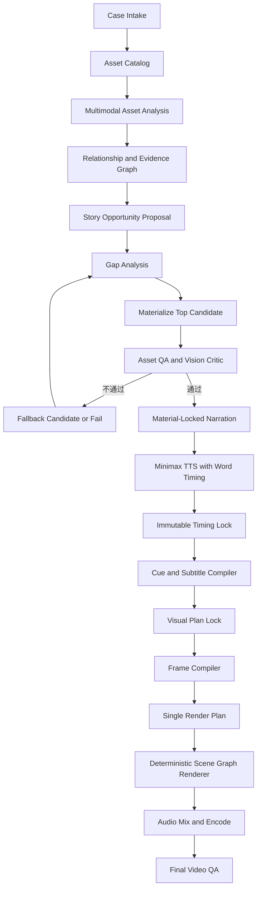

# Video Agent V3 终极设计

> 状态：终极设计基线，吸收专业剪辑评审与 AI/人工成片对比结论
>
> 日期：2026-07-10
>
> 适用范围：基于现有图片、网站截图、真实结果图及其受控派生素材，生成 9:16 高质量短视频
>
> 核心原则：不兼容 V2，不迁移历史项目格式，不保留双链路；只保留经验证有价值的算法和视觉能力

## 1. 最终结论

V3 应当作为一个全新的“素材驱动、词级定时、确定性渲染”系统实现，而不是继续扩展 V2 的脚本流水线。

系统只有两个最高目标，优先级不可交换：

1. **声音、画面、字幕准确卡点**：字幕词、视觉语义命中和音效命中共享同一个 Minimax 词级时间锚点，语义命中误差不超过 1 帧。
2. **高质量短视频观感**：节奏紧凑但不慌乱，画面有层次、鲜活感和呼吸感；每个叙事事实必须由现有素材或可追溯派生素材承载。

V3 默认采用以下生产顺序：

```text
素材注册与理解
→ 素材关系和可讲事实
→ 必要派生与质量验收
→ 基于已验收素材写口播和分镜意图
→ Minimax 一次性配音并返回 word timing
→ 不可变音频时间锁
→ 语义 Cue 编译
→ 镜头、字幕、SFX 共用 Cue
→ 单一 Render Plan
→ 确定性场景图渲染
→ 最终成片 QA
```

这里最重要的调整是：**默认先确定能展示什么，再决定具体怎么讲**。不得再生成脱离素材的口播，然后依靠模糊匹配或虚构画面补救。

## 2. 对 V3.2 的评价

`video_agent_v3_ai_orchestration_design_v3_2.md` 的总体方向正确，值得保留的部分包括：

- Minimax word timing 作为唯一时间权威；
- AI 负责语义与审美决策，程序负责帧级编译；
- 先理解素材关系，再选择镜头模板；
- 引入引用图派生、证据分级和视觉 Critic；
- 使用 Python 场景图形成可控动画；
- 用能量预算限制特效堆砌；
- 提示词外置并记录哈希；
- 最终只验收实际交付视频。

但 v3.2 不宜直接进入开发，必须修正以下架构问题：

### 2.1 时间锁混入了视觉决策

v3.2 在 `timing_lock.json` 中放入 `reference.show`、`result.reveal` 等动作。此时视觉方案尚未选定，会造成“不可变时间锁”反过来预设视觉方案。

最终设计规定：

- `timing_lock.json` 只保存音频、词和短语锚点的客观时间事实；
- `show`、`reveal`、`click`、`compare` 等视觉动作只能出现在 `visual_plan.json`；
- `render_plan.json` 将视觉动作编译为绝对帧。

### 2.2 “误差 1 帧”没有区分动作起点和语义命中

一个自然的拉近镜头通常需要在关键词前开始蓄势，在关键词处到达重点，然后稳定展示。若把整个动画起点都限制在关键词帧，画面会显得迟钝且机械。

V3 将一个语义动作拆为三段：

```text
anticipation  蓄势，可比关键词提前 3-7 帧
hit           语义命中，必须对齐关键词，误差 <= 1 帧
settle/hold   回稳与阅读，按模板预算持续
```

QA 检查的是 `hit_frame`，不是动画最早出现的帧。

### 2.3 正式契约过多，阶段草稿被误当成系统真相

素材关系图、候选策略和派生计划都有价值，但它们是一次运行中的推理产物，不应全部成为跨模块长期维护的正式契约。

V3 只保留七类权威产物，其他内容统一放入 `runs/<run_id>/work/`：

1. `case.json`
2. `asset_catalog.json`
3. `narration.json`
4. `timing_lock.json`
5. `visual_plan.json`
6. `render_plan.json`
7. `run_manifest.json` 与 `qa_report.json`

### 2.4 Agent 数量过多

v3.2 中的 Agent 应理解为职责，而不是十多个相互独立的智能体调用。过度拆分会导致上下文丢失、规则冲突、成本膨胀和不可复现。

V3 使用一个确定性 Orchestrator，最多组织四类多模态 AI 调用：

1. 素材批量分析与关系发现；
2. 故事、口播与镜头候选联合规划；
3. 派生素材生成；
4. 候选图和最终成片视觉审查。

其余步骤全部是 schema 校验、规则编译或确定性渲染。

### 2.5 派生素材的证据边界不够严格

“参考图生成结果”不能被当成网站真实生成结果；AI 生成的编辑器后态也不能证明产品真实能力。

V3 明确区分：

- 原始证据素材可以支持产品事实；
- 保真派生只对未改动区域继承证据；
- 语义派生只能支持概念表达；
- 装饰素材不支持事实。

### 2.6 实施顺序过宽

不应先建设完整 Agent 群、多个渲染后端和大量模板。应先做一条可交付的垂直链路，再扩展视觉能力。

### 2.7 提示词外置不能放在最后阶段

提示词、模型、参数和输入哈希是 AI 产物可追溯的基础，应从第一次 AI 调用开始存在。硬性规则必须写在代码和 schema 中，不能依赖提示词自觉遵守。

### 2.8 与最新 V2 代码的关系

PR #1 及 master 当前代码只用于确认 V2 的真实现状，不代表 V3 已经实现，也不约束 V3 的模块边界。

最新代码验证了部分算法和测试思路可以复用：

- 透视拉近等程序化图片特效具备可用原型；
- 相邻字幕片段复用同一画面时，应先合并视觉组，再按总时长规范化特效；
- 特效时长、透视效果和视觉分组适合建立独立确定性测试。

同时，最新代码仍证明 V2 架构不适合继续扩展：

- `run_pipeline_mode.py` 的正式渲染没有统一纳入特效计划，`render_with_effects.py` 仍是旁路入口；
- 特效旁路没有完整串联 contact sheet 和最终 render QA；
- `build_subtitle_track.py` 在精确匹配失败后仍会退化为按时长比例分配；
- `prepare_gpt_image_keyframes.py` 会把刚生成的素材直接写成 `ai_verified=true`；
- Minimax 默认速度统一为 `1.5`；
- `render_simple_ffmpeg.py` 仍通过包装 `render_simple_ffmpeg_legacy.py` 工作；
- schema 中存在 `audio_tracks`，当前成片渲染仍主要只接入 Voice。

这些是 V3 需要解决的问题清单，不是要求 V3 兼容的接口清单。V3 开发完成后应删除对应旧链路，而不是继续包装。

### 2.9 专业评审与两版成片对比结论

本轮对比素材：

- AI 版：`cases/vi_seed_effects_20260710/output/versions/vi_fx_v3.mp4`
- 人工版：`cases/vi_seed_effects_20260710/output/versions/VI人工剪辑版.mp4`
- 人工版中的真人讲解画面不作为 V3 必需能力，只分析其余剪辑语言。

量化结果：

| 项目 | AI 版 | 人工版中可借鉴部分 |
|---|---|---|
| 总时长 | 26.08s，其中主片 22.6s | 33.85s，包含真人讲解 |
| 前半段信息密度 | 前 11.1s 只有首页、入口、参数页 3 个视觉状态 | 同一时段拆分为结果、入口、上传区、品牌名、行业等多个状态 |
| 最长单状态 | 参数整页约 4.67s | UI 演示通常每 0.8-1.5s 出现一次新重点 |
| 字幕 | 字号 78，单 cue 可达 22 字，出现两行 | 短句单行，重点词更明确 |
| 构图 | 页面和结果图经常接近全屏，平台遮挡风险高 | 内容卡片位于网格舞台内，四周保留呼吸空间 |
| UI 强调 | 整页发光框，重点不明确 | 镜头更近，按语义依次强调上传区、品牌名和行业 |
| 特效 | 首页 `drop_bounce`，三张结果连续 `radial_unfurl` | 以切换、推近、缩放和淡变为主 |
| Hook | 口播说“LOGO 延展成 VI”，画面却先展示网站首页 | 开头先展示 Logo 和 VI 结果，再解释工具路径 |
| 结果展示 | 多张长图重复全屏或同类入场 | 全景、局部和不同结果快速交替 |

这次对比形成十项终极修订：

1. 画布仍为 1080x1920，但内容不再默认铺满；背景层、内容舞台和关键安全区分层定义。
2. 一个页面截图可以编译成多个“原像素状态镜头”，按口播词级 Cue 依次突出不同区域。
3. 参数页默认只展示参数主体，不重复展示无关页头、空白和整页外框。
4. 字幕强制单行，每条建议不超过 10 个中文全角单位，超长内容拆成连续 cue，不换行。
5. Minimax 文本在重要标点和 Beat 边界使用受控停顿标签，合成后仍以真实 word timing 重锁时间轴。
6. 横图上下留白统一使用低对比网格或品牌背景，不用纯黑，也不抢主体。
7. 动效白名单收敛为切换、翻页、大小缩放和淡入淡出；复杂装饰动效默认禁用。
8. 视觉密度按“语义状态变化”而不是文件切换次数衡量，任何 2.2s 以上无有效变化都必须有明确阅读理由。
9. “几分钟搞定”“自动匹配”等效率或机制话术必须由真实生成回执、操作记录或参数到结果关系支撑，单张结果图不能证明。
10. CTA 优先叠加在最后一张结果上，独立品牌片尾目标 0.8-1.2s、硬上限 1.5s；当前约 3.45s 的独立片尾不再作为默认值。

## 3. 非目标和删除原则

V3 不做以下事情：

- 不读取或转换 V2 的 `video_project*.json`；
- 不保留“基础版”和“特效版”两条成片链路；
- 不以大量平铺脚本作为公共 API；
- 不让 LLM 直接计算逐帧参数；
- 不让 GPT Image 重画真实网站 UI；
- 不用生成图证明网站实际输出；
- 不在首版引入 ModernGL、多渲染后端或可视化 Prompt 平台；
- 不为复用历史 case 保留兼容适配层。

现有 V2 代码仅有三类内容可以作为实现参考：

- 已验证的图片合成、字幕样式和 FFmpeg 编码参数；
- 已验证的视觉算法，例如透视拉近、擦除、卡片入场；
- 真实素材注册、CDP 截图和 Minimax 调用经验。

这些能力应移植为 V3 原生模块，不直接导入 V2 模块，也不保留 `legacy` 包装。

## 4. V3 单一流水线



任何正式运行都必须进入同一个 DAG。预览只是降低分辨率、关闭昂贵 QA 或复用缓存，不能改用另一套逻辑。

## 5. 素材先行与文案生成

### 5.1 默认模式：`material_first`

系统先从已验收素材中建立“可讲事实池”，再生成口播：

```json
{
  "claim_id": "claim_vi_expand",
  "claim": "一个品牌标识可以延展成完整 VI 视觉体系",
  "supporting_asset_ids": ["asset_logo", "asset_vi_board_01"],
  "relationship": "identity_to_system",
  "allowed_wording": "conceptual",
  "forbidden_wording": ["网站已经自动生成了这套结果"]
}
```

口播生成器只能使用事实池中的 claim，并必须为每个句段回写 `claim_ids` 和 `visual_beat_id`。

### 5.2 锁定文案模式：`script_locked`

用户明确要求原文不改时，系统先做可视化覆盖检查：

- 每个事实句是否存在匹配素材；
- 每个动作词是否存在可实现视觉动作；
- 总时长是否符合短视频范围；
- 是否包含派生素材不能证明的产品事实。

任何硬缺口必须失败并输出报告，不能静默换图、编造结果或把口播强行加速。

### 5.3 文案与镜头共同规划

口播不是独立文本任务。每个 Beat 必须同时定义：

- 讲什么；
- 用哪张或哪组素材证明；
- 哪个词是视觉命中点；
- 需要怎样的进入、命中和稳定阶段；
- 最低可读时长；
- 证据等级和允许措辞。

镜头候选只写语义意图和模板需求，不写秒数和逐帧参数。

## 6. 权威数据契约

### 6.1 `case.json`

保存本次任务目标、画幅、时长策略、语言、品牌约束和用户输入，不保存运行中间状态。

```json
{
  "schema_version": 3,
  "case_id": "vi_seed_001",
  "mode": "material_first",
  "format": {"width": 1080, "height": 1920, "fps": 30},
  "platform_profile": "douyin_portrait_v1",
  "duration_policy": {"preferred_sec": [15, 20], "hard_max_sec": 24},
  "voice": {
    "provider": "minimax",
    "model": "speech-2.8-hd",
    "speed": 1.5,
    "pause_profile": "short_video_natural_v1",
    "subtitle_type": "word"
  },
  "goal": "介绍文生图 VI 功能"
}
```

### 6.2 `asset_catalog.json`

这是唯一素材事实来源。所有原图和派生图都必须注册，不再维护平行 manifest。

核心字段：

```json
{
  "asset_id": "asset_vi_board_01",
  "uri": "assets/results/文生图/VI/科技/柯幻熊猫_文生图_VI_科技_结果图_01.png",
  "sha256": "...",
  "media_type": "image",
  "semantic_path": ["文生图", "VI", "科技"],
  "role": "result",
  "evidence_class": "source_evidence",
  "claims": ["claim_vi_result"],
  "identity_group": "brand_x",
  "visual_anchors": [],
  "quality": {"status": "approved", "checks": []},
  "provenance": {"origin": "user", "parent_asset_ids": []}
}
```

### 6.3 `narration.json`

保存最终口播文本、TTS 标记文本、Beat、事实绑定和期望命中短语。`spoken_text` 是字幕和语义的干净文本，`tts_markup_text` 允许加入 Minimax 停顿标签。它们在 TTS 前一起锁定，TTS 后不得偷偷修改。

```json
{
  "beats": [
    {
      "beat_id": "beat_03",
      "spoken_text": "一个简单标识，就能延展成完整的 VI 视觉体系。",
      "tts_markup_text": "一个简单标识<#0.12#>就能延展成完整的 VI 视觉体系。",
      "claim_ids": ["claim_vi_expand"],
      "asset_slots": ["identity_source", "vi_result"],
      "hit_phrases": ["简单标识", "完整的VI视觉体系"],
      "pause_intents": [
        {"after_phrase": "简单标识", "kind": "micro", "requested_ms": 120}
      ]
    }
  ]
}
```

### 6.4 `timing_lock.json`

只保存音频客观事实，不出现任何镜头或特效名称。

```json
{
  "audio_sha256": "...",
  "fps": 30,
  "duration_ms": 18420,
  "duration_frames": 553,
  "tokens": [
    {
      "token_id": "tok_021",
      "text": "标识",
      "start_ms": 3120,
      "end_ms": 3490,
      "start_frame": 94,
      "end_frame": 105
    }
  ],
  "phrase_anchors": [
    {
      "anchor_id": "anchor_vi_result",
      "text": "完整的VI视觉体系",
      "token_ids": ["tok_027", "tok_028", "tok_029"],
      "hit_frame": 132
    }
  ],
  "pause_events": [
    {
      "pause_id": "pause_03_01",
      "after_token_id": "tok_021",
      "requested_ms": 120,
      "measured_start_frame": 105,
      "measured_end_frame": 109,
      "measured_frames": 4
    }
  ]
}
```

时间转换只能由一个公共函数完成，并固定舍入策略。所有轨道只引用 frame，不在下游重复使用浮点秒计算。停顿帧必须来自合成后音频和返回时间戳的实测结果，不得直接把请求的 `120ms` 当成最终真值。

### 6.5 `visual_plan.json`

保存已经过证据检查和素材 QA 的最终镜头选择，但仍使用语义锚点，不保存展开后的逐帧数据。

```json
{
  "shots": [
    {
      "shot_id": "shot_03",
      "beat_id": "beat_03",
      "template": "identity_to_system_reveal",
      "asset_bindings": {
        "identity_source": "asset_logo_isolated",
        "result": "asset_vi_board_01"
      },
      "cue_bindings": [
        {"action": "identity.hit", "anchor_id": "anchor_logo"},
        {"action": "result.reveal", "anchor_id": "anchor_vi_result"}
      ],
      "energy": "high",
      "evidence_policy": "source_pixels_visible"
    }
  ]
}
```

### 6.6 `render_plan.json`

这是渲染器唯一输入，包含所有绝对帧、图层、关键帧、字幕、音频和安全区数据。生成后禁止 LLM 修改。

### 6.7 `run_manifest.json` 与 `qa_report.json`

`run_manifest.json` 记录：

- 输入和输出文件哈希；
- 模型、供应商、参数、调用回执；
- 提示词文件路径、内容哈希和渲染后的完整 prompt 哈希；
- Python、Pillow、OpenCV、FFmpeg 和字体版本；
- 随机种子与缓存命中；
- 各阶段耗时、重试和成本。

`qa_report.json` 只评价最终交付 MP4，同时引用素材级和计划级检查结果。

## 7. 词级时间、字幕和视觉卡点

### 7.1 唯一时间权威

Minimax 以 `subtitle_type=word` 一次性生成整段口播和词级时间戳。默认使用 `speech-2.8-hd`、语速 `1.5`，除非 case 显式覆盖。

严格来说，最终时间权威由两部分共同组成：

1. 实际返回的音频字节决定总时长和真实听感；
2. Minimax word timing 决定词的初始时间边界。

word timing 必须通过音频 VAD 或强制对齐抽检。若停顿标签导致词起点、词终点或标点时长异常，允许重新合成或判定失败，不允许下游凭感觉修正。当前案例中句号后的停顿被部分吸收到后一个 token 的长时段里，说明 V3 必须先完成停顿标签的实测校准，再锁定视觉 Cue。

不允许：

- 根据字数比例推算字幕时间；
- 按文案段落平均分配时长；
- 多段分别合成后拼接语音；
- 为满足画面长度偷偷拉伸或压缩语音；
- 下游重新计算另一套时间轴。

词级匹配失败、缺词、乱序、覆盖率不足，或音频抽检误差超过 1 帧时，任务直接失败。

### 7.2 同源 Cue

字幕、视觉和 SFX 必须引用同一个 `anchor_id`：

```text
Minimax token range
├─ subtitle phrase start/end
├─ visual hit_frame
├─ subtitle keyword emphasis
└─ SFX hit_frame
```

因此“听到什么、看到什么、字幕强调什么”天然一致，而不是三套时间表事后对齐。

### 7.3 动作三相模型

每个可见动作编译为：

```json
{
  "action": "result.reveal",
  "anchor_id": "anchor_vi_result",
  "anticipation_frames": 5,
  "hit_frame": 132,
  "settle_frames": 8,
  "hold_frames": 18
}
```

约束：

- `hit_frame` 与锚点误差不超过 1 帧；
- anticipation 默认 3-7 帧，不得提前泄露完整结果；
- 强动作后稳定期不少于 10 帧；
- UI 主体稳定可读时间不少于 36 帧；
- 结果图单张有效展示通常不少于 22 帧；
- 镜头结尾不得在文字仍未读完时离场。

### 7.4 字幕编译

字幕直接由 token 流按语义短语组装：

- **只允许单行，不允许自动换行**；
- 每条目标长度 6-10 个中文全角单位，硬上限 10；
- 英文、数字和标点按视觉宽度换算为全角单位，不按字符数量粗算；
- 不拆开专有名词、品牌名和关键短语；
- 每条字幕首尾来自首末 token；
- 关键词强调与视觉命中共享 anchor；
- 每条最多强调一个关键词，可使用品牌强调色或 4%-8% 的瞬时字号变化，不能让整行跳动；
- 字幕框不得遮挡 UI 目标、Logo、人物主体和结果图关键内容；
- 超过 10 个单位时按 phrase anchor 拆为前后连续字幕，不得缩字号或改成两行兜底；
- 同一帧只出现一条主字幕，编辑标签和字幕不得表达重复内容；
- 无合法断句方案时失败，不用缩到不可读字号兜底。

字幕区域不是固定在画面底部。布局器在两个安全槽中选择：

- `subtitle_top`：适合页面主体位于中下部，默认优先；
- `subtitle_lower`：适合主体位于上半部，但必须避开抖音底部文案区。

选择结果写入 Render Plan，渲染后用平台遮挡蒙版做逐帧碰撞检查。

### 7.5 标点停顿与节奏

MiniMax 同步语音接口支持在两个可发音文本之间插入 `<#x#>`，`x` 单位为秒、范围为 0.01-99.99，且不能连续使用多个停顿标记。V3 不把标签简单地加在所有标点后，而是由 `Pause Compiler` 根据句法和镜头节奏选择。

首版停顿档位：

| 类型 | 建议请求值 | 适用位置 | 画面行为 |
|---|---:|---|---|
| `micro` | 0.08-0.12s | 短并列、关键词前 | 保持当前镜头，准备下一 hit |
| `short` | 0.14-0.20s | 逗号后的语义转折 | 完成 settle，可切换焦点 |
| `beat` | 0.22-0.32s | 句号、Beat 边界 | 允许切镜或插入短品牌镜 |
| `section` | 0.32-0.45s | 操作转结果、结果转 CTA | 完成一次明确段落换气 |

规则：

- 原始标点已有自然停顿时，不重复叠加标签；
- `tts_markup_text` 与干净的 `spoken_text` 分开保存；
- 停顿标签不得进入字幕文本和词语匹配文本；
- 合成后保存 `requested_pause` 与 `measured_pause`，以实测值编译画面；
- 句中停顿优先用于回稳和焦点交接，不得为了填停顿塞入无关图片；
- 全片显式停顿总量建议为口播时长的 4%-8%，超过 10% 需要重新审稿；
- 每种模型、音色和语速都要通过带逗号、句号、英文缩写和停顿标签的校准用例。

官方能力依据：[MiniMax 同步语音合成 HTTP 文档](https://platform.minimaxi.com/docs/api-reference/speech-t2a-http)。

## 8. 短视频节奏设计

### 8.1 节奏不是平均切片

短视频需要变化，但不应每秒都做强动作。V3 先生成全片 `rhythm_profile`，再决定单镜头节奏。

镜头容器可以持续 3-4 秒，但容器内部必须随着语义发生状态变化。例如参数页可以依次经历“上传区聚焦 → 品牌名称聚焦 → 行业聚焦 → 生成按钮命中”，而不是整页静止 4.7 秒。V3 统计的是 `semantic_visual_event`，不是素材文件数量。

推荐的 15-20 秒功能种草结构：

| 区间 | 叙事职责 | 视觉能量 |
|---|---|---|
| 0-1.5s | Hook，先给结果或核心变化 | 高 |
| 1.5-5s | 入口与操作路径，快速建立可信度 | 中 |
| 5-10s | 参数或输入，按词切换焦点 | 中低，强调可读 |
| 10-17s | 多结果、对比或能力展开 | 中高 |
| 17-20s | 价值收束和 CTA | 中，稳定结束 |

该结构是节奏轮廓，不是固定模板。具体边界由词级音频和素材信息量共同决定。

### 8.2 呼吸感的来源

呼吸感来自受控变化，不来自一直缩放：

- 动作前有短蓄势，动作后有回稳；
- 强镜头和稳定镜头交替；
- 前景、主体和背景使用不同幅度的微动；
- 结果图以轻微推进、卡片错层或轮播进入，主体内容保持稳定；
- UI 阅读时冻结主运动，只保留光标、柔和高亮或极弱背景视差；
- 字幕出现时降低背景运动和局部对比度；
- 连续镜头避免相同方向、相同时长和相同模板机械重复。

### 8.3 能量预算

- 平均每 2 秒最多一个强命中；
- 连续最多两个高能镜头；
- 同屏最多三个高动态层；
- 同一模板连续使用不超过两次；
- 强运动后至少 10 帧稳定；
- UI 阅读阶段禁止持续透视变化；
- 每 4-7 秒至少安排一个低运动呼吸镜头；
- 转场不能覆盖关键词命中帧。

### 8.4 视觉信息密度

首版密度约束：

- 0.8 秒内必须出现第一个有效画面，Hook 不得先展示无关首页；
- 操作演示阶段相邻语义视觉事件的目标间隔为 0.6-1.4 秒；
- 结果展示阶段目标间隔为 0.9-1.8 秒；
- 任意 2.2 秒以上没有语义变化必须声明 `long_hold_reason=reading|appreciation|pause`；
- 4 秒以上单状态一律失败；
- 同一截图可以产生多个焦点状态，但每个状态必须绑定不同的字幕短语或操作 Cue；
- 不能通过无意义抖动、粒子或循环缩放伪造“画面变化”；
- 15-20 秒视频建议包含 12-18 个语义视觉事件，通常由 7-12 个镜头容器承载。

人工版值得借鉴的是状态密度和焦点切换，不是盲目增加硬切。稳定阅读仍必须保留，只是稳定对象应当是当前正在讲述的区域。

## 9. 素材关系、引用和派生

### 9.1 四级信任模型

| 等级 | 类型 | 是否可证明产品事实 | 允许处理 |
|---|---|---:|---|
| E0 | `source_evidence` | 是 | 像素级缩放、裁切、遮罩、合成 |
| E1 | `faithful_derivative` | 仅未改动区域 | 原像素抠图、扩展画布、布局重组 |
| E2 | `semantic_derivative` | 否 | 参考图派生的概念画面、过渡画面 |
| E3 | `decorative` | 否 | 背景、纹理、光效、抽象元素 |

### 9.2 保真派生

对品牌 Logo、中文文字、网站 UI 和真实结果主体，优先生成遮罩，再把原始像素重新合成，而不是让模型重画。

首批保真派生任务：

- `crop_and_reframe`
- `canvas_extend`
- `subject_mask`
- `logo_isolate_original_pixels`
- `ui_focus_composite`
- `result_layout_composite`

例如 `logo_isolate` 的正确实现是：模型或分割算法只输出 mask，系统使用原图像素生成透明 Logo。不得接收模型重画的 Logo 作为品牌证据。

### 9.3 语义派生

语义派生用于让已有素材更适合表达概念和转场：

- `identity_to_system_transition`
- `reference_grounded_concept`
- `style_context_extension`
- `product_one_click_concept`
- `background_scene_reconstruct`
- `result_detail_stage`
- `result_context_stage`
- `logo_result_bridge`

语义派生必须带有 `supported_claims=[]`，不能出现在“这是网站真实生成结果”的叙述中。

GPT Image 增加画面状态时，优先生成“舞台、上下文和过渡”，再把真实原图作为独立像素层嵌回最终构图。例如由一张 VI 长图派生：完整安全舞台、Logo 局部原像素近景、应用系统局部原像素近景、Logo 到完整 VI 的概念桥接。前三者可以保留证据，概念桥接只能承担叙事过渡。单张主素材默认最多派生两个新增状态，超过时必须证明每个状态承载了不同信息。

### 9.3.1 页面状态派生

“增加画面”不等于为每句生成一张全新的图片。网站截图首先派生为保留原像素的状态组：

```text
参数页原图
├─ state_upload_focus
├─ state_brand_name_focus
├─ state_industry_focus
├─ state_generate_button_focus
└─ state_clean_params_overview
```

每个状态记录：

- `source_asset_id`；
- `focus_anchor_id`；
- 原图像素裁切范围；
- 目标字段组范围；
- 上下文扩张比例；
- 背景压暗强度；
- 可绑定的 phrase anchor；
- OCR 和几何保真检查。

焦点框不是文字检测框。以“品牌名称”为例，应包含图标、字段名、必填标记和输入框，并向外保留 8%-16% 的上下文；目标组在内容舞台中的可见宽度不得低于 38%，也不得大到覆盖参数面板的 75% 以上。这样既有辨识度，又能看出它位于什么页面。

默认强调样式：

- 非重点区域压暗 14%-24%，不做重模糊；
- 重点区域保持原亮度或轻微提升 4%-8%；
- 轮廓使用 5-8px 高对比描边、轻微外发光和短引导线；
- 可选手绘双线或半透明荧光笔底纹，但全片只使用一种强调语言；
- 不在整张参数面板外套统一霓虹框；
- 同一时刻只允许一个主重点，次重点最多一个且亮度低一级；
- 点击动作使用一个高对比光标和 6-8 帧点击脉冲，光标命中点必须落在目标锚点内部；
- 强调出现和消失均绑定词级 Cue。

GPT Image 可以参与状态图的画布扩展、背景生成或非证据装饰，但 UI、中文、输入框和 Logo 必须由原始截图像素重新合成到最终帧。若 GPT Image 输出改变网站内容，该状态直接拒绝。

### 9.3.2 IP、Logo 与字幕填充镜头

`assets/results` 中与柯幻熊猫相关的 IP、Logo 结果，以及站点吉祥物、品牌标识，可以注册为 `brand_cutaway` 或 `feature_cutaway`，用于解决纯页面视频过于单调的问题。

使用规则：

- 必须与当前口播的品牌、功能或视觉身份相关；
- 0.6-1.2 秒为宜，优先放在 `beat` 或 `section` 停顿处；
- 画面由一个清晰 IP/Logo 主体、低干扰背景和一条单行字幕组成；
- 20 秒视频最多使用两次，不能连续使用；
- 不得打断“参数输入 → 生成 → 结果”的因果链；
- 无关功能的 IP 或 Logo 只能作为明确标记的案例补充，不能伪装成当前功能结果；
- 若素材仅用于品牌呼吸镜，证据等级为 E3；若口播明确介绍该真实结果，则必须按 E0/E1 注册和引用。

这类镜头替代人工版中的真人切镜功能，为视频提供节奏换气，但不能成为缺少真实功能画面的借口。

### 9.4 派生闭环

```text
候选只描述所需素材槽
→ 规则判断是否已有素材
→ 先尝试保真派生
→ 必要时生成语义派生
→ 机器检查尺寸、文字、Logo、相似度和空白
→ Vision Critic 比较原图与派生图
→ 身份关键素材必要时人工批准
→ 注册到 asset_catalog
→ 重新评分镜头候选
```

不得一次生成每个 Beat 的全部候选素材。先用低成本结构化候选评分，只物化排名第一的方案；失败后才尝试第二方案。

### 9.5 关系图是运行中间产物

关系至少包括：

- `same_identity`
- `reference_to_result`
- `input_to_output`
- `before_to_after`
- `parameter_to_result`
- `detail_to_full`
- `workflow_transition`
- `same_feature_variant`

每条关系必须记录来源和置信度，例如文件名规则、pHash、OCR、视觉模型或人工确认。关系图不直接成为渲染输入，只用于规划。

## 10. AI 编排边界

### 10.1 AI 可以决定

- 素材表达了什么；
- 哪些素材属于同一功能或同一视觉身份；
- 哪些事实值得讲；
- Beat 如何组织；
- 每个 Beat 的候选素材和候选模板；
- 是否存在素材缺口；
- 生成任务的参考图角色与视觉目标；
- 成片是否美观、是否语义匹配。

### 10.2 AI 不可以决定

- 词级时间戳；
- 最终 `hit_frame`；
- 帧率和时间换算；
- 证据继承规则；
- 素材是否自动通过质量门；
- 渲染器支持哪些参数；
- 最终文件是否达到机器验收标准。

### 10.3 有界候选循环

每个 Beat 最多保留三个结构化候选：

1. 先做证据、安全区、时长和素材可用性硬过滤；
2. 对剩余候选做语义、视觉多样性和节奏评分；
3. 只物化最高分候选；
4. 物化后重新进行机器和 Vision 评分；
5. 失败则尝试下一候选；
6. 三个候选都失败则终止，不生成低质量成片。

### 10.4 提示词管理

首个 AI 阶段就引入最小外置提示词：

```text
prompts/
  asset_analysis.md
  story_and_shot_proposal.md
  materialization.md
  visual_critic.md
  final_video_critic.md
```

代码负责注入 schema、时间窗口、素材清单和硬约束。提示词负责语义判断、审美目标和候选多样性。每次运行冻结实际 prompt 文本和哈希。

## 11. 镜头模板与动画系统

### 11.1 三层结构

```text
Primitive       基础图层和原子动画
Effect Recipe   可复用的短动作
Shot Template   有叙事语义的完整镜头
```

AI 只能选择 Shot Template、素材槽和语义锚点。模板负责把锚点编译为 Primitive 和 Effect Recipe。

### 11.2 首批高价值模板

UI 类：

- `ui_home_to_feature`
- `ui_menu_focus`
- `ui_submenu_focus`
- `ui_params_walkthrough`
- `ui_perspective_push_in`
- `ui_one_click_generate`

结果与派生类：

- `result_safe_stage_hold`
- `result_full_to_detail`
- `result_carousel`
- `result_card_stack`
- `reference_to_result_reveal`
- `before_after_compare`
- `identity_to_system_reveal`
- `detail_to_full_reveal`
- `brand_ip_subtitle_break`

每个模板必须声明：

- 支持的素材槽；
- 最小、理想和最大帧预算；
- anticipation、hit、settle、hold 的分配规则；
- 证据要求；
- 字幕避让区域；
- 强度等级；
- 可降级变体；
- 不适用条件。

### 11.3 画面适配规则

- 1080x1920 是发布画布，不是内容必须铺满的区域；
- 背景层可以铺满画布，证据图和 UI 默认放在安全舞台内；
- 竖图按原比例置于安全舞台，建议宽度为画布的 66%-84%，不再默认左右撑满；
- 横图按原比例上下居中，宽度建议为画布的 74%-86%，上下留白使用低对比网格或品牌背景；
- 网站 UI 默认裁到当前功能或参数主体，不保留无关页头、大片空白和无关案例区；
- 网站 UI 可以做确定性的重点近景，但必须由视觉锚点和原像素裁切生成，不做无目标放大；
- 目标区域通过构图、原像素近景、压暗、光标和单一高亮共同强调；
- 结果图主体必须完整，不得为了动效切掉关键内容；
- 透视拉近只用于入场，命中后恢复到可读角度并稳定；
- 所有裁切参数由素材锚点和模板计算，不让模型输出随意坐标。

#### 抖音安全区配置

安全区必须是可版本化的 `platform_profile`，不能散落在模板参数中。基于本轮提供的抖音遮挡参考图，`douyin_portrait_v1` 首版采用以下 1080x1920 坐标：

```json
{
  "canvas": {"x": 0, "y": 0, "w": 1080, "h": 1920},
  "frame_safe": {"x": 48, "y": 96, "w": 964, "h": 1724},
  "content_safe": {"x": 100, "y": 186, "w": 856, "h": 1536},
  "critical_safe": {"x": 100, "y": 186, "w": 760, "h": 1314},
  "avoid_right_rail": {"x": 870, "y": 560, "w": 210, "h": 1040},
  "avoid_bottom_meta": {"x": 0, "y": 1540, "w": 930, "h": 380},
  "subtitle_top": {"x": 90, "y": 138, "w": 820, "h": 116},
  "subtitle_lower": {"x": 90, "y": 1320, "w": 760, "h": 116}
}
```

坐标含义：

- `frame_safe` 允许卡片阴影、装饰和非关键信息进入；
- `content_safe` 放主要图片和 UI 卡片；
- `critical_safe` 放 Logo、按钮、字段名、字幕关键词等不可遮挡内容；
- 右侧互动栏和底部发布文案区是硬避让区；
- 字幕优先上方安全槽，只有主体占据上部时才切换到下方安全槽；
- 背景网格、光影和无信息装饰允许超出所有安全区。

该坐标是由本轮参考图换算出的首版基线，不冒充抖音官方固定规范。上线前必须把安全蒙版叠到真实抖音预览页，在至少三种设备比例下校准；校准只更新 profile，不修改模板。

#### 横图网格背景

横图或窄幅 UI 上下留白时默认使用：

- 深灰黑底，不用纯黑；
- 48-72px 网格间距；
- 网格线亮度比背景高 8%-14%；
- 每四格允许一条略强主线；
- 主体周围轻微阴影或边缘光，用于分离层级；
- 网格保持静止，或仅做 0.5% 以下的极慢位移；
- 不使用高饱和颜色、强透视流动或粒子抢夺注意力。

#### `perspective_push_in` 最终构图

当前错误是卡片最终停在左侧，右侧存在大面积无效留白。V3 的最终状态约束为：

- 卡片视觉中心 `x` 必须位于画布宽度的 46%-54%；
- 最终宽度为画布的 72%-82%；
- 卡片可见轮廓落在 `frame_safe`，主体内容落在 `content_safe`，核心字段落在 `critical_safe`；
- 最终旋转绝对值不超过 0.8 度，保留轻透视但必须可读；
- 顶部和两侧保留网格呼吸空间，任一侧无效留白不得超过另一侧两倍；
- 拉近结束后至少稳定 12 帧，UI 阅读镜头稳定 36 帧以上；
- 透视构图和字幕槽联合求解，不能先摆卡片再把字幕压在按钮或输入框上；
- 若无法同时满足安全区、字幕和目标字段可读性，自动退化为无透视的 `scale_in`。

### 11.4 现有特效的处理

V3 首版特效白名单只保留简单、清晰、可读的动作：

- `cut`
- `crossfade`
- `fade_in` / `fade_out`
- `scale_in`，由小到大并回稳
- `scale_out`，由大到小并回稳
- `page_slide` 或简洁翻页
- 修正构图后的 `perspective_push_in`

默认删除或禁用：

- `tile_drop`
- `radial_unfurl`
- 多格碎片、放射展开和复杂粒子转场
- 持续弹跳或影响阅读的循环缩放

`drop_bounce` 不进入普通功能视频的自动候选，只能用于“每天一个功能”“今日案例”等系列标题徽章，并要求显式模板授权。不得作用于首页、参数页或结果图主体。

现有白名单算法应重写为 V3 Recipe：

- 输入统一为 scene node 和 frame context；
- 以绝对帧或归一化阶段进度执行；
- 不读取 V2 event；
- 不自行改变镜头总时长；
- 每个动作必须声明最终稳定构图，而不只是起始参数；
- 模板优先使用 4-10 帧的短过渡，特效不能吞掉主体阅读时间；
- 同一 Render Plan 在固定环境下逐帧一致。

## 12. 场景图与渲染

### 12.1 首版技术范围

首版只使用：

- Pillow：图片、文字、遮罩和基础合成；
- NumPy：像素运算；
- OpenCV：透视、变换、模糊和图像分析；
- FFmpeg：编码、字幕、混音和封装。

ModernGL 等 GPU 后端只在 Pillow/OpenCV 无法达到性能目标时再引入。

### 12.2 场景图节点

```text
Scene
├─ BackgroundNode
├─ ImageNode
├─ MaskNode
├─ CardNode
├─ TextNode
├─ SubtitleNode
├─ CursorNode
├─ HighlightNode
└─ ParticleOrLightNode
```

节点属性全部是可插值的确定性值：位置、尺寸、透明度、旋转、透视、圆角、模糊、阴影、遮罩和裁切。

### 12.3 单一 Render Plan

V3 不生成 `base`、`gpt_image`、`effects` 多份项目。所有轨道进入一个 plan：

```json
{
  "fps": 30,
  "frame_count": 553,
  "video_tracks": [],
  "subtitle_track": [],
  "voice_track": {},
  "bgm_track": {},
  "sfx_track": [],
  "outro_track": {},
  "render_environment": {}
}
```

渲染器先产出主视频完整帧和音频混合，再执行一次最终编码。封面和片尾若属于交付视频，也必须在同一个时间轴和 QA 中。

CTA 默认与最后一张真实结果图共享镜头，减少一次无信息切换。确需独立品牌片尾时，目标时长 0.8-1.2 秒、硬上限 1.5 秒，并计入总时长、字幕安全区和节奏验收。

### 12.4 可复现边界

“可复现”只承诺：

- 已冻结素材字节；
- 已冻结 Render Plan；
- 已冻结字体和渲染环境；
- 相同渲染器版本。

在这些条件下逐帧一致。GPT Image 本身可能非确定性，因此必须冻结生成结果、响应元数据和哈希，不能声称相同 prompt 一定重新生成相同图片。

## 13. 多轨音频

音频包含 Voice、BGM、SFX 和可选 Outro。

规则：

- Voice 永远最高优先级；
- 默认 Minimax 语速 `1.5`，整段一次合成；
- `Pause Compiler` 在 TTS 前生成 `tts_markup_text`，TTS 后使用实测 word timing 和 pause events 重新锁帧；
- 普通中文功能种草口播的目标有效语速为 5.0-5.8 单位/秒，4.6-6.2 之外必须改稿或重合成；
- 当前 VI AI 版约为 6.48 字符/秒，且前段停顿不足，应视为节奏过密而不是合格默认值；
- BGM 在人声下自动 ducking，不遮盖辅音和句尾；
- SFX 的主瞬态与视觉 `hit_frame` 误差不超过 1 帧；
- 音乐节拍只允许在语义锚点附近 `±80ms` 内吸附；
- 若音乐节拍与语义冲突，以语义为准；
- 禁止每个点击和转场都叠 SFX；
- 最终响度、峰值和静音段必须机器检查。

## 14. 最终 QA

QA 必须检查最终 MP4，不能只检查计划文件或中间主片。

### 14.1 P0 硬门槛

| 指标 | 标准 |
|---|---|
| 词级对齐覆盖率 | 100%，不得比例回退 |
| 视觉语义命中 | 与目标 anchor 误差 <= 1 帧 |
| SFX 命中 | 与视觉 hit 误差 <= 1 帧 |
| 主体音画总时长 | 误差 <= 1 帧 |
| 停顿时间轴 | 使用合成后实测 pause event，不使用请求值代替 |
| 字幕行数 | 始终 1 行 |
| 字幕长度 | 每 cue <= 10 个中文全角单位 |
| 平台遮挡 | 字幕和关键锚点与硬避让区碰撞为 0 |
| UI 稳定可读时间 | >= 36 帧 |
| 强动效后稳定期 | >= 10 帧 |
| 视觉事件密度 | 无理由最大空档 <= 2.2s，单状态硬上限 4s |
| 透视终点 | 卡片中心 x=46%-54%，宽度=72%-82% |
| 禁用特效 | 普通功能片中 `tile_drop`、`radial_unfurl`、未授权 `drop_bounce` 为 0 |
| 素材引用 | 每个事实 Beat 都有已批准素材绑定 |
| 证据安全 | 语义派生不得证明产品真实结果 |
| 最终分辨率 | 1080x1920 |
| 交付总时长 | 默认 15-20s，包含片尾超过 24s 失败 |

任何 P0 失败都不得输出“成功成片”。

### 14.2 素材保真 QA

- 原图和最终引用区域的 pHash、OCR、Logo 和主体相似度；
- UI 中文文字是否被改变；
- 结果图主体是否被裁断或重绘；
- 派生图是否符合证据等级；
- 是否存在空白、拉伸、低清、错位和异常边缘；
- 所有派生图是否有父素材和生成回执。

### 14.3 视觉和节奏 QA

机器检查：

- 黑帧、冻结帧、闪帧和重复帧；
- 字幕越界、遮挡和字号异常；
- 字幕换行、超 10 单位和连续 cue 闪烁；
- 关键内容与抖音右侧栏、底部信息区碰撞；
- 镜头长度分布和模板重复；
- 相邻语义视觉事件间隔和无理由长停留；
- 连续高能镜头数量；
- 运动速度、方向跳变和稳定尾帧；
- 透视终点偏左、偏右、过小或遮住关键字段；
- 黑色留白是否已按 profile 使用低对比网格承接；
- 禁用特效是否被选入正式计划；
- 关键画面是否完整出现。

Vision Critic 观看最终视频和带时间码 contact sheet，评价：

- 听到的内容是否与画面一致；
- 画面重点是否明确；
- 节奏是否紧凑但可读；
- 是否有鲜活感而非模板堆叠；
- 是否出现素材错配或虚假暗示；
- 是否有重复、突兀或过度运动。

Vision Critic 只能给出问题和重跑建议，不能直接改时间轴。

### 14.4 可定位重跑

QA 问题必须映射到阶段：

- 对白不准：重跑 narration；
- word timing 异常：重跑 TTS；
- 素材错配：重跑 planning；
- 派生图不合格：重跑 materialization；
- 构图或运动不佳：重跑 template 参数编译；
- 字幕遮挡：重跑 subtitle layout；
- 编码异常：只重跑 render。

## 15. 推荐代码组织

```text
video_agent/
  cli.py
  orchestrator.py
  contracts/
    case.py
    assets.py
    narration.py
    timing.py
    visual.py
    render.py
    qa.py
  assets/
    registrar.py
    analyzer.py
    relationships.py
    evidence.py
    quality.py
  ai/
    client.py
    prompt_loader.py
    asset_analysis.py
    story_planner.py
    materializer.py
    visual_critic.py
  speech/
    minimax.py
    alignment.py
    pause_compiler.py
    pause_calibration.py
    timing_lock.py
  planning/
    claims.py
    candidates.py
    gap_analysis.py
    visual_lock.py
  compiler/
    phrase_matcher.py
    cue_compiler.py
    subtitle_compiler.py
    rhythm_compiler.py
    state_compiler.py
    frame_compiler.py
  platform/
    profiles.py
    safe_layout.py
    collision.py
  scene/
    graph.py
    nodes.py
    keyframes.py
    easing.py
  templates/
    registry.py
    ui/
    result/
    compare/
    identity/
  effects/
    registry.py
    recipes.py
    primitives.py
  audio/
    bgm.py
    sfx.py
    mix.py
  render/
    pillow_opencv.py
    ffmpeg.py
  qa/
    timing.py
    assets.py
    frames.py
    subtitles.py
    rhythm.py
    platform_safe.py
    effects.py
    final_video.py
  prompts/
  schemas/
tests/
```

对外只暴露一个 CLI：

```powershell
python -m video_agent run --case cases/<case_id> --quality final
```

允许 `--from-stage`、`--until-stage` 和 `--force-stage`，但阶段依赖由 Orchestrator 管理，用户不需要手工选择一串脚本。

## 16. 实施顺序

### 阶段 1：先打通正确的垂直链路

实现：

- 七类权威契约；
- Minimax word timing 与严格匹配；
- Minimax 停顿标签校准、Pause Compiler 和实测 pause event；
- timing lock；
- Cue、字幕和 frame compiler；
- `douyin_portrait_v1` 安全区、单行字幕和碰撞检查；
- 单一 Render Plan；
- Pillow/OpenCV 渲染；
- 一个参数聚焦模板、一个安全舞台结果模板；
- 最终 MP4 时间轴 QA。

完成标准：使用现有素材生成一条 15-20 秒视频，字幕、画面 hit 和 SFX 共享 anchor，全部误差不超过 1 帧；字幕始终单行且不进入抖音硬遮挡区。

### 阶段 2：素材先行和证据体系

实现：

- 唯一 asset catalog；
- 多模态素材分析；
- claim pool；
- 关系图和证据分级；
- `material_first` 文案生成；
- 素材覆盖失败显式终止。

完成标准：字幕描述与实际素材一一匹配，不再出现行业、场景或结果错配。

### 阶段 3：受控派生素材

先实现：

- `logo_isolate_original_pixels`；
- `crop_and_reframe`；
- `canvas_extend`；
- `ui_focus_composite`；
- `state_upload_focus`；
- `state_brand_name_focus`；
- `state_industry_focus`；
- `brand_ip_subtitle_break`；
- `identity_to_system_transition`。

同时完成派生素材 QA、provenance 和 candidate fallback。

完成标准：派生素材可追溯，Logo、中文和主体不被无意改写，语义派生不冒充真实结果。

### 阶段 4：短视频视觉系统

实现首批模板、三相动作模型、全片 rhythm profile、视觉事件密度、网格舞台、特效白名单和多轨音频。将现有有效视觉算法重写为 V3 Recipe，删除 `tile_drop`、`radial_unfurl`，限制 `drop_bounce`，修正 `perspective_push_in` 终点构图。

完成标准：镜头节奏有快慢变化，UI 可读，结果展示充足，连续运动不令人疲劳；无理由视觉空档不超过 2.2 秒，页面和结果图不会默认撑满画布。

### 阶段 5：AI 候选与最终视觉审查

实现有界候选循环、提示词冻结、Vision Critic、contact sheet 和可定位重跑。

完成标准：AI 只在边界内做审美选择，所有硬规则仍由程序保证。

### 阶段 6：删除 V2

Golden Case 全部通过后：

- 删除 V2 pipeline、兼容 wrapper 和 legacy renderer；
- 删除多份 `video_project.*.json` 约定；
- 删除单独特效成片入口；
- 删除已被 V3 覆盖的平铺脚本和历史文档；
- 仅保留必要的素材与案例迁移脚本，执行后即可删除。

## 17. Golden Cases

### 17.1 VI 功能种草

必须覆盖：

- 0.8 秒内先展示 Logo 或真实 VI 结果，不用网站首页承接“LOGO 延展成 VI”的 Hook；
- 真实网站入口；
- 参数页只保留参数主体，并按“上传 Logo → 品牌名称 → 行业 → 一键生成”的词级 Cue 切换重点；
- 原像素 Logo 派生；
- Logo 到完整 VI 的概念展开；
- 多张真实结果图；
- 网格背景、安全舞台、单行字幕和抖音遮挡测试；
- 修正后的透视入场、稳定阅读、简洁缩放或淡变；
- 至少一次受控标点停顿及 pause event 验证；
- 可选一次相关 IP/Logo 加字幕的呼吸镜，但不得打断操作到结果的因果链；
- 词级卡点和最终视觉 QA。

### 17.2 文化墙多结果视频

必须覆盖：

- 首页、功能入口、参数页；
- 多张结果图按真实内容生成文案；
- 不把不确定行业写进字幕；
- 功能路径和结果展示节奏不同；
- 多结果不重复使用同一种入场。

### 17.3 图文广告三级功能

必须覆盖：

- 二级菜单到三级子功能；
- 文件名与语义路径解析；
- 功能入口、参数面板和结果图严格同功能；
- 网站 UI 不被 GPT 重画。

## 18. 最终验收定义

V3 可以投入使用，必须同时满足：

1. 任一视觉语义 hit、字幕关键词强调和对应 SFX 共用同一 anchor，误差不超过 1 帧；
2. 词级匹配不存在比例分配回退；
3. 每个事实 Beat 都能追溯到已批准的原始素材或明确等级的派生素材；
4. 默认成片含片尾 15-20 秒，超过 24 秒失败，节奏有快慢、强弱和稳定期；
5. 每条字幕单行且不超过 10 个中文全角单位；
6. UI、结果图和字幕均落入平台 profile 允许区域，关键内容与抖音遮挡区零碰撞；
7. 参数页能按口播动态聚焦字段组，不再使用整页统一外框；
8. 无理由语义视觉事件空档不超过 2.2 秒，4 秒以上单状态为零；
9. 横图上下留白使用低对比网格或品牌背景，不出现大面积纯黑空区；
10. 普通功能片不出现 `tile_drop`、`radial_unfurl` 和未授权 `drop_bounce`；
11. `perspective_push_in` 最终居中、足够大、可读，并保留稳定尾帧；
12. 停顿标签与干净口播分开保存，最终帧位使用合成后实测 word timing；
13. 不使用 AI 重画的 UI、Logo 或结果图作为真实产品证据；
14. 最终 MP4 通过时间、素材、字幕、音频、构图、节奏、平台安全区和 Vision QA；
15. 同一冻结素材和 Render Plan 在固定环境中逐帧一致；
16. 任一步失败都能明确定位并只重跑必要阶段；
17. 系统只有一条正式成片链路。

## 19. 最终决策

V3 不应继续以“给每张图添加更多特效”为核心。真正决定成片质量的是以下闭环：

```text
先用真实素材决定能讲什么
→ 再让口播、字幕和镜头共享同一语义结构
→ 用受控停顿形成自然口播，再用真实语音锁定唯一词级时间
→ 由编译器把语义命中变成绝对帧
→ 在抖音安全舞台内，用原图状态和受控派生增加视觉信息量
→ 用简单模板让画面有蓄势、命中、回稳和呼吸
→ 用最终成片 QA 阻止错配、遮挡、失真和节奏问题进入交付
```

这条路线比继续扩充 V2 更激进，但也更直接。它把准确卡点放在第一层，把素材真实性放在第二层，把视觉表现建立在前两层之上，符合“只为高质量成片服务”的唯一目标。
