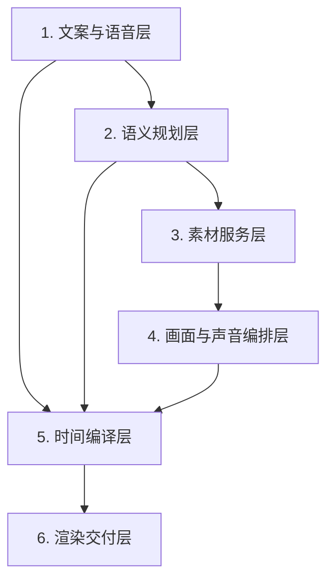
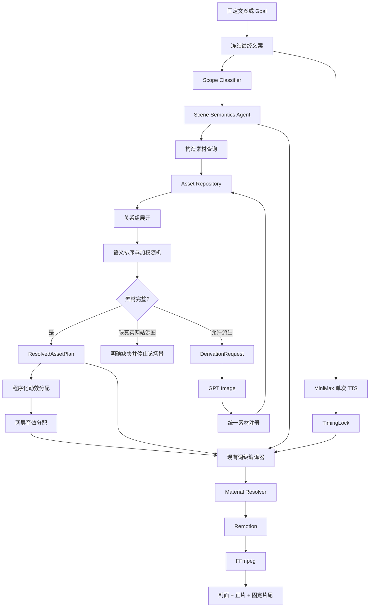

# Video Agent V4 架构框架

日期：2026-07-17

状态：架构框架评审稿

本文件只定义系统分层、模块职责、主数据流和边界。具体 Prompt、数据库表、Pydantic Contract、Effect 配置和迁移步骤在框架确认后分别设计。

## 1. 核心目标

V4 的主链路保持简单：

```text
冻结文案
→ 判断视频范围
→ 按文案拆分语义场景和素材需求
→ 查询、选择或补充素材
→ 按配置分配动效和音效
→ 复用现有词级卡点编译
→ Remotion 与 FFmpeg 渲染
```

第一优先级仍然是：

> 同一语义短语的口播、字幕、画面切换、字幕高亮和音效必须绑定同一个词级时间 Anchor。

## 2. 已确认的设计原则

1. 文案一旦进入 TTS 就必须冻结，后续 Agent 不得改写。
2. 视频范围分为单个具体分类和多个具体分类，不使用“通用场景视频”这个概念。
3. 通用只表示素材可跨具体分类复用，不表示可以任意兜底。
4. 场景理解只输出素材需求，不选择具体文件。
5. 素材需求必须将具体功能分类和素材角色分开表达。
6. 一个场景可包含单图、并列、因果或对比素材结构。
7. 程序先按结构化条件查询合法素材，AI 只在合法候选中排序。
8. 因果和对比素材必须来自已注册关系组，不能按图片相似度临时拼接。
9. 网站主页、功能入口和参数页不能凭空生成，只允许从真实截图派生。
10. 结果图、参考图、平面图和编辑前后图允许按受控关系使用 GPT Image 派生。
11. 动效完全由程序根据配置加权选择，不由 AI 自由创造。
12. 同一个连续场景组共享动效、方向、节奏、容器和背景。
13. 音效分为动效音效和操作语义音效两层，并由程序解决冲突。
14. 保留现有 TimingLock、PhraseAnchor、GalleryItem、Subtitle Compiler 和 SFX 峰值对齐机制。
15. 素材库只服务柯幻熊猫，不建设多品牌或多租户能力。

## 3. 系统分层

V4 分为六层：



### 3.1 文案与语音层

负责产生不可变的最终文案和真实语音时间。

输入方式：

- `--script`：用户提供固定文案；
- `--goal`：文案生成模块先产生文案，再冻结。

冻结后并行执行：

```text
FrozenNarration
├── Video Scope 判断
├── Scene Semantics 分析
└── MiniMax 单次完整 TTS
```

输出：

- `FrozenNarration`
- `TimingLock`

这一层不接触素材和动效。

### 3.2 语义规划层

包含两个固定 AI 单元。

#### Scope Classifier

负责判断：

- `single`：单个具体分类，例如文化墙；
- `multiple`：多个具体分类，例如文化墙、门头招牌、LOGO、美陈。

所有分类必须映射到功能分类注册表，不允许自由创造分类名称。

输出：`VideoScope`

#### Scene Semantics Agent

负责：

- 按独立画面语义拆分文案；
- 保留原文短语和位置；
- 建立连续场景组；
- 标记素材结构：`single`、`parallel`、`causal`、`comparison`；
- 为每个画面槽声明功能分类和素材角色；
- 标记 Gallery 枚举项和字幕高亮意图。

它不负责：

- 选择具体素材；
- 生成资产 ID；
- 选择动效；
- 生成帧号；
- 修改文案。

输出：`SceneSemanticPlan`

示意：

```json
{
  "group_id": "group_002",
  "structure": "parallel",
  "text": "文化墙、门头招牌、LOGO",
  "items": [
    {
      "phrase": "文化墙",
      "asset_requirement": {
        "category_path": ["文化墙"],
        "asset_role": "result_image"
      }
    },
    {
      "phrase": "门头招牌",
      "asset_requirement": {
        "category_path": ["门头招牌"],
        "asset_role": "result_image"
      }
    }
  ]
}
```

### 3.3 素材服务层

素材服务层负责回答三个问题：

1. 当前素材需求有哪些合法候选？
2. 从合法候选中选择哪一张或哪一组？
3. 没有素材时是否允许派生，以及从什么源素材派生？

素材服务层分为基础设施和运行时编排两部分。

#### 素材基础设施

```text
Category Registry
Asset Repository
Asset Group Repository
Asset Object Store
Usage Repository
```

职责：

- 功能分类、层级与别名；
- 素材注册与结构化查询；
- 因果、对比和流程关系组；
- 本地文件或未来 OSS 对象读取；
- 素材使用历史和随机去重。

本地第一版使用：

```text
SQLite + LocalFileObjectStore
```

未来可替换为：

```text
PostgreSQL + OSS
```

上层业务只依赖 Repository 接口。

#### 素材查询与选择

查询顺序：

```text
功能分类 + 素材角色精确过滤
→ 关系组展开
→ 文案有明确行业或案例要求时进行 AI 排序
→ 文案没有明显要求时进行可复现加权随机
→ 应用方向连续性和使用历史权重
```

选择规则：

- 单候选直接选择；
- 多候选由语义排序与加权随机共同决定；
- 因果和对比场景只能选择完整关系组；
- 本视频不重复使用同一素材；
- 近期高频素材降低权重；
- 组内优先保持横竖屏方向一致，但方向只是软约束；
- 同一个 Run 使用固定 seed，保证重新渲染结果不变。

#### 素材缺口与派生

缺失处理分为：

```text
真实网站素材缺失
→ 返回 missing_source_asset，不凭空生成

结果或因果素材缺失
→ 生成 DerivationRequest
→ GPT Image
→ 使用统一注册入口持久化
→ 重新查询受影响的场景

抽象承接没有图片证据需求
→ 使用 LightSweep 等无图动效
```

派生素材必须记录父素材和关系，不能只保存 PNG。

输出：`ResolvedAssetPlan`

### 3.4 画面与声音编排层

这一层完全程序化，不再设置视觉导演 Agent。

#### Motion Assignment

输入：

- 场景结构；
- 素材角色；
- 图片数量；
- 横竖屏方向；
- 场景组连续性；
- TimingLock 提供的可用时长。

程序从 Effect Registry 过滤合法动效，再按权重和 Run seed 选择。

场景组只选择一次动效，组内项目继承：

- 动效类型；
- 运动方向；
- 容器尺寸；
- 背景；
- 节奏参数。

全片规则负责避免连续重复动效、运动方向冲突和强动效堆叠。

#### SFX Assignment

音效有两层来源：

```text
动效事件音效
例如 SlideGallery.item_transition → swish

操作语义音效
例如 参数输入 → typing
     功能点击 → mouse_click
     生成完成 → task_complete
```

操作语义音效优先级高于动效音效。同一 Anchor 冲突时弱化或取消低优先级音效。

输出：`MotionAudioPlan`

### 3.5 时间编译层

V4 不重写当前合理的卡点核心。

保留：

```text
MiniMax word timestamps
→ TokenTiming
→ PhraseAnchor
→ GalleryItem.anchor_id
→ Render hit_frame/onset_frame
→ Subtitle Cue
→ SFX peak alignment
```

Scene Semantics 只提供原文短语、出现位置和高亮意图。现有编译器负责：

- 将短语映射到词级 Token；
- Gallery 下一张图片在对应词开始发音时首次出现；
- Gallery 项生成独立黄色字幕；
- 普通字幕按标点和实际安全区宽度断句；
- 禁止两行字幕；
- 画面、字幕和 SFX 使用同一 Anchor；
- 实际 SFX 峰值与视觉命中帧保持现有容差。

输出：`CompiledVideoTimeline`

### 3.6 渲染交付层

#### Material Resolver

渲染前将所有 `asset://Axxxx` 解析并冻结到当前 Run：

```text
AssetObjectStore
→ 下载或复制到 run/assets
→ 校验文件与媒体信息
→ Remotion 使用本地冻结路径
```

Remotion 和 FFmpeg 不直接读取 OSS 临时 URL。

#### Render

```text
CompiledVideoTimeline
→ Remotion 画面、字幕和动效
→ FFmpeg TTS、SFX、片尾和最终编码
```

封面和固定片尾独立于正文场景：

- 封面读取完整文案、VideoScope 和已选主素材；
- 固定片尾读取配置，默认开启；
- 二者不进入正文随机素材选择。

## 4. 主流程



## 5. 素材领域边界

### 5.1 最小素材信息

```json
{
  "asset_ref": "asset://A0123",
  "filename": "柯幻熊猫_文生图_文化墙_社区服务_结果图_01.png",
  "object_key": "results/文生图/文化墙/社区服务/结果图_01.png",
  "module": "文生图",
  "category_path": ["文化墙"],
  "asset_role": "result_image",
  "case_label": "社区服务",
  "industry": null,
  "description": "社区服务中心室内文化墙效果图",
  "width": 2048,
  "height": 1152,
  "orientation": "landscape",
  "animated": false,
  "origin": "imported"
}
```

强制信息：

- 稳定 `asset_ref`；
- 相对对象键；
- 功能分类；
- 素材角色；
- 文件尺寸和方向；
- 来源。

辅助信息：

- 案例名称；
- 行业；
- 内容描述。

不在第一版建设独立风格、色彩或复杂视觉标签体系。

### 5.2 素材角色

第一版使用封闭角色：

```text
site_home
feature_list
feature_entry
parameter_panel
result_image
reference_image
flat_plan
editor_page
editor_modal
edited_result
brand_logo
brand_ip
outro
```

派生用途不是素材角色，例如 `gallery_normalized` 记录在派生信息中，素材角色仍是 `result_image`。

### 5.3 素材关系组

```json
{
  "group_ref": "group://G0012",
  "category_path": ["文化墙"],
  "group_type": "causal",
  "members": [
    {"asset_role": "reference_image", "asset_ref": "asset://A0122"},
    {"asset_role": "result_image", "asset_ref": "asset://A0123"},
    {"asset_role": "flat_plan", "asset_ref": "asset://A0124"}
  ]
}
```

一个素材允许进入多个关系组。

## 6. Agent 与程序的最终边界

### 固定 AI 单元

1. `Scope Classifier`
2. `Scene Semantics Agent`

### 条件 AI 能力

1. 多候选素材语义排序；
2. 素材首次导入时生成内容描述；
3. 缺失素材的 DerivationRequest 和 GPT Image Prompt；
4. Goal 模式的文案生成。

这些能力按需调用，不构成每次运行都必须经过的长 Agent 链。

### 程序模块

- 分类映射与别名解析；
- 素材索引、查询和关系组展开；
- 加权随机与使用历史；
- 动效分配；
- 音效分配与冲突解决；
- TimingLock 与帧级编译；
- 素材本地化；
- Remotion 和 FFmpeg 渲染。

## 7. 明确不建设的能力

- 多品牌和多租户；
- 每次运行重新进行 AI 图片审核；
- 任意图片数量上限；
- 让 AI 直接输出帧号；
- 让 AI 自由创造动效 ID；
- 用通用素材掩盖具体素材缺失；
- 凭视觉相似度猜测因果关系；
- 第一版引入向量数据库；
- 为风格、颜色和构图建立复杂本体。

## 8. 下一阶段设计拆分

框架确认后，再分别输出以下详细设计：

1. `VideoScope` 与 `SceneSemanticPlan` Contract；
2. Scope 和 Scene Semantics Prompt；
3. Category Registry、AssetRecord 和 AssetGroup 数据契约；
4. Repository、SQLite 和 ObjectStore 接口；
5. 素材选择、随机去重和 GPT Image 派生流程；
6. Effect Registry 和两层 SFX 配置；
7. 与当前 TimingLock 和 Compiler 的接入边界；
8. 旧单体 Planner 删除与 V4 主线切换计划。

这八项应按顺序设计和实施，避免在主数据契约未稳定前提前修改渲染细节。
