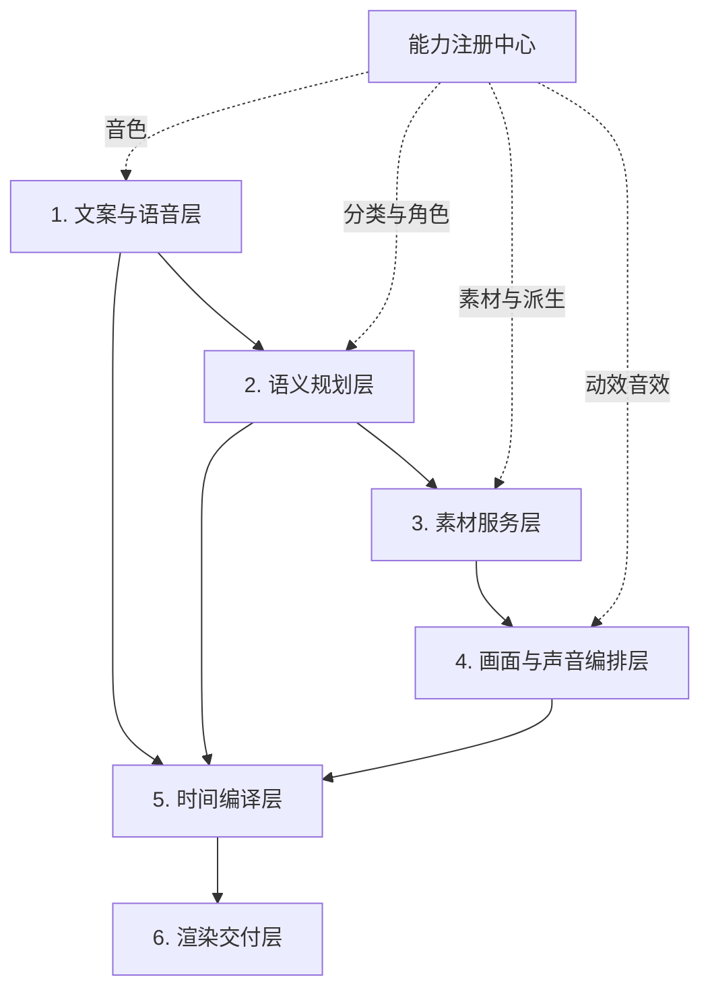
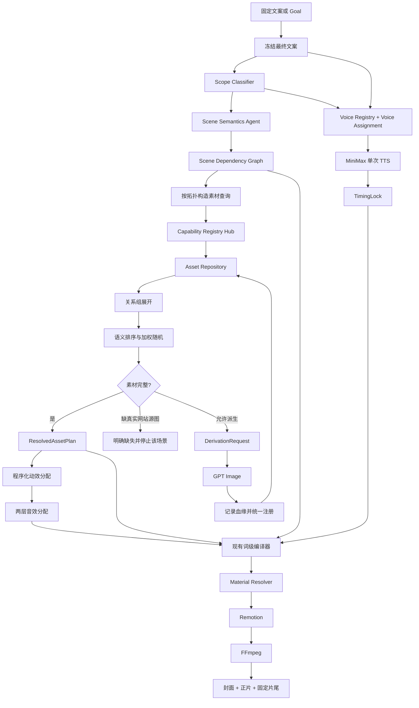

# Video Agent V4 架构框架

日期：2026-07-17

状态：架构框架修订稿

本文件只定义系统分层、模块职责、主数据流和边界。具体 Prompt、数据库表、Pydantic Contract、Effect 配置和迁移步骤在框架确认后分别设计。

## 1. 核心目标

V4 的主链路保持简单：

```text
冻结文案
→ 判断视频范围
→ 按文案拆分语义场景和素材需求
→ 建立跨场景依赖和连续性链
→ 查询、选择或派生素材
→ 按配置分配动效和音效
→ 复用现有词级卡点编译
→ Remotion 与 FFmpeg 渲染
```

第一优先级仍然是：

> 同一语义短语的口播、字幕、画面切换、字幕高亮和音效必须绑定同一个词级时间 Anchor。

## 2. 已确认的设计原则

1. 文案一旦进入 TTS 就必须冻结，后续 Agent 不得改写。
2. 视频范围分为单个具体分类和多个具体分类，不使用“通用场景视频”这个概念。
3. 通用只表示素材可跨具体分类复用，不表示可以任意兜底。
4. 场景理解只输出素材需求，不选择具体文件。
5. 素材需求必须将具体功能分类和素材角色分开表达。
6. 一个场景可包含单图、并列、因果或对比素材结构。
7. 程序先按结构化条件查询合法素材，AI 只在合法候选中排序。
8. 因果和对比素材必须来自已注册关系组，不能按图片相似度临时拼接。
9. 网站主页、功能入口和参数页不能凭空生成，只允许从真实截图派生。
10. 结果图、参考图、平面图和编辑前后图允许按受控关系使用 GPT Image 派生。
11. 动效完全由程序根据配置加权选择，不由 AI 自由创造。
12. 同一个连续场景组共享动效、方向、节奏、容器和背景。
13. 音效分为动效音效和操作语义音效两层，并由程序解决冲突。
14. 保留现有 TimingLock、PhraseAnchor、GalleryItem、Subtitle Compiler 和 SFX 峰值对齐机制。
15. 素材库只服务柯幻熊猫，不建设多品牌或多租户能力。
16. 功能分类、素材角色、动效、音效和音色都由独立能力注册表提供，不写死在 Agent Prompt 或业务分支中。
17. 场景之间通过显式输入输出依赖保持叙事连续，不以“上一镜头文件”这种隐式位置关系代替语义关系。
18. 原始素材和派生素材必须保留来源、父素材和派生方式；同等语义条件下优先选择原始素材。
19. 每次 Run 冻结所用注册表版本、素材版本和随机 seed，保证同一输入可解释、可复现。

## 3. 系统分层

V4 分为六层：



能力注册中心是横跨各层的控制面，不承载单个 Run 的业务状态。实际视频运行只读取启动时验证并冻结的注册表快照。

### 3.1 文案与语音层

负责产生不可变的最终文案和真实语音时间。

输入方式：

- `--script`：用户提供固定文案；
- `--goal`：文案生成模块先产生文案，再冻结。

冻结后先判断 VideoScope。Scene Semantics 与 Voice Assignment 随后可并行；音色确定后执行 TTS。`fixed` 音色模式不需要等待 AI 匹配，可直接开始 TTS：

```text
FrozenNarration
└── Video Scope 判断
    ├── Scene Semantics 分析
    └── Voice Assignment
        └── MiniMax 单次完整 TTS
```

输出：

- `FrozenNarration`
- `ResolvedVoiceProfile`
- `TimingLock`

这一层不接触素材和动效。

#### Voice Assignment

音色在 TTS 前从 Voice Registry 解析，支持两种模式：

```text
fixed   配置明确指定 voice_profile_id
auto    根据完整文案、VideoScope 和口播语气，在启用音色候选中匹配
```

Voice Profile 至少声明：

```json
{
  "voice_profile_id": "minimax_ad_clear_01",
  "enabled": true,
  "provider": "minimax",
  "provider_voice_ref": "minimax.voice.ad_clear_01",
  "language": "zh-CN",
  "traits": ["清晰", "有节奏", "广告种草"],
  "default_speed": 1.2,
  "supported_emotions": [],
  "priority": 100
}
```

`provider_voice_ref` 对应的真实供应商音色 ID 仍保存在不提交 Git 的本地配置中，注册表不保存密钥或本地敏感值。`auto` 模式可以使用条件 AI 排序，但只能从合法候选中返回 `voice_profile_id`；程序负责校验并冻结最终音色。音色一旦进入 TTS，不得在同一条完整口播中途切换。

### 3.2 语义规划层

包含两个固定 AI 单元。

#### Scope Classifier

负责判断：

- `single`：单个具体分类，例如文化墙；
- `multiple`：多个具体分类，例如文化墙、门头招牌、LOGO、美陈。

所有分类必须映射到功能分类注册表，不允许自由创造分类名称。

输出：`VideoScope`

#### Scene Semantics Agent

负责：

- 按独立画面语义拆分文案；
- 保留原文短语和位置；
- 建立连续场景组；
- 标记素材结构：`single`、`parallel`、`causal`、`comparison`；
- 为每个画面槽声明功能分类和素材角色；
- 标记 Gallery 枚举项和字幕高亮意图；
- 声明场景产出的语义结果和后续场景需要引用的输入；
- 识别“继续编辑”“基于这个场景”“同时还能”等指代和流程延续关系。

它不负责：

- 选择具体素材；
- 生成资产 ID；
- 选择动效；
- 生成帧号；
- 修改文案。

输出：`SceneSemanticPlan`

示意：

```json
{
  "group_id": "group_002",
  "structure": "parallel",
  "text": "文化墙、门头招牌、LOGO",
  "items": [
    {
      "phrase": "文化墙",
      "asset_requirement": {
        "category_path": ["文化墙"],
        "asset_role": "result_image"
      }
    },
    {
      "phrase": "门头招牌",
      "asset_requirement": {
        "category_path": ["门头招牌"],
        "asset_role": "result_image"
      }
    }
  ]
}
```

#### 场景依赖与连续性

`SceneSemanticPlan` 不是只有时间顺序的数组，而是带顺序约束的有向无环图。每个场景可声明命名输出，后续场景通过语义输入引用它：

```json
{
  "scene_id": "scene_006",
  "text": "画面细节不满意，可以继续编辑",
  "inputs": [
    {
      "input_name": "source_result",
      "from_scene": "scene_005",
      "from_output": "primary_result",
      "required": true
    }
  ],
  "outputs": [
    {
      "output_name": "edited_result",
      "asset_role": "edited_result"
    }
  ]
}
```

依赖解析规则：

- 明确说出分类或对象时，绑定被明确指代的素材；
- 使用“它、这个、继续、基于上图”等指代时，绑定上游场景声明的 `primary_output`；
- Gallery 必须显式声明 `primary_output`，不能在下游临时猜测“最后一张就是参考图”；
- 如需让 Gallery 中某一项进入后续编辑，编排器应将该项安排为组末稳定画面，再输出为 `primary_output`；
- 参考图到结果图、结果图到编辑页、编辑前到编辑后、结果图到平面图可以形成连续依赖链；
- 上游输出未解析成功时，所有必需依赖它的下游场景停止解析，不得随机换图补位；
- 派生出的输出注册后必须立即进入当前 Run 的解析上下文，供后续场景继续引用。

连续性不仅约束素材身份，也传递必要的展示上下文：

```text
主体内容
横竖屏方向
关键构图区域
容器比例
安全区布局
必要时的视点和背景约束
```

这保证“结果图 → 编辑页 → 编辑后结果”看起来是同一张图被操作，而不是三张语义相近但彼此无关的图片。

### 3.3 素材服务层

素材服务层负责回答三个问题：

1. 当前素材需求有哪些合法候选？
2. 从合法候选中选择哪一张或哪一组？
3. 没有素材时是否允许派生，以及从什么源素材派生？

素材服务层分为基础设施和运行时编排两部分。

#### 能力注册中心

V4 使用统一的 `CapabilityRegistryHub` 管理多类独立注册表：

```text
Category Registry       功能分类、层级和别名
Asset Role Registry     素材角色及其选择、派生和展示约束
Effect Registry         动效实现、适用条件和时间要求
SFX Registry            音效文件、同步点、增益和适用事件
Voice Registry          音色、供应商、语言、语气和推荐场景
Derivation Registry     允许的派生类型、输入角色、输出角色和执行器
```

注册表的共同契约：

```json
{
  "registry_id": "asset_role",
  "version": "2026.07.17.1",
  "entries": [
    {
      "id": "result_image",
      "enabled": true,
      "schema_version": 1,
      "handler": null,
      "capabilities": {}
    }
  ]
}
```

设计约束：

- 新增或停用条目通过注册表完成，不修改 Agent Prompt 的枚举文本或散落的 `if/else`；
- 数据型能力如分类、素材角色可只提供 Schema 和约束；
- 行为型能力如动效、派生器必须声明已注册 `handler`，启动时验证实现存在；
- 媒体型能力如音效、音色声明文件、供应商参数和适用标签；
- “移除”采用 `enabled=false`，新 Run 不再使用；历史 Run 继续读取当时冻结的注册表快照；
- Agent 只看到当前启用条目的稳定 ID、中文名称和必要说明；输出未知 ID 必须失败，不做兼容猜测；
- Prompt 中的分类、角色和能力说明由当前注册表快照动态生成，不维护另一份手写枚举；
- 注册表变更不直接修改历史素材。迁移由显式迁移命令完成；
- 每个 Run Manifest 记录所有注册表 ID、版本和内容哈希。

Contract 中的分类、角色、动效、音效和音色字段使用稳定字符串引用，并在边界处通过注册表校验；不再用需要改代码发布的永久 `Literal` 枚举。若某角色被停用：

- 已登记素材和历史 Run 不删除；
- 新查询排除该角色素材；
- 新 Scene Plan 请求该角色时在语义计划边界明确失败；
- 需要恢复时启用原 ID，不能创建含义相同的新别名 ID 绕过历史。

#### 素材基础设施

```text
Capability Registry Hub
Category Registry
Asset Role Registry
Asset Repository
Asset Group Repository
Asset Object Store
Usage Repository
```

职责：

- 功能分类、层级与别名；
- 素材注册与结构化查询；
- 因果、对比和流程关系组；
- 本地文件或未来 OSS 对象读取；
- 素材使用历史和随机去重。

本地第一版使用：

```text
SQLite + LocalFileObjectStore
```

未来可替换为：

```text
PostgreSQL + OSS
```

上层业务只依赖 Repository 接口。

#### 素材查询与选择

查询顺序：

```text
启用的功能分类 + 启用的素材角色精确过滤
→ 关系组展开
→ 文案有明确行业或案例要求时进行 AI 排序
→ 文案没有明显要求时进行可复现加权随机
→ 应用跨场景依赖、来源优先级、方向连续性和使用历史权重
```

选择规则：

- 单候选直接选择；
- 多候选由语义排序与加权随机共同决定；
- 因果和对比场景只能选择完整关系组；
- 本视频不重复使用同一素材；
- 近期高频素材降低权重；
- 组内优先保持横竖屏方向一致，但方向只是软约束；
- 同一个 Run 使用固定 seed，保证重新渲染结果不变。
- 同等分类、角色、关系完整度和语义匹配度下，`source_kind=original` 优先于 `source_kind=derived`；
- 原图优先是排序规则，不得覆盖显式场景依赖。例如编辑场景必须使用上游结果图派生的编辑素材；
- 专门为当前叙事关系生成且已注册的派生素材，优先于不具备该关系的普通原图。

#### 按依赖图解析素材

素材解析器按场景依赖图拓扑顺序执行：

```text
无依赖场景查询与选择
→ 冻结场景 outputs
→ 将实际 asset_ref 注入下游 inputs
→ 查询关系组或创建 DerivationRequest
→ 注册派生输出
→ 继续解析后续场景
```

因此，“编辑上一张结果图”中的上一张，不是文件列表位置，也不是重新进行一次关键词搜索，而是当前 Run 已冻结的具体 `asset_ref`。

#### 素材缺口与派生

缺失处理分为：

```text
真实网站素材缺失
→ 返回 missing_source_asset，不凭空生成

结果或因果素材缺失
→ 生成 DerivationRequest
→ GPT Image
→ 使用统一注册入口持久化
→ 重新查询受影响的场景

抽象承接没有图片证据需求
→ 使用 LightSweep 等无图动效
```

派生素材必须记录父素材和关系，不能只保存 PNG。相同父素材、派生类型、Prompt 模板版本和关键参数构成可复用的 `derivation_signature`；命中已有活动素材时直接复用，避免重复调用 GPT Image。

输出：`ResolvedAssetPlan`

### 3.4 画面与声音编排层

这一层完全程序化，不再设置视觉导演 Agent。

#### Motion Assignment

输入：

- 场景结构；
- 素材角色；
- 图片数量；
- 横竖屏方向；
- 场景组连续性；
- TimingLock 提供的可用时长。

程序从当前启用的 Effect Registry 条目过滤合法动效，再按权重和 Run seed 选择。新增动效只需注册能力和实现，不修改场景规划 Contract。

场景组只选择一次动效，组内项目继承：

- 动效类型；
- 运动方向；
- 容器尺寸；
- 背景；
- 节奏参数。

全片规则负责避免连续重复动效、运动方向冲突和强动效堆叠。

#### SFX Assignment

音效有两层来源：

```text
动效事件音效
例如 SlideGallery.item_transition → swish

操作语义音效
例如 参数输入 → typing
     功能点击 → mouse_click
     生成完成 → task_complete
```

操作语义音效优先级高于动效音效。同一 Anchor 冲突时弱化或取消低优先级音效。

所有语义音效和动效绑定都引用 SFX Registry ID。停用音效后，新 Run 自动从适用候选中重新选择；历史 Run 使用冻结快照。

输出：`MotionAudioPlan`

### 3.5 时间编译层

V4 不重写当前合理的卡点核心。

保留：

```text
MiniMax word timestamps
→ TokenTiming
→ PhraseAnchor
→ GalleryItem.anchor_id
→ Render hit_frame/onset_frame
→ Subtitle Cue
→ SFX peak alignment
```

Scene Semantics 只提供原文短语、出现位置和高亮意图。现有编译器负责：

- 将短语映射到词级 Token；
- Gallery 下一张图片在对应词开始发音时首次出现；
- Gallery 项生成独立黄色字幕；
- 普通字幕按标点和实际安全区宽度断句；
- 禁止两行字幕；
- 画面、字幕和 SFX 使用同一 Anchor；
- 实际 SFX 峰值与视觉命中帧保持现有容差。

输出：`CompiledVideoTimeline`

### 3.6 渲染交付层

#### Material Resolver

渲染前将所有 `asset://Axxxx` 解析并冻结到当前 Run：

```text
AssetObjectStore
→ 下载或复制到 run/assets
→ 校验文件与媒体信息
→ Remotion 使用本地冻结路径
```

Remotion 和 FFmpeg 不直接读取 OSS 临时 URL。

#### Render

```text
CompiledVideoTimeline
→ Remotion 画面、字幕和动效
→ FFmpeg TTS、SFX、片尾和最终编码
```

封面和固定片尾独立于正文场景：

- 封面读取完整文案、VideoScope 和已选主素材；
- 固定片尾读取配置，默认开启；
- 二者不进入正文随机素材选择。

## 4. 主流程



## 5. 素材领域边界

### 5.1 最小素材信息

```json
{
  "asset_ref": "asset://A0123",
  "filename": "柯幻熊猫_文生图_文化墙_社区服务_结果图_01.png",
  "object_key": "results/文生图/文化墙/社区服务/结果图_01.png",
  "module": "文生图",
  "category_path": ["文化墙"],
  "asset_role": "result_image",
  "case_label": "社区服务",
  "industry": null,
  "description": "社区服务中心室内文化墙效果图",
  "width": 2048,
  "height": 1152,
  "orientation": "landscape",
  "animated": false,
  "source_kind": "original",
  "origin_type": "imported",
  "status": "active",
  "lineage": null
}
```

强制信息：

- 稳定 `asset_ref`；
- 相对对象键；
- 功能分类；
- 素材角色；
- 文件尺寸和方向；
- 原始或派生来源；
- 生命周期状态。

辅助信息：

- 案例名称；
- 行业；
- 内容描述。

不在第一版建设独立风格、色彩或复杂视觉标签体系。

### 5.2 素材血缘与动态更新

原始素材：

```json
{
  "source_kind": "original",
  "origin_type": "imported",
  "lineage": null
}
```

GPT Image 派生素材：

```json
{
  "source_kind": "derived",
  "origin_type": "gpt_image",
  "lineage": {
    "parent_asset_refs": ["asset://A0123"],
    "derivation_type": "result_to_editor_workspace",
    "provider": "gpt-image",
    "model": "configured-model",
    "prompt_template_version": "editor-workspace-v2",
    "prompt_sha256": "...",
    "derivation_signature": "..."
  }
}
```

更新规则：

- 修改图片内容产生新 `asset_ref`，不静默覆盖旧记录；
- 被替代素材标记为 `superseded` 并记录 `superseded_by`；
- 默认查询只返回 `active` 素材；
- 已冻结 Run 继续引用旧版本，不受素材库后续更新影响；
- 派生素材注册后与原图使用相同 Repository 查询入口，不进入旁路目录；
- 使用历史分别记录原图和派生图，不能把父素材使用次数合并到子素材。
- 父素材被 `superseded` 后，其派生素材保留供历史 Run 使用，但默认退出新 Run 候选；只有显式确认仍有效或基于新父素材重新派生后才能重新激活；
- Run Manifest 同时冻结所选素材的 `asset_ref`、对象内容哈希和血缘摘要，不能只冻结数据库主键。

### 5.3 素材角色

素材角色来自 Asset Role Registry。首批内置条目是：

```text
site_home
feature_list
feature_entry
parameter_panel
result_image
reference_image
flat_plan
editor_page
editor_modal
edited_result
brand_logo
brand_ip
outro
```

这只是初始配置，不是写死在 Pydantic `Literal`、Prompt 或业务代码中的永久枚举。新增角色必须同时声明：

- 中文名称和语义边界；
- 可接受的功能分类范围；
- 是否允许原图、派生图或两者；
- 可作为哪些关系组成员；
- 可接受的父角色和派生方式；
- 默认展示约束和合法动效能力标签。

派生用途不是素材角色，例如 `gallery_normalized` 记录在血缘信息中，素材角色仍是 `result_image`。

### 5.4 素材关系组

```json
{
  "group_ref": "group://G0012",
  "category_path": ["文化墙"],
  "group_type": "causal",
  "members": [
    {"asset_role": "reference_image", "asset_ref": "asset://A0122"},
    {"asset_role": "result_image", "asset_ref": "asset://A0123"},
    {"asset_role": "flat_plan", "asset_ref": "asset://A0124"}
  ]
}
```

一个素材允许进入多个关系组。

### 5.5 场景输出与关系组的区别

关系组描述素材库中长期有效的事实，例如“这张参考图生成了这张结果图”。场景输出描述当前 Run 中实际选择和展示的结果，例如“scene_005 的 primary_result 是 asset://A0123”。

二者不可混用：

- Asset Group 解决长期素材关系；
- Scene Dependency 解决当前视频的叙事连续性；
- 派生成功后可同时新增 Asset Group 关系，并把新素材绑定为当前 Scene output。

## 6. Agent 与程序的最终边界

### 固定 AI 单元

1. `Scope Classifier`
2. `Scene Semantics Agent`

### 条件 AI 能力

1. 多候选素材语义排序；
2. 素材首次导入时生成内容描述；
3. 缺失素材的 DerivationRequest 和 GPT Image Prompt；
4. Goal 模式的文案生成；
5. `auto` 模式下从 Voice Registry 合法候选中进行音色排序。

这些能力按需调用，不构成每次运行都必须经过的长 Agent 链。

### 程序模块

- 分类映射与别名解析；
- 能力注册表加载、校验、版本冻结和启停；
- 素材索引、查询和关系组展开；
- 场景依赖图校验和拓扑解析；
- 加权随机与使用历史；
- 动效分配；
- 音效分配与冲突解决；
- TimingLock 与帧级编译；
- 素材本地化；
- Remotion 和 FFmpeg 渲染。

## 7. 明确不建设的能力

- 多品牌和多租户；
- 每次运行重新进行 AI 图片审核；
- 任意图片数量上限；
- 让 AI 直接输出帧号；
- 让 AI 自由创造动效 ID；
- 用通用素材掩盖具体素材缺失；
- 凭视觉相似度猜测因果关系；
- 第一版引入向量数据库；
- 为风格、颜色和构图建立复杂本体；
- 通过删除历史 ID 破坏已冻结 Run 的可重现性。

## 8. 下一阶段设计拆分

框架确认后，再分别输出以下详细设计：

1. `VideoScope` 与 `SceneSemanticPlan` Contract；
2. Scope 和 Scene Semantics Prompt；
3. CapabilityRegistry、Category Registry、Asset Role Registry、AssetRecord、AssetLineage 和 AssetGroup 数据契约；
4. Repository、SQLite 和 ObjectStore 接口；
5. Scene Dependency、素材选择、随机去重和 GPT Image 派生流程；
6. Effect、SFX、Voice 和 Derivation Registry 配置；
7. 与当前 TimingLock 和 Compiler 的接入边界；
8. 旧单体 Planner 删除与 V4 主线切换计划。

这八项应按顺序设计和实施，避免在主数据契约未稳定前提前修改渲染细节。
