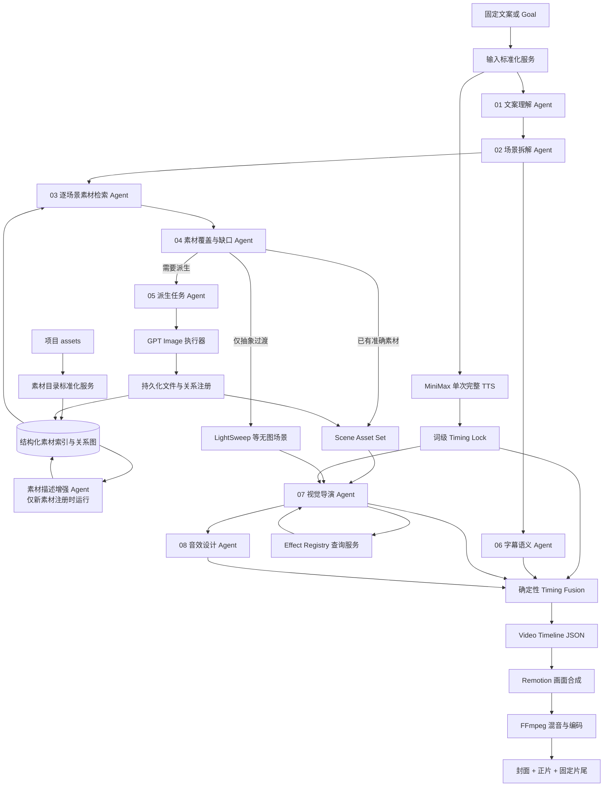

# Video Agent V4 多 Agent 编排设计

日期：2026-07-17

状态：最终设计稿，暂不实施

目标：以 AI 完成语义判断和创意决策，以程序完成检索、校验、时间计算和渲染；不保留 V3 单体 Planner 的兼容包袱。

## 1. 当前问题的本质

当前链路把以下职责压在一次或少数几次模型调用中：

- 判断视频是单功能种草、综合功能宣传还是流程演示；
- 拆分场景和口播短语；
- 从大量素材中粗筛并选择图片；
- 判断素材是否缺失以及是否需要 GPT Image 派生；
- 选择布局、动效、字幕高亮和音效；
- 同时输出可直接编译的时间线结构。

这不是提示词写得不够漂亮的问题，而是职责边界错误。一个模型输出需要同时满足素材语义、因果关系、词级时间、渲染契约和兜底策略，任何局部判断错误都会让整个 JSON 失效，也导致纠错提示越来越长。

现有导出格式还有三个基础问题：

1. `rows` 使用位置数组，字段含义依赖另一个 `fields` 数组，模型和人工都容易错位。
2. 模型看到了宿主机绝对路径，既无语义价值，也让请求不可移植。
3. system prompt、业务输入和素材表被封装在一个转义后的 JSON 字符串中，不利于人工复核和跨模型调试。

JSON 文件中的 `\n` 本身只是序列化表现，不会降低模型理解能力；真正的问题是 Prompt 内容过长且职责混杂。V4 仍使用 JSON 传输，但导出时将 `system.md`、`input.json`、`output.json` 分开保存。

## 2. V4 核心原则

### 2.1 一名 Agent 只做一种语义决策

Agent 不直接执行渲染，也不同时承担场景拆分、选材和动效选择。每个 Agent 读取明确的上游对象，只生成自己拥有的字段。

### 2.2 先理解文案，再检索素材

禁止先看素材再猜文案想表达什么。必须先得到视频定位、场景清单、精确口播短语和证据需求，随后逐场景检索素材。

### 2.3 AI 决策，程序落锚

AI 输出原文短语和语义关系，不输出臆造的 token ID 或帧号。程序将短语映射到 MiniMax 词级时间戳，并统一计算字幕、画面命中点和 SFX 峰值。

### 2.4 素材引用可读、可迁移

模型只看到 `asset://` URI 和结构化语义信息。Windows 绝对路径只存在于本地 Asset Resolver 中，不进入任何模型请求。

### 2.5 不用任意数量限制代替上下文治理

不设置“最多 12 张图”或“每个 Beat 最多 3 张图”之类的创作限制。通过逐场景检索、分页候选和按需展开素材详情控制上下文；文案提到多少个明确对象，就为多少个对象建立视觉槽位。

### 2.6 因果素材必须来自显式关系

参考图到结果图、结果图到平面图、编辑前到编辑后等关系必须来自注册关系或受控派生任务。Agent 不得仅凭相似外观拼成因果对。

### 2.7 时间匹配是铁律

口播短语、字幕 Cue、视觉命中帧和语义音效必须绑定同一个词级 Anchor。所有创意 Agent 的结果最终都要经过确定性 Timing Fusion，不能凭大致时间直接进入渲染。

## 3. 总体架构



这里的 Agent 是无状态、结构化调用单元，不是互相聊天的自治角色。中央 Orchestrator 只负责 DAG 调度、上下文裁剪、模型路由、产物持久化和失败定位。

## 4. Agent 职责设计

### 4.1 文案理解 Agent

输入：完整文案、产品信息、发布平台。

输出：`NarrativeIntent`。

不读取素材库，不选择图片和动效。

关键输出：

```json
{
  "video_scope": "multi_feature_overview",
  "product": "柯幻熊猫",
  "primary_feature": "文生图",
  "audience": ["广告从业者"],
  "communication_goal": "综合功能种草",
  "feature_mentions": [
    {
      "phrase": "文化墙",
      "feature_path": ["文生图", "文化墙"],
      "intent": "result_showcase"
    }
  ],
  "workflow_claims": [
    {
      "phrase": "上传你的场景照片参考图",
      "relation_required": "reference_to_result"
    }
  ],
  "opening_intent": "product_hook",
  "closing_intent": "brand_statement"
}
```

`video_scope` 至少支持：

- `single_feature_demo`：围绕文化墙、美陈等单一功能；
- `multi_feature_overview`：多个并列功能快速展示；
- `workflow_demo`：输入、生成、编辑、导出等流程；
- `mixed_campaign`：综合功能加局部流程；
- `brand_statement`：品牌认知或结尾宣言。

### 4.2 场景拆解 Agent

输入：完整文案、`NarrativeIntent`。

输出：`SceneBlueprint[]`。

只确定“这段话需要什么画面证据”，不选择具体文件。

场景采用两层分类：

| scene_domain | scene_kind | 说明 |
|---|---|---|
| `site` | `home` / `feature_entry` / `parameter_panel` | 网站首页、功能入口、参数页 |
| `result` | `detail` / `gallery` | 单结果细节、多结果逐项轮播 |
| `causal_workflow` | `reference_to_result` / `result_to_flat_plan` / `before_after` | 有明确因果关系的素材组 |
| `tool` | `editor_workspace` / `feature_list` | 编辑页面或其他工具页面 |
| `abstract` | `light_sweep` / `brand_end` | 无需具体证据的过渡或品牌陈述 |

每个场景必须引用文案中的原文边界：

```json
{
  "scene_id": "scene_003",
  "spoken_span": {
    "start_phrase": "文化墙",
    "end_phrase": "活动物料"
  },
  "scene_domain": "result",
  "scene_kind": "gallery",
  "visual_slots": [
    {"slot_id": "slot_文化墙", "exact_phrase": "文化墙", "required_feature": "文化墙"},
    {"slot_id": "slot_门头招牌", "exact_phrase": "门头招牌", "required_feature": "门头招牌"}
  ],
  "evidence_requirement": "exact_feature_result",
  "continuity": "parallel_items"
}
```

枚举文案必须拆成逐词槽位，不能将整句交给一个三图 Gallery 近似表达。

### 4.3 逐场景素材检索 Agent

输入：单个 `SceneBlueprint`、结构化查询结果。

输出：`AssetCandidateSet`。

不判断缺口，不生成派生提示词。

检索分两步：

1. 程序按 `feature_path`、`role`、`industry`、`relation_type` 和媒体方向做结构化过滤；
2. Agent 根据素材描述与场景意图排序，并说明每个候选支持哪个视觉槽位。

模型不会收到整个素材库。每个场景按需读取候选摘要；如果候选不足，可请求下一页或展开某个素材的详细描述。这样没有全局图片数量上限，也不会把无关素材塞入上下文。

### 4.4 素材覆盖与缺口 Agent

输入：一个场景、它的候选集、已注册关系。

输出：`CoverageDecision`。

这是“是否需要补图”的唯一决策者。

```json
{
  "scene_id": "scene_006",
  "slot_decisions": [
    {
      "slot_id": "slot_reference_to_result",
      "status": "derive_required",
      "reason_code": "MISSING_CAUSAL_PAIR",
      "available_asset_refs": ["asset://results/文生图/文化墙/科技/001"],
      "required_relation": "result_to_reference"
    }
  ]
}
```

允许状态：

- `exact_ready`：语义和关系均满足；
- `related_ready`：场景允许同类补充图，且素材明确相关；
- `derive_required`：中间枚举项、因果链或连续演示缺少必要素材；
- `abstract_transition`：文案本身是抽象承接，可用 LightSweep；
- `unresolved`：无法安全补齐，显式停止该场景，不得乱选图。

“主题公园”位于多分类枚举中时应是 `derive_required`，不能因为缺图直接改成 LightSweep；品牌总结、抽象连接词等不依赖实体证据的场景才可使用 `abstract_transition`。

### 4.5 派生任务 Agent

输入：缺口决策、源素材对象、目标关系、上下文文案。

输出：`DerivationSpec`。

只负责编写受约束的图片生成或编辑任务，不决定视频动效。

```json
{
  "derivation_id": "derive_001",
  "kind": "result_to_reference",
  "source_asset_refs": ["asset://results/文生图/文化墙/科技/001"],
  "target": {
    "feature_path": ["文生图", "文化墙"],
    "industry": "科技企业",
    "role": "reference_image",
    "orientation": "landscape"
  },
  "prompt_spec": {
    "preserve": ["墙体空间比例", "拍摄机位", "环境结构"],
    "change": ["移除墙面设计内容，恢复为空白待设计墙面"],
    "forbid": ["改变建筑结构", "新增人物", "添加说明文字"],
    "composition": "与结果图保持相同横屏比例和视角"
  },
  "register_relation": "reference_to_result"
}
```

GPT Image 输出必须持久化为正式素材，并写入来源、父素材和关系。后续运行直接复用，不重复生成。

### 4.6 字幕语义 Agent

输入：文案、场景边界、词级时间戳。

输出：`SubtitlePlan`。

不选择图片，不决定场景时长。

职责包括：

- 按语义和标点断句，不固定每 10 个字机械截断；
- 枚举项分别形成 Cue，例如“文化墙”“门头招牌”各自单独出现；
- 指定关键词高亮，不输出两行字幕；
- 保留原文短语，禁止改写口播。

### 4.7 视觉导演 Agent

输入：单个场景、最终素材集合、素材方向、场景可用时长、Effect Registry 能力。

输出：`VisualDirection`。

不再修改场景语义或素材选择。

```json
{
  "scene_id": "scene_003",
  "template": "slide_gallery",
  "layout_profile": "mixed_orientation_safe_gallery",
  "items": [
    {
      "slot_id": "slot_文化墙",
      "asset_ref": "asset://results/文生图/文化墙/通用/001",
      "hit_phrase": "文化墙",
      "motion": "slide_left",
      "fit": "contain"
    }
  ],
  "background": "grid_dark",
  "safe_area_profile": "douyin_content_safe"
}
```

Effect Registry 根据素材横竖屏、图片数量、场景时长和可读稳定时间返回可用动效。Agent 只能从返回的能力中选择，不能创造不存在的 effect ID。

### 4.8 音效设计 Agent

输入：视觉动作事件、场景意图、词级 Timing Lock。

输出：`SfxPlan`。

音效绑定语义事件而非镜头编号：点击用 `mouse_click`，输入用 `typing`，滑动用 `transition_whoosh` 或 `swish`，明确完成才用 `task_complete`。

音效 Agent 只指定 `anchor_phrase`、`semantic_id` 和强度。实际起点、峰值偏移、首帧 trim 和混音由程序计算。

## 5. 素材对象重新设计

V4 删除 `fields + rows` 位置表，模型输入统一为具名对象。推荐结构如下：

```json
{
  "asset_ref": "asset://results/文生图/文化墙/科技企业/结果图_001",
  "file": {
    "name": "柯幻熊猫_文生图_文化墙_科技企业_结果图_001.png",
    "uri": "asset://results/文生图/文化墙/科技企业/结果图_001",
    "media_type": "image/png",
    "width": 2048,
    "height": 1152,
    "orientation": "landscape",
    "animated": false
  },
  "classification": {
    "site": "柯幻熊猫",
    "product": "文生图",
    "feature_path": ["文生图", "文化墙"],
    "industry": "科技企业",
    "role": "result_image",
    "workflow_step": "generated_result"
  },
  "semantics": {
    "title": "科技企业文化墙效果图",
    "description": "科技企业展厅中的横向文化墙设计，蓝色科技视觉，展示企业发展与品牌信息。",
    "subjects": ["企业文化墙", "展厅", "科技视觉"],
    "style": ["科技", "现代"],
    "text_density": "medium",
    "claims": ["文化墙效果展示"]
  },
  "relations": [
    {
      "type": "generated_from_reference",
      "target_ref": "asset://references/文生图/文化墙/科技企业/参考图_001"
    }
  ],
  "provenance": {
    "origin": "gpt_image",
    "parent_refs": ["asset://references/文生图/文化墙/科技企业/参考图_001"]
  },
  "render_hints": {
    "preferred_fit": "contain",
    "focal_region": "center",
    "text_sensitive": true
  }
}
```

本地维护一张不进入模型的解析表：

```json
{
  "asset://results/文生图/文化墙/科技企业/结果图_001": "assets/results/柯幻熊猫_文生图_文化墙_科技企业_结果图_001.png"
}
```

所有路径均相对于仓库。运行目录移动、换机器或导出请求后，语义引用仍然有效。

## 6. 素材注册时的描述增强

图片描述不应在每次视频生成时临时猜测。新素材进入 `assets` 后运行一次素材描述增强 Agent，持久化以下事实：

- 画面主体与场景；
- 功能分类、行业和用途；
- 横屏、竖屏、方图和动画状态；
- 是网站页、参考图、结果图、平面图还是编辑页面；
- 可读文字密度与主要视觉焦点；
- 已知父素材和因果关系。

该 Agent 只做内容描述和分类，不做“视觉审核”。进入项目的素材默认可用，人工质量审核发生在项目之外。

文件名和目录规则提供初始分类，图像理解补充描述，但不能凭视觉相似性创建因果关系。因果关系必须由导入清单、派生执行器或明确人工注册产生。

## 7. Prompt 规范

每个 Agent Prompt 使用独立 Markdown 文件，固定六段：

```markdown
# Role
# Goal
# Inputs
# Allowed Decisions
# Forbidden Decisions
# Output Contract
```

复杂 Agent 可增加 `Decision Table` 和一组正反例。Prompt 不重复抄写所有下游规则，也不要求模型生成不归它所有的字段。

请求导出目录采用：

```text
run/agents/
  01_intent/
    request.system.md
    request.input.json
    response.raw.json
    response.validated.json
  02_scene_blueprint/
    ...
  03_asset_retrieval/
    scene_001/
    scene_002/
  04_gap_analysis/
    scene_001/
  05_derivation/
    derive_001/
```

这样可以直接把 `request.system.md` 和 `request.input.json` 交给其他模型对比，而不是从一个包含大量反斜杠的总 JSON 中拆字符串。

## 8. 上下文切片与模型路由

### 8.1 上下文层级

`RunContext` 仅含全局稳定信息：产品、平台、分辨率、安全区、完整文案和 Narrative Intent。

`SceneContext` 仅含一个场景：原文短语、语义槽位、可用时长、候选素材摘要和必要关系。

`AssetDetail` 按需展开：只有检索 Agent 请求查看时才加入完整描述和关系，不把全部素材详情一次传入。

### 8.2 模型路由

| 任务 | 默认模型等级 | 升级条件 |
|---|---|---|
| 文案理解、素材描述 | 快速模型 | 分类置信度低或结构校验失败 |
| 场景拆解、缺口判断 | 高级模型 | 默认使用，避免错误传播 |
| 素材语义排序 | 快速模型 | 候选冲突或因果语义复杂 |
| 派生任务 Prompt | 高级模型 | 默认使用 |
| 视觉导演、字幕语义 | 高级模型 | 默认使用 |

结构失败时只重试拥有该字段的 Agent，并携带最小化错误信息。连续失败后升级高级模型；仍失败则返回明确的 `unresolved`，不允许主 Planner 猜一个可编译结果。

程序可自动修复的内容仅限：

- `asset_ref` 映射和排序；
- 相同原文短语到 token 的确定性定位；
- 帧取整、末帧裁切和音效峰值补偿；
- JSON 默认值和可证明等价的格式归一化。

程序不得自动修复素材语义、因果关系或场景意图。

## 9. 产物所有权与合并规则

| 产物 | 唯一拥有者 | 下游可否修改 |
|---|---|---|
| `NarrativeIntent` | 文案理解 Agent | 否 |
| `SceneBlueprint` | 场景拆解 Agent | 否 |
| `AssetCandidateSet` | 素材检索 Agent | 仅缺口 Agent读取 |
| `CoverageDecision` | 缺口 Agent | 否 |
| `DerivationSpec` | 派生任务 Agent | 执行器只填结果引用 |
| `SelectedAssetSet` | 素材解析服务 | 否 |
| `SubtitlePlan` | 字幕语义 Agent | 编译器只落帧 |
| `VisualDirection` | 视觉导演 Agent | 编译器只规范化 |
| `SfxPlan` | 音效 Agent | 编译器只计算时点 |
| `VideoTimeline` | Timing Fusion 编译器 | 渲染器只执行 |

合并以 `scene_id` 和 `slot_id` 为主键。后续 Agent 不允许重写上游的 `spoken_span`、`feature_path` 或 `relation_required`。如果视觉方向与场景证据冲突，编译失败并返回视觉导演 Agent，而不是修改场景。

## 10. Timing Fusion

Timing Fusion 是全链路唯一能产生帧号的模块：

1. 将 `spoken_span` 和每个 `exact_phrase` 匹配到词级 token；
2. 生成场景绝对起止帧；
3. 枚举 Gallery 的每张图在对应词开始帧切入，而不是等上一词结束；
4. 将字幕 Cue 绑定同一 phrase anchor；
5. 将动效 hit point 和 SFX peak 对齐同一 anchor；
6. 对不足完整动效时长的场景选择降级动效或裁掉动效尾部，禁止延长口播；
7. 最后一个 base 画面覆盖到 `timeline_end`，但不得用无关图片冒充新语义。

核心中间结构：

```json
{
  "anchor_id": "anchor_文化墙_01",
  "phrase": "文化墙",
  "token_span": [18, 20],
  "start_frame": 91,
  "end_frame": 103,
  "visual_slot_id": "slot_文化墙",
  "subtitle_cue_id": "subtitle_004",
  "sfx_event_ids": ["sfx_007"]
}
```

## 11. 失败隔离与可观测性

日志以 Agent 和场景为粒度：

```text
[01_intent] 文案定位完成 scope=multi_feature_overview
[02_scene] 场景拆解完成 scenes=8 visual_slots=14
[03_retrieval][scene_003] 素材检索完成 exact=5 related=2
[04_gap][scene_003][slot_主题公园] 需要派生 reason=MISSING_ENUM_ITEM
[05_derivation][derive_004] GPT Image 补充素材中...
[05_derivation][derive_004] 已注册 asset://results/文生图/主题公园/通用/001
[07_visual][scene_003] 选择 slide_gallery items=7
[timing_fusion] 文化墙 frame=91 subtitle=subtitle_004 visual=slot_文化墙
```

Manifest 记录每次调用的 Prompt 版本、输入文件、输出文件、模型、耗时和校验结果，不记录 API Key。失败时可以单独重跑某个 Agent 或某个 scene，不需要从 TTS 重新开始。

## 12. 建议目录结构

```text
video_agent/
  orchestration/
    orchestrator.py
    context_builder.py
    model_router.py
  agents/
    narrative_intent.py
    scene_blueprint.py
    asset_retrieval.py
    coverage_gap.py
    derivation_spec.py
    subtitle_semantics.py
    visual_direction.py
    sfx_design.py
  contracts/
    narrative.py
    scene.py
    asset.py
    derivation.py
    visual.py
    audio.py
    timeline.py
  services/
    asset_index.py
    asset_resolver.py
    timing_fusion.py
    effect_registry.py
    gpt_image_executor.py
  prompts/
    narrative_intent.md
    scene_blueprint.md
    asset_retrieval.md
    coverage_gap.md
    derivation_spec.md
    subtitle_semantics.md
    visual_direction.md
    sfx_design.md
```

V4 落地后删除 `asset_coarse_selector.md` 和单体 `action_scene_planner.md`，不保留兼容适配层。

## 13. 实施顺序

### 阶段一：先换契约与素材索引

- 定义 V4 Pydantic contracts；
- 将素材表改为具名对象和 `asset://` URI；
- 增加本地 Asset Resolver；
- 将 Agent 请求拆成 `system.md + input.json + output.json`。

### 阶段二：建立语义主干

- 实现文案理解 Agent；
- 实现场景拆解 Agent；
- 固化五类场景和逐枚举项视觉槽位；
- 保持 MiniMax 单次 TTS，建立原文短语到 Timing Lock 的映射。

### 阶段三：拆出选材和派生

- 实现逐场景结构化检索和语义排序；
- 实现覆盖与缺口 Agent；
- 实现派生任务 Agent、GPT Image 执行和关系注册；
- 派生完成后只重跑受影响场景的检索。

### 阶段四：拆出视觉、字幕与音效

- 视觉导演只消费已解决的素材集合；
- 字幕 Agent 输出语义 Cue 和高亮；
- 音效 Agent 输出语义事件；
- Timing Fusion 统一生成帧级时间线。

### 阶段五：切换主线并删除旧实现

- CLI 的 `--script` 和 `--goal` 都进入同一 V4 DAG；
- 删除 Flash 粗筛加单体 Pro Planner 的旧链路；
- 删除旧 positional rows 导出；
- README 只保留 V4 架构和运行入口。

## 14. 完成标准

V4 达成以下行为才算完成：

- 完整文案先被判定为单功能、综合宣传、流程演示或混合视频；
- 每个场景都有原文边界、场景类型和明确视觉证据需求；
- 枚举中的每个具体功能都有独立视觉槽位和词级命中点；
- 模型输入中不存在宿主机绝对路径和无字段名的 rows；
- 图片描述能表达功能、行业、画面内容、方向和来源关系；
- 缺图、抽象过渡和因果关系缺失被区分处理；
- GPT Image 派生结果可持久化复用，并有父素材与关系记录；
- 视觉、字幕和音效不能修改场景语义；
- 同一个 phrase anchor 同时驱动画面、字幕和音效；
- 任一 Agent 失败都能定位到具体场景和产物，不再整条 Planner 重新猜测。

最终流水线应保持一句话可解释：

> 文案先被理解并拆成语义场景；每个场景独立找图和补图；素材确定后再选择动效、字幕和音效；最后由程序按词级时间统一编译成视频。
