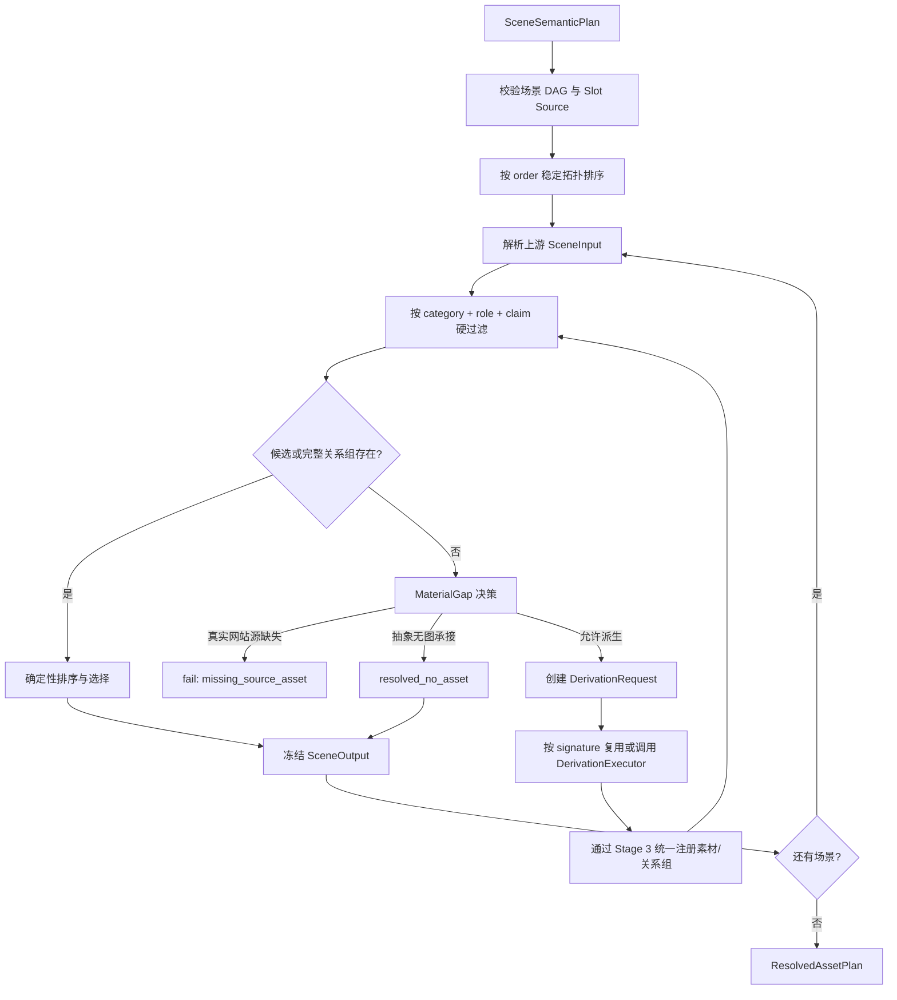

# Video Agent V4 Stage 4：依赖解析、素材选择与派生闭环设计

状态：设计冻结，Stage4 代码实施完成；真实派生执行器由 Stage5 接入

日期：2026-07-18
上游权威：

- `video_agent_v4_architecture_framework_rev3_20260717.md`
- `video_agent_v4_stage0_golden_scenario_rev3_20260718.md`
- `video_agent_v4_stage1_semantic_contract_and_ai_runtime_design_20260717.md`
- `video_agent_v4_stage2_capability_and_asset_contracts_20260717.md`
- `video_agent_v4_stage3_repository_sqlite_migration_20260718.md`

## 1. 本阶段目标

Stage 4 将 Stage 1 产出的 `SceneSemanticPlan` 解析为不可变的 `ResolvedAssetPlan`。

它只回答四个问题：

1. 每个场景输入的上游素材究竟是哪一个 `asset_ref`；
2. 每个素材槽应从 Stage 3 Repository 选择哪个素材或关系组；
3. 素材缺失时应报错、使用无图承接，还是创建可复用的派生请求；
4. 派生产物注册后，如何重新查询并冻结场景输出。

Stage 4 不负责：

- 文案生成与场景语义判断；
- TTS、字幕切分、词级时间和帧锚点；
- 动效、音效、音色和渲染参数选择；
- GPT Image Prompt、模型、供应商和能力条目的定义；
- 视觉审核或人工审核状态。

所有进入 Stage 3 Repository 的活动素材均可用于生产。Stage 4 只校验语义契约、关系完整性和技术状态，不创建 `reviewed`、`human_approved` 等字段。

## 2. 不可破坏的原则

### 2.1 显式依赖优先

“编辑上一张结果图”中的上一张图必须来自 `SceneInput.from_scene/from_output` 最终冻结的 `asset_ref`，不能通过文件顺序、关键词或再次随机查询推测。

### 2.2 分类与角色正交

候选必须同时满足：

```text
category_id/category_path 维度
AND
asset_role 维度
```

禁止把 `文化墙` 与 `result_image` 合并成一个模糊标签，也禁止缺少某个角色时跨角色兜底。

### 2.3 关系场景只接受完整关系组

`process`、`causal`、`comparison` 场景必须使用已注册且符合指定 `pattern_id` 的完整 `AssetGroup`。不得从三个无关系的素材分别搜索后临时拼成“参考图 → 结果图 → 平面图”。

### 2.4 原图优先只是同条件排序

同分类、角色、关系完整度和语义匹配度下，`source_kind=original` 优先。以下情况可以选择派生图：

- 场景显式依赖指定的派生素材；
- 派生素材属于当前关系组，而原图与当前叙事没有关系；
- 原图不存在，且该缺口允许派生；
- 已有相同 `derivation_signature` 的活动派生产物可复用。

### 2.5 选材不决定时间

Stage 4 不设置图片数量上限、镜头时长、最低停留时长或帧数。Gallery 有几个明确短语，就解析几个素材槽；实际帧区间由 Stage 6 使用词级锚点编译。

### 2.6 可复现

同一 Repository 快照、Registry 快照、语义计划、选择配置和 Run seed 必须得到相同结果。随机只允许使用显式 Run seed 的确定性随机。

## 3. 总体流程



## 4. 输入与输出

### 4.1 输入

```text
FrozenNarration
SceneSemanticPlan
Stage 3 AssetRepository（包含 asset/group/configured binding）
Frozen Capability Registry Snapshot
AssetResolutionSession（固定 base revision + 本 Run 派生 overlay）
Stage4SelectionConfig
RunSeed
可选 DerivationCapabilityResolver / DerivationExecutor
```

### 4.2 输出：ResolvedAssetPlan

建议新增 V4 Contract：

```json
{
  "schema_version": 1,
  "run_seed": "run seed",
  "scene_plan_sha256": "...",
  "repository_base_revision": 42,
  "pre_run_repository_fingerprint": "...",
  "used_assets_snapshot_id": "...",
  "post_run_repository_revision": 45,
  "registry_snapshot_id": "...",
  "group_bindings": {
    "culture_wall_reference_flow": "group://G0002"
  },
  "scenes": [
    {
      "scene_id": "s006",
      "inputs": {
        "source_result": "asset://A0123"
      },
      "slots": [
        {
          "slot_id": "editor_page",
          "status": "resolved_asset",
          "asset_ref": "asset://A0278",
          "group_ref": "group://G0001",
          "member_key": "editor_page",
          "selection_decision_id": "decision://D0008"
        }
      ],
      "outputs": {
        "edited_result": "asset://A0279"
      }
    }
  ],
  "selection_decisions": [],
  "derivation_requests": []
}
```

允许的槽状态是封闭协议值：

```text
resolved_asset
resolved_group_member
resolved_no_asset
```

缺失、派生失败或契约错误不得写入成功的 `ResolvedAssetPlan`。

## 5. Stage 4 核心 Contract

### 5.1 CandidateSummary

这是唯一允许发给可选 AI 排序器的素材结构。不得包含宿主机绝对路径、数据库行号、内容哈希或 ObjectStore 物理地址。

```json
{
  "asset_ref": "asset://A0123",
  "display_name": "柯幻熊猫_文生图_文化墙_科技企业_结果图_01.png",
  "module": "文生图",
  "category_path": ["文化墙"],
  "asset_role": "result_image",
  "case_label": "科技企业文化墙",
  "industry": "科技办公",
  "description": "科技企业展厅文化墙效果图",
  "orientation": "landscape",
  "source_kind": "original",
  "evidence_class": "E0_source_evidence",
  "claims": ["feature_can_generate_result"]
}
```

### 5.2 SelectionDecision

每次选择都必须留下可解释记录：

```text
decision_id
scene_id / slot_id
query_contract
candidate_asset_refs 或 candidate_group_refs
hard_filter_counts
rank_mode: single | deterministic_weighted | semantic_ranked
semantic_requirement
seed_material
score_breakdown
selected_asset_ref/group_ref
rejected_reasons
```

`score_breakdown` 用于解释，不作为跨版本稳定 API。稳定性由输入快照、配置版本和 seed 保证。

封闭字段：

```text
rank_mode = single | deterministic_weighted | semantic_ranked
selection_scope = independent | dependency_reuse | group_binding | configured
```

### 5.3 MaterialGap

```text
scene_id / slot_id
category_id
asset_role
source_variant
required_group_type/pattern/member
upstream_asset_refs
claim_requirements
reason_code
derivation_allowed
```

`reason_code` 为封闭协议值：

```text
missing_source_asset
missing_configured_asset
no_candidate_asset
incomplete_asset_group
relation_not_bound_to_input
claim_evidence_unsatisfied
no_asset_transition
missing_derivation_capability
```

### 5.4 DerivationRequest

Stage 5 handoff amendment（2026-07-18）：Stage 4 只产生派生需求形状，最终 capability binding、Prompt/model/size 指纹和 `derivation_signature` 由 Stage 5 `PreparedDerivation` 产生。以下为目标 Contract；现有 Stage 4 临时字段在 Stage 5 第一实施单元直接删除，不保留兼容别名。

```json
{
  "request_id": "derivation://R0001",
  "scene_id": "s006",
  "slot_id": "editor_page",
  "derivation_type": "result_to_editor_process",
  "category_id": "text_to_image.culture_wall",
  "target_asset_role": "editor_page",
  "required_group": {
    "group_type": "process",
    "pattern_id": "editor_sequence",
    "member_key": "editor_page"
  },
  "parent_asset_refs": ["asset://A0123"],
  "context_asset_refs": ["asset://A0003"],
  "narrative_context": {
    "scene_text": "画面细节不满意可直接进入编辑页面随心调整修改",
    "anchor_phrase": "进入编辑页面",
    "previous_scene_summary": "展示刚生成的文化墙结果",
    "next_scene_summary": "展示编辑后的结果"
  },
  "target_orientation": "landscape",
  "evidence_ceiling": "E2_semantic_derivative"
}
```

`DerivationRequest.status` 使用封闭值：

```text
pending | signature_hit | generated | registered | failed
```

Stage 4 决定“是否需要派生、父素材是谁、需要什么结果”；Stage 5 的 Derivation Registry 决定“使用哪个模板、Prompt、模型和执行器”。

### 5.5 Stage4SelectionConfig

结构字段封闭、Registry ID 动态：

```json
{
  "schema_version": 1,
  "profile_id": "default",
  "semantic_ranker": {
    "enabled": true,
    "trigger": "explicit_semantic_requirement_only"
  },
  "weights": {
    "semantic_relevance": 1.0,
    "original_source": 0.25,
    "orientation_continuity": 0.2,
    "recent_usage_penalty": 0.3
  },
  "gap_policies": [
    {
      "source_kind": "asset_query",
      "asset_role": "result_image",
      "pattern_id": null,
      "action": "derive"
    }
  ]
}
```

`trigger` 当前只允许 `explicit_semantic_requirement_only`；`action` 只允许 §11 定义的四个值。权重不能让候选越过硬过滤。

## 6. 场景依赖解析

### 6.1 稳定拓扑顺序

1. 使用 `SceneInput.from_scene` 建立有向边；
2. 检查引用场景存在、引用输出存在、依赖只指向更早场景；
3. 检查无环；
4. 按拓扑层执行，层内按 `SemanticScene.order` 稳定排序；
5. 当前版本串行冻结素材输出，避免并行选择改变使用历史与方向连续性。

Stage 4 暂不并行解析相互独立的场景。素材查询可以并行，但最终选择与使用状态提交必须按稳定顺序完成。

### 6.2 AssetResolutionSession

Stage 4 不能一边声称读取 Frozen Repository，一边又要求中途注册的派生素材立刻可见；也不能直接查询完全 live 的库存，否则其他任务并发入库会改变当前 Run 的候选集。

因此 Stage 3 Repository Protocol 需要提供解析会话边界：

```text
AssetResolutionSession
  base_revision
  pre_run_repository_fingerprint
  run_created_asset_refs
  run_created_group_refs
```

可见集合固定为：

```text
base_revision 时已存在且活动的素材/组
UNION
当前 Run 通过统一注册入口创建的素材/组
```

其他 Run 在解析期间新增的素材不可见。派生执行期间不保持长 SQLite 事务；Repository 使用单调 revision 或等价 as-of 查询实现固定视图。本 Run 注册成功后仅加入自己的 overlay。

Stage 4 结束时：

1. 冻结实际使用的 asset/group refs；
2. 记录 `pre_run_repository_fingerprint`；
3. 记录本 Run 注册后的 `post_run_repository_revision`；
4. 校验 base 记录和已使用对象未被 supersede 或篡改；
5. 将 used snapshot ID 写入 `ResolvedAssetPlan`。

### 6.3 SceneInput

输入解析只能读取已经冻结的上游输出表：

```text
resolved_outputs[(from_scene, from_output)] -> asset_ref
```

`required=true` 且输出不存在时立即失败。禁止退回 `asset_query`。

### 6.4 SceneOutput

场景全部必需槽解析成功后，才允许一次性冻结 outputs。输出绑定到 `bound_slot` 的实际素材，而不是查询条件。

冻结后不可在同一 Run 中替换。若派生导致上游输出变化，必须从受影响场景创建新的 Stage 4 运行产物，不原地修改旧计划。

## 7. Slot Source 分派

| source variant | 解析方式 | 失败行为 |
|---|---|---|
| `asset_query` | 精确查询分类、角色、Claim 后选择单素材 | 进入 MaterialGap |
| `asset_group_query` | 精确查询 `group_type + pattern_id + category`，先绑定 alias，再取 member | 进入 MaterialGap |
| `group_member` | 从当前场景已经绑定的 alias 取指定 member | alias/member 缺失即 Contract 错误 |
| `scene_input` | 直接使用已解析的 SceneInput | required 输入缺失即失败 |
| `relation_from_input` | 查询包含指定上游 `asset_ref` 的完整关系组并绑定 alias | 进入关系型 MaterialGap |
| `configured_asset` | 从 Stage 3 configured binding 解析 | 缺失或角色不符即配置错误 |

### 7.1 Group Alias 规则

- alias 在当前 Run 的 `ResolvedAssetPlan` 内有效；
- alias 第一次绑定后写入 Run 级 `group_bindings`，同一 alias 只能绑定一个 `group_ref`；
- 后续场景使用同一 alias 时必须复用已绑定组，不重新随机查询；
- 后续声明的 `group_type`、`pattern_id` 和 `category_id` 必须与首次绑定一致，否则 fail-loud；
- 后续 `group_member` 必须继承同一个组；
- `pattern_id` 与 `member_key` 必须在 Registry 中存在并匹配角色；
- 缺少 required member 的组不得进入候选；
- optional member 缺失可以接受，但不得伪造成员。

### 7.2 relation_from_input

解析顺序：

```text
精确上游 asset_ref
AND category_id
AND group_type
AND pattern_id
AND 指定 input 所在成员角色
```

只有同时满足这些条件的完整组才是候选。这样编辑场景会绑定“这张文化墙结果图”的编辑流程，而不是任意文化墙编辑素材。

当前 Stage 3 `GroupQuery` 尚不能按包含的 `asset_ref` 查询。Stage 4 实施前必须对 Stage 3 Repository Protocol 做窄范围增量扩展：

```python
@dataclass(frozen=True)
class GroupQuery:
    group_types: tuple[str, ...] = ()
    pattern_ids: tuple[str, ...] = ()
    category_ids: tuple[str, ...] = ()
    member_roles: tuple[str, ...] = ()
    containing_asset_refs: tuple[str, ...] = ()
    required_member_keys: tuple[str, ...] = ()
    active_only: bool = True
```

SQLite 查询必须通过 group member 表按 `asset_ref` 索引过滤，不允许 Stage 4 拉取全部关系组后在 Python 中全表扫描。`relation_from_input` 先用 `containing_asset_refs=(actual_input_ref,)` 定位关系组，再校验 Registry required members 和目标 `member_key`。

## 8. 候选生成与硬过滤

候选生成顺序固定：

1. Registry 中 category 与 asset role 均启用；
2. Stage 3 `active_only=true`，自动排除 superseded 素材及其默认退出候选的派生后代；
3. category 精确匹配；
4. asset role 精确匹配；
5. Claim 所需证据等级和 claim ID 匹配；
6. source variant 的组、pattern、member 或 configured binding 条件匹配；
7. 排除本 Run 已用于不允许重复的槽位；
8. 进入软排序。

Evidence class 目前不是 Stage 3 `AssetQuery` 字段，因此 Stage 4 在 Repository 返回的有限候选集上执行证据等级 post-filter。Claim ID 仍由 `AssetQuery.claims` 下推。Stage 6 只验证 Claim 在词级窗口是否可见，不重新决定素材是否具备证据资格。

禁止：

- 从父分类向任意子分类扩散，除非查询 Contract 显式声明 descendant 查询；
- `result_image` 缺失时选择 `reference_image`；
- 文化墙缺失时选择美陈或 IP 形象；
- 因为方向相同而覆盖分类、角色、关系或 Claim 硬条件；
- 给 AI 全库路径并让其自由返回不存在的素材 ID。

网站画面允许选择带标注、裁切或竖屏排版的持久化派生关键帧，但该资产必须是 `E1_faithful_derivative`，保留对应 Claim，并通过 lineage 追溯到活动的 E0 真实截图。`E2_semantic_derivative` 不能携带事实 Claim；即使视觉上像网站，也不能替代真实网站证据。该规则同时满足“展示使用派生关键帧”和“不得生成虚假网站页面”两个边界。

## 9. 确定性选择策略

### 9.1 模式

```text
单候选
→ 直接选择

存在明确行业、案例、风格或内容语义要求，且候选大于一
→ 可选 AssetSemanticRanker
→ 验证返回 asset_ref 必须属于候选集
→ 在同分层内进行固定 seed 加权选择

没有明确语义要求
→ 完全程序化固定 seed 加权选择
```

AI 排序器只是候选重排器，不能扩大候选集、改变角色、创建关系或请求派生。调用失败时回退到程序化排序，不使整个视频失败。

### 9.2 软权重维度

权重由 `Stage4SelectionConfig` 配置，不散落在业务代码中：

- 语义相关度；
- `source_kind` 优先级；
- 与同一 Gallery/连续场景已选素材的方向一致性；
- 当前视频是否已使用；
- 历史使用次数与最近使用时间；
- 关系是否精确绑定当前上游素材；
- case/industry 匹配度。

软排序优先级：

```text
语义匹配
> 原图优先
> 方向连续性
> 使用历史与随机权重
```

显式依赖、分类、角色、Claim 和关系完整性已在此之前完成硬过滤，不得再次作为可被权重覆盖的软分数。

### 9.3 Gallery 连贯性

- 每个 `anchor_phrase` 是独立素材槽，不能按整句只选三张图；
- 槽顺序严格继承 Scene Plan；
- 第一张确定后，后续优先同方向，但方向只是软约束；
- 没有明显案例要求时，从合格候选中按 seed 变化，避免每次固定同一张；
- Stage 4 只输出素材序列，不决定 SlideGallery、CardStack 或字幕时间；
- 同一个 Gallery 的动效族与运动方向由 Stage 5/6 统一分配，不在每张图上独立随机。

### 9.4 去重矩阵

| 解析来源 | 是否排除本 Run 已显示素材 | 说明 |
|---|---:|---|
| 独立 `asset_query` | 是 | s005 必须排除 s002 Gallery 已选文化墙结果 |
| 独立 `asset_group_query` | 是 | 不重复选择已用于另一独立流程的同一组，除非 Scene Plan 显式复用 alias |
| `scene_input` | 否 | 显式叙事连续性必须复用上游实际素材 |
| `relation_from_input` | 否 | 关系组必须围绕同一个上游素材展开 |
| 已绑定 `group_member` | 否 | 同一组跨场景展示不同成员属于预期复用 |
| `configured_asset` | 否 | Logo、片尾等固定素材可按配置使用 |

去重以 `asset_ref` 为准。派生子图不是父图的重复，但 selector 可根据叙事需要对相同父 lineage 降权；显式 process/causal 关系不受该降权影响。

## 10. 使用历史

Stage 4 新增独立的 `AssetUsageRepository`，不修改不可变 `AssetRecord`：

```text
asset_ref
run_id
scene_id
slot_id
selected_at
selection_profile
completed
```

规则：

- 选择时可读取历史已完成 Run；
- 当前 Run 的选择先写 pending usage；
- `ResolvedAssetPlan` 成功后标记 completed；
- 失败 Run 不计入长期频率；
- 删除历史 usage 不影响素材记录、关系或 lineage；
- 第一版本与 Stage 3 共用 SQLite，但通过独立 Repository Protocol 隔离，未来可迁移数据库。

## 11. 缺口分类与决策表

| 缺口 | 处理 | 原因 |
|---|---|---|
| 网站主页、功能入口、参数页既无 E0 原图，也无可追溯到 E0 的 E1 忠实派生 | `missing_source_asset`，失败 | E2/GPT Image 语义图不能冒充真实网站证据 |
| configured logo/outro 缺失 | 配置错误，失败 | 品牌与片尾不可猜测 |
| `no_asset_transition` 场景 | `resolved_no_asset` | 由后续 LightSweep 等无图动效承接 |
| 普通结果图缺失，分类明确且派生能力启用 | DerivationRequest | 可生成并注册为 E2 |
| Gallery 中间明确对象缺图 | DerivationRequest | 不能用 LightSweep 打断枚举关系 |
| 编辑流程缺少当前上游结果对应的 editor/edited member | 关系型 DerivationRequest | 必须保持跨场景连续性 |
| 参考图/结果图/平面图关系不完整 | 关系型 DerivationRequest 或失败 | 必须形成同一 causal group，不能猜配 |
| 派生能力未注册或禁用 | `missing_derivation_capability`，失败 | 禁止静默换图 |
| 抽象收束且无 Claim/素材要求 | `resolved_no_asset` | 可以使用无图过渡 |

“找不到图”本身不能直接等同于 LightSweep。是否无图承接由 Scene Plan 的 `visual_structure=no_asset_transition` 或明确 gap policy 决定。

`gap policy` 不是 Scene Agent 自由输出字段，而是 `Stage4SelectionConfig.gap_policies` 的程序配置。键由 `source kind + asset role + optional group pattern` 组成，动作是封闭值：

```text
fail_missing_source | fail_missing_config | derive | resolve_no_asset
```

`resolve_no_asset` 只允许 `visual_structure=no_asset_transition` 且场景无 Claim、无 required slot。其他场景即使配置错误地写成该动作，也必须由 Domain Validator 拒绝。

## 12. 派生闭环

### 12.1 能力边界

Stage 4 定义以下 Protocol。Stage 5 handoff amendment 后不再暴露“先 resolve binding、后由 Stage 4 算签名”的接口：

```text
DerivationPreparationService
  prepare(request_shape, frozen_registry, repository_session) -> PreparedDerivation

DerivationExecutor
  execute(prepared_derivation, repository_session) -> DerivationResultDraft
```

Stage 5 负责具体 Derivation Registry、Prompt 模板、模型、供应商、参数和 executor 实现。Stage 4 使用冻结的 fake capability binding 验证 request、注册和重查闭环；测试签名同样必须经过 Stage 5-compatible prepare 接口产生。生产配置必须显式声明 `requires_stage5_registry=true`；Stage 5 未提供真实 binding 时 fail-loud，不允许拿 fake binding 生成生产素材。

### 12.2 Signature 与复用

最终 `derivation_signature` 由 Stage 5 `PreparedDerivation` 计算，至少包含：

```text
父素材 asset_ref + 内容哈希
上下文素材 asset_ref + 内容哈希
目标 category / role / group pattern / member
capability_id + capability_version
Prompt 模板内容哈希
模型与影响画面的关键参数
目标方向与尺寸策略
```

流程：

1. Stage 4 把 `DerivationRequest` 交给 Stage 5 prepare；
2. Stage 5 绑定 capability、Prompt、模型、尺寸并计算最终签名；
3. Stage 4 调用 `find_by_derivation_signature`；
4. 命中活动素材且 lineage、角色、分类正确时复用；
5. 未命中才执行生成；
6. 使用 Stage 3 ObjectStore 和 Repository 原子注册；
7. 多资产结果同时注册 AssetGroup；
8. 重新执行原槽查询；
9. 只有查询命中后才能继续冻结场景。

禁止把临时 PNG 路径直接写进 `ResolvedAssetPlan`。

### 12.3 编辑连续性

编辑场景的派生请求必须携带：

- 上游冻结的 `source_result`；
- 注册的编辑页/编辑弹窗上下文素材（若能力需要）；
- 当前与相邻场景的叙事摘要；
- `editor_sequence` 所需目标成员；
- 保持原结果主体、构图和比例的约束。

生成后注册为 `process/editor_sequence`，成员至少包含：

```text
source_result -> editor_page -> edited_result
```

若 Repository 已有像当前文化墙一样的完整关系组，直接复用，不再调用 GPT Image。

### 12.4 参数序列派生

当 `parameter_callout_sequence` 不存在时，Stage 4 只能从同分类的真实 `parameter_panel` 创建派生请求：

```text
derivation_type = site_params_flower_text_frame_sequence
parent = 真实 parameter_panel
spoken_operation_fields = 从当前场景原文解析出的操作字段
registered_required_fields = 素材登记信息，不由文案猜测
callout_fields = spoken_operation_fields 与已登记页面字段的交集
outputs = base / stage / final
group = process / parameter_callout_sequence
```

原页面星号和 UI 内容必须保留；花字只使用 `callout_fields`。任一父素材为 E2 时，输出序列不得提升为 E1。三个成员原子注册为 process 组后，重新解析 s004 alias。

### 12.5 参考图与结果图

优先级：

1. 参考图与结果图均为人工导入原图的完整关系；
2. 参考图为原图、结果图为合法派生的完整关系；
3. 参考图由 GPT Image 从当前结果图反推，且关系已注册并命中 signature；
4. 没有完整关系时，基于当前已选结果图派生缺失成员，原子注册完整组后重新查询。

反推参考图可以用于视频中表达“上传参考图后生成结果”的演示，但记录必须保留 `source_kind=derived`、E2 证据和 lineage。后续存在真实原图关系时，在同条件下优先真实原图。

## 13. Snapshot、Resume 与追溯

Stage 4 输入指纹包含：

```text
FrozenNarration SHA256
SceneSemanticPlan SHA256
Repository base revision
Pre-run repository fingerprint
Registry snapshot ID
Stage4SelectionConfig SHA256
Run seed
AssetSemanticRanker Prompt/model/provider fingerprint（若启用）
Derivation capability/prompt/model fingerprint（若实际执行）
Stage 4 代码指纹
```

运行目录至少保存：

```text
resolved_asset_plan.json
selection_decisions.json
material_gaps.json
derivation_requests.json
asset_repository.snapshot.json
asset_resolution_session.json
capability_registry.snapshot.json
stage4_manifest.json
```

Resume 只在完整输入指纹一致时复用。恢复时验证 base revision/fingerprint、used snapshot 以及本 Run 派生 overlay；当前 Repository 后续新增的无关素材不使已完成 Run 失效。若重新开始一个 Stage 4 Run，则使用新的 base revision，新素材可以进入候选。旧 Run 的 `ResolvedAssetPlan` 仍通过 used snapshot 解析历史素材。

## 14. 日志与错误

建议日志：

```text
[Stage4][DAG] 场景依赖校验完成 scenes=10
[Stage4][选择] scene=s002 slot=文化墙 candidates=9 selected=asset://A0123 mode=deterministic_weighted
[Stage4][关系] scene=s006 alias=editor_flow input=asset://A0123 group=group://G0001
[Stage4][缺口] scene=s007 slot=reference role=reference_image action=derive
[Stage4][GPT Image] 补充素材中 request=derivation://R0001
[Stage4][注册] assets=2 groups=1 signature=...
[Stage4][输出] ResolvedAssetPlan 已冻结
```

错误码至少包括：

```text
invalid_scene_dependency
missing_scene_output
invalid_slot_source
missing_source_asset
missing_configured_asset
no_candidate_asset
incomplete_asset_group
relation_not_bound_to_input
claim_evidence_unsatisfied
missing_derivation_capability
derivation_failed
derivation_registration_failed
derivation_requery_failed
repository_snapshot_changed
```

错误必须报告 `scene_id`、`slot_id`、分类、角色、source variant 和被拒原因，不允许只报“找不到素材”。

## 15. 模块布局建议

```text
video_agent/
  contracts/v4/
    resolved_assets.py
    derivation.py
  assets/v4/
    resolver.py
    dependency_graph.py
    candidate_builder.py
    selector.py
    group_resolver.py
    gap_policy.py
    usage_repository.py
    derivation_orchestrator.py
  semantic/
    asset_ranker.py              # 可选 AI 排序，不能选库外 ID
  orchestration/
    v4_stage4.py
config/
  stage4_selection.v4.json
tests/
  test_v4_stage4_resolver.py
```

Stage 4 代码只能依赖 Stage 3 Repository Protocol，不读取 `assets/catalog.json`、`assets/relationships.json` 或目录文件名作为运行时权威数据。

## 16. Stage 0 黄金场景映射

| 场景 | Stage 4 解析目标 |
|---|---|
| s001 首页 | `asset_query(homepage)`，真实网站源缺失则失败 |
| s002 多分类 Gallery | 每个 anchor phrase 独立精确查询结果图并按 seed 选择 |
| s003 文化墙入口 | `asset_query(feature_entry)` |
| s004 参数过程 | 查询或从真实参数页派生 `parameter_callout_sequence`，绑定一次并按 base/stage/final 取成员 |
| s005 结果确立 | 独立 `asset_query(result_image, 文生图/文化墙)`，排除 s002 Gallery 已用素材，冻结为 `primary_result` |
| s006 编辑流程 | `relation_from_input(source_result)` 精确绑定 editor_sequence |
| s007 参考→结果 | 围绕 s005 `primary_result` 选择或派生完整 reference_result_plan，并将 alias 写入 Run 级 binding |
| s008 平面图 | 复用 s007 的同名 Run 级 alias，从同一 causal group 取 flat_plan，不另找一张 |
| s009 无图承接 | `resolved_no_asset`，留给后续 LightSweep |
| s010 片尾 | `configured_asset(default_outro)` |

## 17. 实施顺序

1. 增量扩展 Stage 3 `GroupQuery` 索引查询与 Repository resolution revision/session API；
2. 新增 Stage 4 Contracts、封闭枚举和 Domain Validator；
3. 实现稳定 DAG、SceneInput/Output 冻结与六类 Slot Source 分派；
4. 实现候选硬过滤、Run 级 alias、去重矩阵和 deterministic selector；
5. 实现 usage repository 与选择追溯；
6. 实现配置化 MaterialGap 决策；
7. 实现 DerivationRequest、signature 复用、fake binding/executor、注册后重查闭环；
8. 接入 V4 Orchestrator，保存 pre/post repository 指纹、used snapshot 与 Manifest；
9. 使用 Stage 0 fixture 验证 `s001-s010` 的素材/关系/依赖结果；
10. Stage 5 完成 Derivation Registry 后，再启用真实 GPT Image executor。

## 18. Definition Of Done

- [ ] 六类 Slot Source 均有唯一、明确、fail-loud 的解析路径。
- [ ] 场景依赖按稳定拓扑顺序解析，输出冻结后下游只使用实际 `asset_ref`。
- [ ] 分类、角色、Claim、关系完整性是硬过滤，方向和来源只是软排序。
- [ ] `relation_from_input` 只能命中包含指定上游素材的完整关系组。
- [ ] Stage 3 `GroupQuery` 支持按包含的 asset refs 和 required member keys 走索引查询，不做全表扫描。
- [ ] Group alias 是 Run 级不可变 binding；s007/s008 必须解析为同一个 causal group。
- [ ] Gallery 按每个 anchor phrase 选择素材，不存在全局图片数量上限。
- [ ] s005 独立查询并排除 s002 Gallery 身份，随后 s006-s008 显式复用 s005.primary_result。
- [ ] 独立查询去重，scene_input/relation/group member/configured 依赖复用不参与独立去重。
- [ ] 同 base revision、Run overlay、配置与 seed 重跑得到完全相同的 `ResolvedAssetPlan`。
- [ ] 无明确语义要求时无需 AI；AI 排序器不能返回候选集外素材。
- [ ] 原图优先不覆盖显式依赖或叙事关系。
- [ ] 网站源缺失、无图承接、可派生缺口三者严格区分。
- [ ] 派生先查 signature，产物通过 Stage 3 原子注册后重新查询。
- [ ] signature hit 不调用 executor；signature miss 只调用一次并在注册后命中原查询。
- [ ] Stage 5 未提供生产 capability binding 时，fake binding 不得进入生产路径。
- [ ] 派生图保留 lineage/source_kind/evidence，不能冒充真实网站证据。
- [ ] E2 网站相似图不能通过 real website Claim；可追溯 E1 忠实派生可以。
- [ ] 编辑流程使用上游冻结结果，文化墙现有完整 editor group 可直接复用。
- [ ] causal/process 场景不允许从无关系素材临时拼装。
- [ ] 缺少任一 required group member 时 fail-loud 或进入合法关系派生，不接受残组。
- [ ] 参数序列缺失时按 Stage0 字段规则派生 base/stage/final，并原子注册 process 组。
- [ ] causal 选择严格执行四级优先级，反推参考图保留 E2 和 lineage。
- [ ] 选择历史独立存储，不修改不可变 AssetRecord。
- [ ] Run 保存选择原因、缺口、派生请求、pre/post Repository 指纹、used snapshot、Registry 快照和完整输入指纹。
- [ ] Stage 4 不引入动效、SFX、TTS、字幕或帧时长逻辑。
- [ ] Stage 0 黄金场景的 s001-s010 全部得到预期素材来源、关系组和依赖绑定。

## 19. 进入 Stage 5 前仍需确认

Stage 4 设计冻结后，Stage 5 必须补齐：

1. Derivation Registry 的动态条目、输入角色、输出角色和允许的关系 pattern；
2. GPT Image Prompt 模板结构、版本与禁止事项；
3. 模型、供应商、尺寸策略和失败重试；
4. Effect/SFX/Voice Registry 与 Scene/Asset 能力匹配；
5. 派生产物技术校验，不包含 AI 视觉审核或 review 状态。

在这些能力完成前，Stage 4 可以完成选择与派生请求闭环，但不得把 fake executor 的结果视为生产素材。
