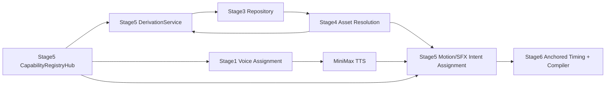

# Video Agent V4 Stage 5：可执行能力注册与派生执行设计

状态：设计已冻结；按 §16 实施中（Unit 1–5 完成）

日期：2026-07-18

## 1. 权威基线

本设计服从以下文档，冲突时按顺序取高优先级：

1. `video_agent_v4_architecture_framework_rev3_20260717.md`
2. `video_agent_v4_stage0_golden_scenario_rev3_20260718.md`
3. `video_agent_v4_stage1_semantic_contract_and_ai_runtime_design_20260717.md`
4. `video_agent_v4_stage2_capability_and_asset_contracts_20260717.md`
5. `video_agent_v4_stage3_repository_sqlite_migration_20260718.md`
6. `video_agent_v4_stage4_dependency_selection_derivation_design_20260718.md`

Stage 5 的核心任务不是增加新的规划 Agent，而是把当前散落在 Python、JSON、Remotion 和本地配置中的能力，收敛为可冻结、可校验、可执行的控制面，并为 Stage 4 提供真实派生执行器。

## 2. 目标

Stage 5 交付五类动态能力：

1. `Derivation Registry`：声明允许的派生类型、输入输出、证据等级、Prompt、模型和执行器。
2. `Effect Registry`：声明动效实现、适用结构、素材形态、方向和时间要求。
3. `SFX Registry`：声明音效文件、同步点、增益、裁切和适用事件。
4. `SFX Profile Registry`：声明音效密度、冷却、预算和冲突降级策略。
5. `Voice Registry`：声明音色、供应商、语言、速度、语气和推荐场景。

同时交付：

- 真实 GPT Image 派生执行器；
- 忠实派生的确定性执行器；
- 程序化 Motion/SFX 意图分配；
- TTS 前的 Voice Profile 解析；
- 完整能力快照、执行指纹和可追溯产物。

## 3. 非目标

Stage 5 不负责：

- 改写文案或重新分类场景；
- 选择业务素材，或改变 Stage 4 已冻结的父素材与关系组需求；
- 生成词级 PhraseAnchor、字幕 Cue、帧号或 Shot 边界；
- 计算 SFX 的最终播放帧、峰值补偿或混音轨；
- 渲染 Remotion/FFmpeg 成片；
- AI 视觉审核、人工审核状态或素材审美评分；
- 为缺失的真实网站页面伪造截图。

## 4. 首要架构决定：实施阶段不等于运行时串行阶段

Stage 5 是能力控制面的实施里程碑，不是一个只能排在 Stage 4 后面的单一运行时步骤。



运行时边界：

- Voice Registry 在 TTS 前被 Stage 1 调用；
- Stage 4 遇到允许派生的 `MaterialGap` 时，同步调用 Stage 5 `DerivationService`，注册后重新查询；
- Stage 4 完成后，Stage 5 根据场景结构、已选素材、SpeechTimingLock 和冻结能力表生成无帧号的 `MotionAudioPlan`；
- Stage 6 才把语义 Anchor 解析为精确帧，并完成字幕、画面和 SFX 峰值卡点。

这样既不形成循环依赖，也不会把真实派生推迟到素材计划完成之后。

## 5. 注册中心扩展

### 5.1 新注册表文件

```text
config/registries/v4/
  derivation.json
  effect.json
  sfx.json
  sfx_profile.json
  voice.json
```

全部由 `CapabilityRegistryHub` 加载、交叉校验和冻结。运行代码不得同时维护 Python 常量表作为第二权威源。

### 5.2 共同行为

每个条目保留 Stage 2 的共同字段：

```json
{
  "id": "example_id",
  "enabled": true,
  "schema_version": 1,
  "handler": "package.module:callable",
  "capabilities": {}
}
```

约束：

- `id` 是稳定协议 ID，显示名不是 ID；
- 禁用只影响新 Run，历史 Run 由冻结快照重放；
- handler 必须可导入且可调用；
- 所有跨注册表引用在 Hub 启动时 fail-loud；
- 注册表内容哈希进入 Run 指纹；
- API Key、绝对路径和本地 provider secret 不进入注册表或快照。

## 6. Derivation Registry

### 6.1 条目契约

```json
{
  "id": "result_to_reference_mock",
  "enabled": true,
  "schema_version": 1,
  "handler": "video_agent.derivation.v4.executors:GptImageExecutor",
  "capabilities": {
    "version": "1",
    "executor_kind": "gpt_image",
    "input_roles": ["result_image"],
    "context_roles": [],
    "output_roles": ["reference_image"],
    "allowed_group_patterns": ["reference_result_plan"],
    "minimum_parents": 1,
    "maximum_parents": 1,
    "output_evidence_class": "E2_semantic_derivative",
    "prompt_template": "video_agent/prompts/v4/derivation/result_to_reference_mock/system.v1.md",
    "prompt_contract_version": "result_to_reference_mock.v1",
    "provider_profile": "gpt_image_default",
    "supports_orientations": ["portrait", "landscape", "square"],
    "website_truth_policy": "forbidden"
  }
}
```

Registry 决定允许做什么，Stage 4 决定当前场景是否需要做。Agent 不能临时发明 capability ID、输入角色、输出角色或证据等级。

### 6.2 首批能力

| capability_id | 输入 | 输出 | 执行器 | 证据等级 |
|---|---|---|---|---|
| `site_faithful_reframe` | 网站截图 | 同角色竖屏关键帧 | deterministic compositor | E1 |
| `site_feature_entry_callout_keyframe` | 真实功能入口截图 | 标记后的同角色单帧 | deterministic compositor | E1 |
| `site_params_flower_text_frame_sequence` | 真实参数面板 + 已登记字段 | base/stage/final 三帧 | deterministic compositor | E1 |
| `result_to_reference_mock` | 结果图 | 参考图 mock | GPT Image | E2 |
| `reference_to_result` | 参考图 | 结果图 | GPT Image | E2 |
| `result_to_flat_plan` | 结果图 | 平面图 | GPT Image | E2 |
| `result_to_editor_process` | 结果图 + 编辑页面底图 | source_result/editor_page/edited_result | composite + GPT Image | E2 |
| `result_to_edited_result` | 结果图 | 明显但连贯的编辑后结果 | GPT Image | E2 |
| `text_to_result` | 无父素材 | 缺失的具体结果图 | GPT Image | E2 |
| `normalize_gallery_asset` | 结果图 | 同内容统一比例版本 | deterministic preferred, GPT Image exceptional | E1 或 E2 |

限制：

- 网站主页、功能入口、参数页必须有真实父截图；不得使用 GPT Image 从文字凭空生成网站 UI；
- 网站截图的 E1 派生只能做像素保持的缩放、裁切、排版或使用已持久化的标记层；
- 需要改变 UI 内容、重绘文字或补造控件的输出只能是 E2，且不得承担网站功能事实 Claim；
- `result_to_reference_mock` 可以用于“上传参考图后生成结果”的演示，但必须保留 GPT Image lineage；存在原始参考图关系组时，Stage 4 优先使用原图；
- `text_to_result` 只用于具体、可派生且位于叙事中间的素材缺口，不替代 `no_asset_transition`。

`editor_sequence` 的权威必需成员只有：

```text
source_result -> editor_page -> edited_result
```

`editor_modal` 只能作为 `context_asset_refs` 中的可选视觉上下文，不能成为 `editor_sequence` 的必需成员，也不能改变 `relation_pattern.json` 的三成员契约。

### 6.3 Stage 4 派生类型映射

Stage 4 只声明需要的 `derivation_type`；其值必须直接等于启用的 Derivation Registry entry ID，不再维护别名表或兼容映射。

| Stage 4 缺口/关系需求 | derivation_type | required pattern | 输出 |
|---|---|---|---|
| 网站截图竖屏忠实重排 | `site_faithful_reframe` | 无或沿用原关系 | 同角色单图 |
| 功能入口强调关键帧 | `site_feature_entry_callout_keyframe` | 无 | `feature_entry` |
| 参数花字序列 | `site_params_flower_text_frame_sequence` | `parameter_callout_sequence` | base/stage/final |
| 编辑流程 | `result_to_editor_process` | `editor_sequence` | source_result/editor_page/edited_result |
| 结果反推参考图 | `result_to_reference_mock` | `reference_result_plan` | reference_image |
| 参考图生成结果 | `reference_to_result` | `reference_result_plan` | result_image |
| 结果生成平面图 | `result_to_flat_plan` | `reference_result_plan` | flat_plan |
| 具体结果缺失且无父图 | `text_to_result` | 由槽需求决定 | result_image |
| Gallery 规格统一 | `normalize_gallery_asset` | 无 | 与父图同业务角色 |

`capability_id` 是 Stage 5 resolver 对 Registry entry 的绑定结果。首版采用 `capability_id == derivation_type`，但只有 `PreparedDerivation` 可以携带 capability version 和最终执行指纹。

### 6.4 Prompt 体系

禁止使用一个万能 Prompt 处理所有派生。每种能力独立目录：

```text
video_agent/prompts/v4/derivation/<capability_id>/
  system.v1.md
  input.schema.json
  examples.v1.json
```

Prompt 固定结构：

1. Role：当前派生能力的唯一职责；
2. Goal：目标角色、方向和关系；
3. Source Facts：父素材顺序、角色、分类和不可改变内容；
4. Narrative Context：当前句、锚点短语、前后场景摘要；
5. Required Changes：只允许的变化；
6. Forbidden Changes：禁止串类、换主体、伪造 UI、增加无关 Logo/文字；
7. Output Geometry：尺寸、方向、安全区和完整画面要求。

传给模型的是结构化相对引用和实际图像输入，不包含宿主机绝对路径。

Prompt 采用“确定性安全外壳 + 条件 AI 语义规格”两层：

```text
DerivationRequest + parent metadata + narrative context
→ deterministic capability envelope
→ optional DerivationPromptAgent
→ typed DerivationPromptSpec
→ deterministic final prompt renderer
```

- E1 忠实派生不调用 Prompt Agent，全部由确定性规则执行；
- E2 语义派生允许 capability 声明 `prompt_mode=semantic_agent`；
- Prompt Agent 只能填写 `subject_continuity`、`requested_change`、`composition_requirement`、`forbidden_changes` 等封闭字段；
- Prompt Agent 不得改父素材、目标角色、分类、关系组、证据等级、模型或输出尺寸；
- 最终自然语言 Prompt 始终由 capability 专属模板渲染，不直接采用 Agent 的自由文本；
- Prompt Agent 是条件 AI 能力，只在真实派生发生时调用，不成为每个 Run 必经的长 Agent 链；
- Agent 请求继续保存五件套 trace，输出必须通过 Pydantic Contract。

这既保留根据文案上下文和参考图动态生成指令的能力，又避免 AI 越权改变 Stage 4 已冻结的素材关系。

### 6.5 准备与执行契约

```text
DerivationRequest
→ CapabilityResolver
→ PreparedDerivation
→ find_by_derivation_signature
→ DerivationExecutor
→ DerivationExecutionResult
→ Stage3 register assets/lineage/group
→ Stage4 re-query
```

`PreparedDerivation` 至少包含：

```json
{
  "request_id": "derivation://R0001",
  "capability_id": "result_to_flat_plan",
  "capability_version": "1",
  "ordered_parent_refs": ["asset://A0011"],
  "ordered_context_refs": [],
  "prompt_template_sha256": "...",
  "prompt_input_sha256": "...",
  "provider_profile_id": "gpt_image_default",
  "provider_model": "gpt-image-2",
  "target_size": "1024x1792",
  "execution_fingerprint": "...",
  "derivation_signature": "..."
}
```

Stage 4 提交给 Stage 5 的 `DerivationRequest` 是需求形状，不是已绑定的执行请求。目标 Contract 为：

```json
{
  "request_id": "derivation://R0001",
  "scene_id": "s006",
  "slot_id": "editor_page",
  "derivation_type": "result_to_editor_process",
  "category_id": "text_to_image.culture_wall",
  "target_asset_role": "editor_page",
  "required_group": {
    "group_type": "process",
    "pattern_id": "editor_sequence",
    "member_key": "editor_page"
  },
  "parent_asset_refs": ["asset://A0123"],
  "context_asset_refs": ["asset://A0003"],
  "narrative_context": {},
  "target_orientation": "landscape",
  "evidence_ceiling": "E2_semantic_derivative"
}
```

`DerivationRequest` 不再包含 `capability_id`、`capability_version` 或 `derivation_signature`。当前 Stage 4 代码中的这三个字段是 Stage 5 接线前的临时实现；Stage 5 第一个实施单元必须直接修订 Contract、resolver 和 fake fixture，不提供兼容字段或占位值。

### 6.6 签名所有权与复用

最终 `derivation_signature` 必须包含：

- 有序父素材 `asset_ref + content_sha256`；
- 有序 context 素材 `asset_ref + content_sha256`；
- capability ID/version；
- Prompt 模板哈希和规范化 Prompt 输入哈希；
- provider profile ID、模型、质量、尺寸；
- category、目标角色、关系 pattern/member key；
- 目标方向和确定性执行参数。

签名不得包含：

- Run ID、request ID；
- API Key；
- 本地绝对路径；
- 时间戳；
- provider 临时 response ID。

最终签名的唯一所有者是 Stage 5 `PreparedDerivation`：

```text
Stage4 DerivationRequest
→ Stage5 prepare capability/prompt/model/size
→ Stage5 compute final derivation_signature
→ Stage4 resolution session find_by_derivation_signature
→ hit: reuse and re-query
→ miss: execute, Stage3 register, re-query
```

Stage 4 仍负责“命中后复用、注册后重查”的解析闭环，但不得在 prepare 之前计算最终签名。

零父素材的 `text_to_result` 使用显式空父集合标记 `parents=[]`；签名仍包含 category、target role、Prompt 输入、narrative context、模型、尺寸和 capability version。它不能退化成只按 `derivation_type` 复用同一张图。

### 6.7 持久化与失败语义

执行成功必须通过 Stage 3 `AssetRepository` 单事务注册：

- 输出对象；
- `AssetRecord`；
- `AssetLineage`；
- 必需的 `AssetGroup`；
- Prompt/provider provenance；
- 派生签名。

仅做技术校验：文件可解码、尺寸/方向/媒体类型正确、输出数量正确、对象哈希稳定。Stage 5 不做 AI 视觉审核。

失败策略：

- 网络超时、429、5xx 可按 provider profile 重试；
- 图片不可解码、输出数量错误、角色不匹配直接失败；
- 不得在失败后悄悄换 Prompt 语义、父素材或目标角色；
- 不得从真实网站素材失败降级为伪造截图；
- 生产配置禁止 Fake resolver/executor；测试 fixture 可显式启用。

## 7. Effect Registry

### 7.1 条目契约

```json
{
  "id": "slide_gallery",
  "enabled": true,
  "schema_version": 1,
  "handler": "video_agent.motion.v4.effects:slide_gallery",
  "capabilities": {
    "visual_structures": ["gallery"],
    "asset_roles": ["result_image"],
    "media_types": ["image"],
    "orientations": ["portrait", "landscape", "square"],
    "minimum_items": 2,
    "maximum_items": null,
    "supports_mixed_orientation": true,
    "animated_input_policy": "preserve_without_extra_breath",
    "continuity_scope": "scene_group",
    "minimum_scene_frames": 36,
    "readable_settle_frames": 12,
    "requires_readable_hold": true,
    "event_bindings": ["item_transition"],
    "fallback_effect_ids": ["card_stack", "fade_in"],
    "weight": 100
  }
}
```

要求：

- 最低时长和可读停留属于 Effect 条目，不是全局硬规则；
- `maximum_items=null`，禁止重新引入全局图片数量上限；
- 横竖屏适配是 handler 能力，不允许仅因竖图改成另一套叙事；
- 同一 Gallery/sequence 组只选择一次动效、方向、容器、背景和节奏参数；
- 已是 GIF/视频的 IP 或品牌素材不叠加 `brand_breath`；静态品牌素材可使用 `light_sweep`；
- 灰色卡片舞台不是默认视觉，Stage 容器默认透明；需要底板时必须由 layout/effect 显式声明。

### 7.2 首批启用映射

| 场景/结构 | 候选动效 |
|---|---|
| 网站主页 | `spring_card_pop`, `card_flip_3d`, `paper_curl_flip` |
| 功能入口 | `detail_push_in`, `spring_card_pop` |
| 参数 process | `fade_in`, `result_reveal`，序列帧渐显 |
| 横/竖屏结果 Gallery | `slide_gallery`, `card_stack` |
| 同图多模块 | `grid_reveal` |
| 单结果细节 | `full_bleed_to_safe_card`, `detail_push_in`, `result_reveal` |
| 因果/对比 | `before_after` |
| 编辑 process | `detail_push_in` + sequence handler |
| 无图承接 | `light_sweep` |

现有 `video_agent/effects.py` 硬编码表迁移为 Registry；Remotion 组件实现保留为 handler，不复制实现。

## 8. Motion Assignment

Motion Assignment 完全程序化，输入：

- `SceneSemanticPlan`；
- `ResolvedAssetPlan`；
- `SpeechTimingLock`；
- Effect Registry 冻结快照；
- Run seed；
- 前一个场景和当前连续组状态。

`continuity_group_id` 由 Stage 5 根据 scene visual structure、关系组 alias 和相邻 Gallery/sequence 边界确定，是 Run 内的程序派生字段。它不是 Scene Semantics Agent 输出，也不恢复 Stage 0 已废弃的 `continuity_group` 字段。

选择顺序：

1. 硬过滤 visual structure、asset role、media type、数量、方向和 sequence/group 能力；
2. 使用 SpeechTimingLock 中该场景原文覆盖的可用毫秒预算过滤最低时长；
3. 继承连续组已经冻结的 effect family、方向和容器；
4. 避免与前一独立组完全重复的强动效；
5. 使用稳定 Run seed 按权重选择；
6. 无合法候选时沿 Registry fallback 链降级；仍无候选则 fail-loud。

Stage 5 只输出语义事件，不输出帧号。例如：

```json
{
  "scene_id": "s002",
  "effect_id": "slide_gallery",
  "continuity_group_id": "gallery:s002",
  "direction": "left",
  "event_intents": [
    {"event_id": "item:g1:enter", "anchor_phrase": "文化墙"},
    {"event_id": "item:g2:enter", "anchor_phrase": "门头招牌"}
  ]
}
```

Stage 6 将 `anchor_phrase` 对齐到 Token 并生成实际帧。因此“文化墙声音出现时切文化墙图”的硬卡点不被 Stage 5 的随机动效破坏。

## 9. SFX Registry 与 Profile

### 9.1 SFX Registry

现有 `assets/audio/sfx/catalog.json` 迁移为 `sfx` 注册表的资产来源，保留 WAV 哈希与 48kHz/16-bit/stereo 技术校验。

SFX 使用独立音频资产边界：

- 文件继续存放在 `assets/audio/sfx/`，由 SFX Registry 记录相对路径和哈希；
- 不写入 Stage 3 视觉 `ObjectStore`、`AssetRecord` 或 `AssetGroup`；
- Stage 3 拒绝 audio 的约束保持不变；
- SFX Registry loader 自行完成 WAV 格式、文件存在性和内容哈希校验；
- Run 快照冻结 SFX 元数据与内容哈希，不复制音频为视觉素材。

条目至少声明：

- 相对音频路径 / content hash；
- gain、trim、fade、priority；
- sync point / sync offset；
- allowed/forbidden event intents；
- 动效事件或操作语义来源；
- 可选替代音效。

首批 ID 保持：`typing`、`transition_whoosh`、`camera_shutter`、`task_complete`、`mouse_click`、`swish`。

### 9.2 SFX Profile Registry

首批 Profile：

```text
clean
normal
energetic
custom
```

Profile 声明而非全局硬编码：

- 最小间隔；
- 滑动时间窗与事件预算；
- 同类冷却；
- 各优先级预算；
- 冲突时 `keep / attenuate / suppress`；
- 动效音效与操作语义音效的优先顺序。

`normal` 可继承当前 `douyin_common_v1` 的资产配置；Profile ID 与资产库 ID 分离。

### 9.3 SFX 意图

Stage 5 产生两层 `SfxIntent`：

```text
operation_semantic  参数输入、点击、上传、生成完成
effect_event        Gallery 切换、卡片入场、轻扫
```

操作语义优先于动效事件。Stage 5 不计算最终播放帧；Stage 6 用同一个 PhraseAnchor 完成冲突仲裁、首帧补偿和峰值对齐。超过 Profile 密度时抑制低优先级事件，不把“音效太密”作为编译失败。

## 10. Voice Registry

### 10.1 条目契约

```json
{
  "id": "minimax_adman_clear_01",
  "enabled": true,
  "schema_version": 1,
  "handler": "video_agent.speech.minimax:MiniMaxSpeechProvider",
  "capabilities": {
    "provider": "minimax",
    "provider_voice_ref": "local:minimax.voice_id",
    "language": "zh-CN",
    "traits": ["清晰", "有节奏", "广告种草"],
    "default_speed": 1.2,
    "supported_emotions": [],
    "priority": 100
  }
}
```

`provider_voice_ref` 可以引用本地 secret/config key，但冻结快照只记录引用和已解析值的不可逆指纹，不记录 API Key。

### 10.2 解析模式

```text
fixed  Case 明确 voice_profile_id，程序直接解析，可与 Scene Semantics 并行执行 TTS
auto   从启用音色中按语言、场景、语气过滤；必要时调用条件 AI 排序
```

当前项目默认使用 `fixed`。一次视频仍使用一个 Voice Profile 和一次完整 MiniMax TTS 调用，不做场景间换音色。

输出 `ResolvedVoiceProfile`，至少记录 profile ID/version、provider、voice ref fingerprint、speed、emotion、subtitle type 和 Registry snapshot ID。

## 11. Stage 5 输出契约

### 11.1 MotionAudioPlan

```json
{
  "schema_version": 1,
  "run_seed": "...",
  "scene_plan_sha256": "...",
  "resolved_asset_plan_sha256": "...",
  "speech_timing_lock_sha256": "...",
  "registry_snapshot_id": "registry-snapshot://sha256/...",
  "scenes": [
    {
      "scene_id": "s002",
      "continuity_group_id": "gallery:s002",
      "effect": {
        "effect_id": "slide_gallery",
        "effect_version": "1",
        "layout_profile_id": "douyin_gallery_safe",
        "direction": "left",
        "parameters": {}
      },
      "event_intents": [
        {
          "event_id": "s002.g1.enter",
          "event_type": "item_enter",
          "slot_id": "g1",
          "member_key": null,
          "anchor_phrase": "文化墙"
        }
      ]
    }
  ],
  "sfx_profile": {
    "profile_id": "normal",
    "profile_version": "1",
    "content_sha256": "..."
  },
  "sfx_intents": [
    {
      "intent_id": "sfx:s002.g1.enter",
      "scene_id": "s002",
      "event_id": "s002.g1.enter",
      "source_kind": "effect_event",
      "anchor_phrase": "文化墙",
      "sfx_id": "swish",
      "priority": 55
    }
  ]
}
```

`MotionAudioPlan` 允许：effect ID、布局 profile、方向、连续组、语义事件、anchor phrase、SFX ID/优先级。

禁止：start/end frame、字幕 Cue、音频 track 起点、实际峰值帧。它们属于 Stage 6。

### 11.2 字段级 Contract 草案

```text
MotionAudioPlan
  schema_version: int >= 1
  run_seed: non-empty string
  scene_plan_sha256: sha256
  resolved_asset_plan_sha256: sha256
  speech_timing_lock_sha256: sha256
  registry_snapshot_id: registry-snapshot URI
  scenes: list[SceneMotionIntent], exactly one per planned scene
  sfx_profile: FrozenSfxProfileRef
  sfx_intents: list[SfxIntent]

SceneMotionIntent
  scene_id: existing SceneSemanticPlan.scene_id
  continuity_group_id: optional Run-scoped string
  effect: EffectBinding
  event_intents: ordered list[EffectEventIntent]

EffectBinding
  effect_id: enabled Effect Registry ID
  effect_version: frozen entry version
  layout_profile_id: enabled layout profile ID
  direction: none | left | right | up | down
  parameters: keys allowed by the selected Effect Registry entry only

EffectEventIntent
  event_id: unique within Run
  event_type: event declared by the selected Effect entry
  slot_id: optional existing scene slot
  member_key: optional existing relation-pattern member
  anchor_phrase: exact non-empty substring of frozen narration

SfxIntent
  intent_id: unique within Run
  scene_id: existing scene ID
  event_id: optional existing EffectEventIntent ID
  source_kind: operation_semantic | effect_event
  anchor_phrase: exact non-empty substring of frozen narration
  sfx_id: enabled SFX Registry ID
  priority: integer copied from registry/profile resolution

FrozenSfxProfileRef
  profile_id: enabled SFX Profile Registry ID
  profile_version: frozen version
  content_sha256: sha256
```

Domain Validator 还必须保证：

- scene 顺序与 `SceneSemanticPlan` 一致且不缺不重；
- 同一 `continuity_group_id` 的 effect family、direction、layout 和共享参数一致；
- 每个 anchor phrase 原样存在于对应 scene 的 frozen text；
- `effect_event` 必须引用已声明 event；
- `operation_semantic` 可以没有 event_id；
- Contract 中不得出现任何 frame、timestamp 或音频 track 起点字段。

这是一版实施前 Contract 草案；字段删除或改名必须先修订本文，禁止实现期自行漂移。

### 11.3 Derivation 执行产物

每次真实派生在 Run 下保存：

```text
derivations/<request_id>/
  request.json
  prompt.md
  prepared.json
  provider.response.json
  result.json
  manifest.json
```

二进制图片只进入 ObjectStore；Run 目录不复制第二份权威素材。

## 12. 冻结、Resume 与可重现性

Stage 5 指纹包含：

- 输入 Scene/Asset/Speech 文件哈希；
- Effect/SFX/SFX Profile/Voice/Derivation 注册表快照；
- Prompt 模板和 examples 哈希；
- provider profile、base URL 指纹、model、quality、size；
- executor handler 代码指纹；
- Run seed 和 Stage 5 配置。

不包含 API Key。Resume 规则：

- 派生签名命中 Repository 时复用素材；
- MotionAudioPlan 输入指纹完全相同才复用；
- 注册表、Prompt、模型或 handler 变化必须失效；
- 历史 Run 始终读取其冻结快照，不受当前 enabled 状态变化影响。

## 13. 当前实现迁移表

| 当前实现 | Stage 5 归宿 |
|---|---|
| `video_agent/effects.py::EFFECTS` | `effect.json` + typed loader |
| Remotion `shot.motion` 分支 | Effect handler，实现保留 |
| `assets/audio/sfx/catalog.json` | SFX 资产源，迁移进 SFX Registry |
| `video_agent/audio/profiles.py` | Registry loader + 技术完整性校验 |
| `config/minimax.local.json` | 本地 provider secret/config，不作为 Registry 权威源 |
| `config/gpt_image.local.json` | 本地 provider profile secret/config |
| `video_agent/assets/materializer.py` | 拆为 capability-specific prompt composer/executor |
| `video_agent/assets/v4/derivation_orchestrator.py::Fake*` | 仅 fixture；生产改注入 Stage5 resolver/executor |
| `video_agent/planning/scene_visual.py` 动效硬编码 | Motion Assignment + Effect Registry |

迁移期间不得让 V3 表和 V4 Registry 同时决定同一个 V4 Run。V3 继续服务旧主线，Stage 7 切换时整体删除旧权威源。

## 14. Stage 0 黄金场景对齐

| 黄金场景 | Stage 5 要求 |
|---|---|
| s001 网站主页 | 真实 `site_home`，从启用主页动效中稳定选择 |
| s002 多结果 Gallery | 一组统一 `slide_gallery/card_stack`；每项 anchor phrase 独立 |
| s003 功能入口 | 真实 `feature_entry`，不得伪造 UI |
| s004 参数 process | 完整 base/stage/final 组；花字序列由 effect event 表达 |
| s005 结果回显 | 使用 Stage4 独立选中的 `primary_result` |
| s006 编辑 process | 上一结果作为父素材；缺素材时真实派生并注册完整 process 组 |
| s007 参考→结果 | 优先已有原始关系组；否则 `result_to_reference_mock`，保留 E2 lineage |
| s008 平面图 | 复用 s007 同一组或从同一 result 派生，不重新猜图 |
| s009 no asset | `light_sweep`，不调用 GPT Image，不用品牌 IP 兜底 |
| s010 片尾 | `default_outro` configured asset；不是客户 LOGO 或通用熊猫 IP |

## 15. 错误码

```text
registry_missing
registry_cross_reference_invalid
capability_disabled
capability_not_applicable
fake_executor_forbidden
website_truth_violation
prompt_contract_invalid
provider_profile_missing
derivation_provider_failed
derivation_output_invalid
derivation_registration_failed
effect_no_legal_candidate
sfx_profile_missing
voice_profile_missing
voice_provider_incompatible
```

错误必须带 scene_id、slot_id/request_id、capability/effect/profile ID 和对应冻结快照 ID。

## 16. 实施顺序

1. 无兼容修订 Stage 4 `DerivationRequest`：增加 `derivation_type`，移除 capability/version/signature，并同步 resolver/fake fixture；
2. 扩展 typed Registry contracts 和 Hub 交叉校验；
3. 建立五份 Registry 与冻结快照；
4. 实现 Voice fixed 解析，接回 Stage 1 TTS 前；
5. 实现 Derivation capability resolver、PreparedDerivation 和生产禁用 Fake；
6. 按 capability 拆分 Prompt 与 GPT Image/确定性 executor；
7. 接入 Stage 3 单事务注册和 Stage 4 重查；
8. 将动效硬编码迁到 Effect Registry，实现 Motion Assignment；
9. 将 SFX Catalog/Profile 迁到 Registry，输出无帧号 SFX Intent；
10. 冻结 `MotionAudioPlan`，为 Stage 6 提供稳定输入；
11. 更新进度文档，但不切换 V3 主线。

每一步必须独立 commit，禁止把 Registry、GPT Image、Motion 和 SFX 一次混入同一提交。

## 17. Definition of Done

- [ ] 五类 Registry 均由 Hub typed load、交叉校验并冻结；
- [ ] 当前 V4 Run 不再读取 `EFFECTS` 或 V3 动效枚举作为权威源；
- [ ] 当前 6 个 SFX 的文件哈希、格式和语义配置进入冻结 Registry；
- [ ] `fixed` Voice Profile 在 TTS 前解析，默认速度来自 Registry/Case 覆盖；
- [ ] Stage 4 生产路径拒绝 Fake executor；
- [ ] 最终 `derivation_signature` 只由 `PreparedDerivation` 计算，Stage 4 不预计算；
- [ ] `site_params_flower_text_frame_sequence` 原子注册 base/stage/final 三成员组；
- [ ] `editor_sequence` 只要求 source_result/editor_page/edited_result，modal 仅为可选 context；
- [ ] 真实派生使用 Stage 4 父素材、上下文和目标角色，不重新选图；
- [ ] 网站截图缺失时 fail-loud，不生成伪截图；
- [ ] 派生输出通过 Stage 3 注册 lineage/group/signature 后才可被 Stage 4 选中；
- [ ] 相同签名不重复调用 GPT Image；
- [ ] 不同 Prompt、模型、父素材或尺寸必然产生不同签名；
- [ ] Gallery/sequence 的 effect、方向、容器和背景按组冻结；
- [ ] MotionAudioPlan 不包含帧号或字幕 Cue；
- [ ] SFX 只输出语义意图，最终峰值对齐留给 Stage 6；
- [ ] SFX 保持独立音频资产边界，不进入 Stage 3 视觉 ObjectStore；
- [ ] 无 AI 视觉审核、reviewed/human_approved 字段或品牌 IP 缺图兜底；
- [ ] Stage 0 s001-s010 能力矩阵均有合法 binding 或明确 fail-loud；
- [ ] Registry/Prompt/model/handler 变化使 Resume 失效；
- [ ] API Key、绝对路径和本地 secret 不进入快照、trace 或 Git。

## 18. 进入 Stage 6 前必须冻结

1. `MotionAudioPlan` 的精确 Contract；
2. Effect event 到 anchor phrase 的命名规则；
3. SFX Intent 的两层来源与优先级；
4. Effect 最短时长不足时的 Registry fallback 语义；
5. `ResolvedVoiceProfile` 与 `SpeechTimingLock` 的指纹关系；
6. Stage 6 只解析 Anchor/帧，不反向更换素材、动效、音效或音色。
