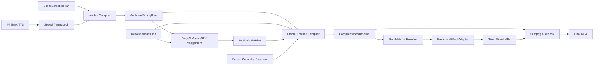

# Video Agent V4 Stage 6：语义锚点、帧级编译与 Remotion Adapter 设计

状态：设计已冻结；允许按 Unit 0–7 分阶段实施

日期：2026-07-18

## 1. 权威基线

本设计服从以下文档，冲突时按顺序取高优先级：

1. `video_agent_v4_architecture_framework_rev3_20260717.md`
2. `video_agent_v4_stage0_golden_scenario_rev3_20260718.md`
3. `video_agent_v4_stage1_semantic_contract_and_ai_runtime_design_20260717.md`
4. `video_agent_v4_stage2_capability_and_asset_contracts_20260717.md`
5. `video_agent_v4_stage3_repository_sqlite_migration_20260718.md`
6. `video_agent_v4_stage4_dependency_selection_derivation_design_20260718.md`
7. `video_agent_v4_stage5_executable_capability_and_derivation_design_20260718.md`

Stage 6 的最高优先级不是“尽量同步”，而是执行仓库根目录 `AGENTS.md` 的硬合同：

> 同一语义短语的口播、字幕、画面首次命中、字幕高亮和 SFX 实际峰值必须绑定同一个词级 Anchor。

关于片尾语义，以 Stage 0 金标和本设计为准：`default_outro` 是最后 CTA 语义场景 s010 的 configured asset，不是口播结束后默认再插入一次的独立视频；仅显式 `postroll_frames` 才追加无口播尾帧。框架 §3.6 中“独立于正文”的表述指片尾不参与随机选材，不表示它脱离最后一句口播 Anchor。

## 2. 目标

Stage 6 交付三个不可变产物和一层真实渲染适配：

1. `SpeechTimingLock`：仅记录 TTS 返回的语音时间事实；
2. `AnchoredTimingPlan`：将 `SceneSemanticPlan` 的场景、槽位、事件和 Claim 精确绑定到词级 Token；
3. `CompiledVideoTimeline`：将素材、动效、字幕和音效意图编译为完整的 30 fps 多轨时间线；
4. `Remotion Effect Adapter`：将冻结的 `effect_id` 执行为像素级 Remotion 组件。

Stage 6 复用现有 V3 已验证的能力，但不复用其不合理的全局限制：

- 复用 Token 对齐与标点恢复；
- 复用 `PhraseAnchor`、Gallery 词起切图、单行字幕和 SFX 峰值补偿；
- 复用完整 base 轨、抖音安全区、Remotion 素材冻结和 FFmpeg 混音；
- 删除 speech 阶段按 Narration beat 猜测语义短语的职责；
- 删除全局视频时长、镜头最长时长、固定十字字幕、任意图片数量等代理质量规则；
- 删除编译期反向换素材、动效、音效、音色或重新请求 AI 的能力。

## 3. 非目标

Stage 6 不负责：

- 改写或重分段文案；
- 修改 `SceneSemanticPlan`；
- 重选、补选或派生素材；
- 重新选择动效、方向、布局、SFX 或音色；
- AI 视觉审核或人工审核状态；
- 按视觉相似度猜测因果关系；
- 让 AI 输出帧号、字幕 Cue 或 SFX 时间；
- 在 Remotion 内根据原始截图坐标重新绘制框选；
- 为通过编译而静默截断 Gallery、删除关系组成员或延长口播。

## 4. 首要架构决定：Stage 6 是两个运行时插入点

Stage 6 是实施里程碑，不是一个只能排在 Stage 5 后面的串行函数。



这带来一个必要的 Stage 5 接线修正：

- Stage 5 Motion 分配不再通过 `scene_budget_ms()` 对全文做比例估算；
- 它读取 `AnchoredTimingPlan.scene_spans` 的精确场景时长过滤 Effect Registry；
- Stage 6 最终编译只验证已冻结动效合法，不在最后一刻替换动效。

因此现有 `motion/v4/timing_budget.py` 的比例 fallback 不进入 V4 主线。场景文本不能精确对齐时，应在 Anchor Compiler fail-loud，而不是猜一个时长继续执行。

## 4.1 Stage 5 Runtime Amend

Stage 5 的能力注册、派生执行、Voice、Motion/SFX 控制面仍视为完成；Stage 6 实施必须对其时间输入接线做一次无兼容修订。该修订属于 Stage 6 Unit 3，不另建旧 `TimingLock` 适配层。

| 项 | 修订前 | Stage 6 强制修订 |
|---|---|---|
| 运行顺序 | TTS → legacy TimingLock → Stage5 Motion | TTS → `SpeechTimingLock` → Anchor Compiler → `AnchoredTimingPlan` → Stage5 Motion |
| Speech 落盘产物 | V3 `TimingLock`，包含 `phrase_anchors` | V4 `SpeechTimingLock`，不含语义 Anchor，必须包含 Voice 指纹 |
| Motion 时间输入 | `TimingLock` | `AnchoredTimingPlan.scene_spans` |
| 场景预算 | 精确匹配失败后按全文比例估算 | 只接受精确 `AnchoredSceneSpan`，失败即停止 |
| 语音指纹 | 含 V3 phrase anchors 的 TimingLock 哈希 | `speech_timing_lock_sha256` 只哈希纯语音事实 |
| 语义时间指纹 | 无 | `MotionAudioPlan.anchored_timing_plan_sha256` 必填 |
| Effect 过滤 | 按 `minimum_scene_frames` 和估算预算 | 按 Registry 变体的真实最小预算和精确 scene span |
| SFX 粗筛 | 按场景 `window_event_budget` 截断 intent | 只折叠完全重复 intent，并在同 phrase 冲突时保留 operation semantic；不同 Anchor 不得按条数截断 |
| 兼容 | 读取 V3 `TimingLock.phrase_anchors` | 禁止兼容读取 |

`MotionAudioPlan` 修订后必须同时携带：

```json
{
  "speech_timing_lock_sha256": "纯语音事实哈希",
  "anchored_timing_plan_sha256": "语义 Anchor 计划哈希"
}
```

Stage 5 DoD 增补一项运行时集成条件：Motion assignment 已使用精确 scene span，且比例 fallback 不可达。在该条件由 Stage 6 Unit 3 落地前，进度描述应理解为“Stage 5 控制面完成，Stage 6 时间接线待完成”，不能宣称 V4 Motion 主路径已最终冻结。

## 5. 不可变产物边界

### 5.1 SpeechTimingLock

`SpeechTimingLock` 只保存供应商返回并经校验后的语音事实：

```json
{
  "schema_version": 1,
  "audio_object_key": "runs/.../speech.wav",
  "audio_sha256": "...",
  "voice_profile_id": "...",
  "voice_profile_sha256": "...",
  "fps": 30,
  "duration_ms": 19842,
  "duration_frames": 596,
  "tokens": [],
  "pause_events": [],
  "beat_spans": []
}
```

约束：

- `tokens` 保留 `text/start_ms/end_ms/start_frame/end_frame`；
- `PauseEvent` 只记录真实 TTS 时间，不限制最大 450 ms；
- `BeatSpan` 第一版保留为字幕分组、调试和段落边界信息；
- `BeatSpan` 不再生成语义 Anchor；
- 不包含 `phrase_anchors`、素材槽、Claim 或动效信息；
- `ResolvedVoiceProfile` 内容哈希必须进入该产物指纹；
- 文本归一化后 Token 全文必须与冻结文案完全一致。

V4 不为旧 `TimingLock.phrase_anchors` 建兼容读取层。实施时应把现有 `build_timing_lock()` 拆成“语音事实构建”和“语义 Anchor 构建”两个模块。

精确 Contract：

```text
SpeechTokenTimingV4
  token_id: str
  text: str
  start_ms: int
  end_ms: int
  start_frame: int
  end_frame: int                 # exclusive
  beat_id: str | null

SpeechPauseEventV4
  pause_id: str
  after_token_id: str
  requested_ms: int
  measured_start_ms: int
  measured_end_ms: int
  measured_start_frame: int
  measured_end_frame: int

SpeechBeatSpanV4
  beat_id: str
  token_ids: list[str]
  start_frame: int
  end_frame: int                 # exclusive

SpeechTimingLock
  schema_version: int
  case_id: str
  run_id: str
  narration_sha256: str
  audio_object_key: str          # Run 内相对 POSIX 路径
  audio_sha256: str
  voice_profile_id: str
  voice_profile_version: str
  voice_profile_sha256: str
  fps: int
  duration_ms: int
  duration_frames: int
  tokens: list[SpeechTokenTimingV4]
  pause_events: list[SpeechPauseEventV4]
  beat_spans: list[SpeechBeatSpanV4]
```

所有帧区间使用 `[start_frame, end_frame)`。`audio_object_key` 禁止宿主机绝对路径。

### 5.2 AnchoredTimingPlan

`AnchoredTimingPlan` 是 `SpeechTimingLock + SceneSemanticPlan` 的唯一语义时间解释：

```json
{
  "schema_version": 1,
  "speech_timing_lock_sha256": "...",
  "scene_plan_sha256": "...",
  "fps": 30,
  "duration_frames": 596,
  "scene_spans": [],
  "anchors": [],
  "bindings": []
}
```

精确 Contract：

```text
AnchoredSceneSpan
  scene_id
  token_ids
  start_frame
  end_frame                 # exclusive

PhraseAnchor
  anchor_id
  scene_id
  text
  token_ids
  onset_ms / end_ms
  onset_frame / end_frame
  hit_frame                 # 统一语义命中帧，等于首 Token onset

AnchorBinding
  binding_id
  scene_id
  anchor_id
  binding_kind              # slot | operation | claim | effect_event | sfx_intent
  source_id                 # slot_id/event_id/claim_id/intent_id
```

这里的类型全名是 `video_agent.contracts.v4.anchored_timing.PhraseAnchorV4`。禁止 import 或复用 V3 `video_agent.contracts.timing.PhraseAnchor`；后者要求 `beat_id`，语义和字段均不兼容。

精确顶层 Contract：

```text
AnchoredTimingPlan
  schema_version: int
  case_id: str
  run_id: str
  narration_sha256: str
  speech_timing_lock_sha256: str
  scene_plan_sha256: str
  fps: int
  duration_frames: int
  scene_spans: list[AnchoredSceneSpan]
  anchors: list[PhraseAnchorV4]
  bindings: list[AnchorBinding]
```

最小 mock：

```json
{
  "schema_version": 1,
  "case_id": "case_x",
  "run_id": "run_x",
  "narration_sha256": "...",
  "speech_timing_lock_sha256": "...",
  "scene_plan_sha256": "...",
  "fps": 30,
  "duration_frames": 596,
  "scene_spans": [
    {"scene_id": "s002", "token_ids": ["tok_0008"], "start_frame": 61, "end_frame": 146}
  ],
  "anchors": [
    {"anchor_id": "anchor://s002/slot_g1", "scene_id": "s002", "text": "文化墙", "token_ids": ["tok_0008"], "onset_ms": 2040, "end_ms": 2360, "onset_frame": 61, "end_frame": 71, "hit_frame": 61}
  ],
  "bindings": [
    {"binding_id": "binding://s002/slot_g1", "scene_id": "s002", "anchor_id": "anchor://s002/slot_g1", "binding_kind": "slot", "source_id": "g1"}
  ]
}
```

同一场景、同一文本出现位置只生成一个 canonical `PhraseAnchor`。槽位、事件、Claim、EffectEvent 和 SFX Intent 通过 `AnchorBinding` 共用它，不复制并重新计算帧号。

### 5.3 CompiledVideoTimeline

`CompiledVideoTimeline` 是唯一供渲染器消费的帧级权威：

```text
CompiledVideoTimeline
  run_id / case_id
  fps / width / height / frame_count
  platform_profile_id
  registry_snapshot_id
  speech_timing_lock_sha256
  anchored_timing_plan_sha256
  resolved_asset_plan_sha256
  motion_audio_plan_sha256
  visual_tracks[]
  subtitle_track[]
  audio_tracks[]
  effect_instances[]
  render_assets[]
```

V4 不继续使用 `preferred_min_sec/preferred_max_sec/hard_max_sec` 约束正文。正文长度由冻结口播和固定片尾配置决定。

### 5.4 Unit 0：精确帧级 Contract

任何 Stage 6 代码实施前，先冻结以下 Pydantic Contract。字段不得在 Remotion TSX 中另起一套名字。

```text
CompiledLayout
  x: int
  y: int
  width: int
  height: int
  fit: contain | cover
  border_radius: int
  opacity: float                  # 0..1
  background_style_id: str
  safe_area_profile_id: str

CompiledRenderAsset
  asset_ref: str
  object_key: str                 # Run 内相对 POSIX 路径
  sha256: str
  media_kind: image | video
  width: int
  height: int
  duration_ms: int | null
  has_alpha: bool

CompiledVisualTrack
  track_id: str
  track_kind: base | overlay
  clips: list[CompiledVisualClip]

CompiledVisualClip
  clip_id: str
  scene_id: str
  slot_id: str | null
  group_ref: str | null
  member_key: str | null
  asset_bindings: dict[str, asset_ref]
  start_frame: int
  end_frame: int                 # exclusive
  semantic_hit_frame: int
  hold_reason: reading | appreciation | pause | scene_span | null
  layout_profile_id: str
  layout: CompiledLayout
  effect_instance_id: str
  z_index: int

CompiledEffectEvent
  event_id: str
  event_type: str
  anchor_id: str
  hit_frame: int
  start_frame: int
  end_frame: int

CompiledEffectInstance
  effect_instance_id: str
  effect_id: str
  effect_version: str
  adapter_id: str                # 默认与 effect_id 相同
  variant_id: full | compact | instant
  direction: none | left | right | up | down
  parameters: dict
  events: list[CompiledEffectEvent]

CompiledSubtitleCueV4
  cue_id: str
  scene_id: str
  anchor_id: str | null
  text: str
  start_frame: int
  end_frame: int                 # exclusive
  slot_id: subtitle_top | subtitle_lower
  style_id: default | gallery_yellow
  emphasize_text: str | null
  emphasize_start_frame: int | null
  single_line: Literal[true]

CompiledAudioTrackV4
  track_id: str
  kind: voice | bgm | sfx | outro
  object_key: str
  sha256: str
  start_frame: int
  gain_db: float
  anchor_id: str | null
  semantic_id: str | null
  hit_frame: int | null
  configured_sync_offset_ms: int
  effective_sync_offset_ms: int
  trim_start_ms: int
  expected_peak_frame: int | null
  max_duration_ms: int | null
  fade_in_ms: int
  fade_out_ms: int

CompiledVideoTimeline
  schema_version: int
  case_id: str
  run_id: str
  width: int
  height: int
  fps: int
  narration_frame_count: int
  postroll_frames: int
  frame_count: int
  platform_profile_id: str
  registry_snapshot_id: str
  speech_timing_lock_sha256: str
  anchored_timing_plan_sha256: str
  resolved_asset_plan_sha256: str
  motion_audio_plan_sha256: str
  used_assets_snapshot_id: str
  render_assets: list[CompiledRenderAsset]
  visual_tracks: list[CompiledVisualTrack]
  effect_instances: list[CompiledEffectInstance]
  subtitle_track: list[CompiledSubtitleCueV4]
  audio_tracks: list[CompiledAudioTrackV4]
```

`effect_instance_id` 必须在 clip 和 `effect_instances` 中形成 1:1 可解析引用；一个 effect instance 可以携带多个按 Anchor 编译的 event，但不能跨 continuity group 偷换配置。

最小 timeline mock：

```json
{
  "schema_version": 1,
  "case_id": "case_x",
  "run_id": "run_x",
  "width": 1080,
  "height": 1920,
  "fps": 30,
  "narration_frame_count": 596,
  "postroll_frames": 0,
  "frame_count": 596,
  "platform_profile_id": "douyin_portrait_v1",
  "registry_snapshot_id": "registry-snapshot-x",
  "speech_timing_lock_sha256": "...",
  "anchored_timing_plan_sha256": "...",
  "resolved_asset_plan_sha256": "...",
  "motion_audio_plan_sha256": "...",
  "used_assets_snapshot_id": "assets-snapshot-x",
  "render_assets": [],
  "visual_tracks": [{"track_id": "base", "track_kind": "base", "clips": []}],
  "effect_instances": [],
  "subtitle_track": [],
  "audio_tracks": []
}
```

## 6. Anchor Compiler

### 6.1 场景跨度解析

`SceneSemanticPlan.scenes` 已保证按顺序完整覆盖冻结文案。Anchor Compiler 按场景顺序维护全文字符游标：

1. 对文案、场景文本和 Token 文本执行同一套 Unicode/空白/标点归一化；
2. 从上一个场景结束字符继续匹配当前场景，禁止每个场景从全文开头 `.find()`；
3. 将字符跨度投影到相交 Token；
4. 场景 `start_frame` 使用首 Token onset；
5. 场景 `end_frame` 使用下一场景首 Token onset，最后场景延伸至 `duration_frames`；
6. 任一场景无法连续匹配、重叠或留下未覆盖正文时 fail-loud。

首场景的 base 画面从 `timeline_start=0` 开始；末场景延伸到 `timeline_end=duration_frames`。首 Token 前静音和尾音区都必须有画面，不允许黑帧。

### 6.2 场景内短语解析

Anchor 短语的来源仅限：

- `MaterialSlot.anchor_phrase`；
- `OperationEvent.phrase`；
- `SceneClaim.phrase`；
- `EffectEventIntent.anchor_phrase`；
- `SfxIntent.anchor_phrase`。

解析范围必须收窄到所属场景 Token 跨度。规则：

1. 优先按源对象在场景中的声明顺序，从局部游标向后匹配；
2. 同一短语被多个对象引用且指向同一文本位置时，共用 Anchor；
3. 第一版不增加 `anchor_occurrence`，避免同时回改 Stage 1 Scene Contract 和 Stage 5 intents；
4. 同一短语在同一场景出现多次且无法由声明顺序和已绑定 canonical Anchor 唯一解释时，返回 `anchor_phrase_ambiguous` 并 fail-loud；
5. 程序不得默认取第一次、最后一次或最近位置；未来确有业务需求时再以一次无兼容 Contract 升级增加 occurrence；
6. Anchor 文本必须是场景原文的原样短语，不接受同义词、关键词扩写或模糊匹配；
7. 标点可以不属于词级 Token，但必须通过 display slice 恢复到字幕文本。

### 6.3 帧换算

所有毫秒到帧的换算集中在一个 Timebase 模块，消费者不得自行 `round()`：

```text
hit/onset frame     = ROUND_HALF_UP(ms * fps / 1000)
interval start      = floor(ms * fps / 1000)
interval end        = ceil(ms * fps / 1000), exclusive
timeline frame_count= ceil(duration_ms * fps / 1000)
```

Token 与 PhraseAnchor 的 `hit_frame` 只计算一次。字幕、画面、Effect Event 和 SFX 都引用该值。

Unit 1 必须从现有 `video_agent.speech.timing_lock.ms_to_frame()` 提取共享 Timebase，而不是复制实现。现有函数的 `ROUND_HALF_UP` 仅适用于 hit/onset；Token/区间 `end_frame` 必须改用 `ceil` 并保持 exclusive。需要用恰好落在半帧、整帧和帧间边界的 fixture 固定行为，禁止 V3/V4 各自舍入。

## 7. 视觉时间编译

### 7.1 通用规则

- base 轨必须从 0 连续覆盖到 `frame_count`，无空洞、无重叠；
- overlay 轨允许重叠，但必须有安全区布局与 `z_index`；
- 每个场景至少产生一个 base clip，`no_asset_transition` 产生无素材 LightSweep clip；
- `entry_policy=scene_start` 从场景边界进入；
- `entry_policy=phrase_start` 的目标素材在 Anchor hit frame 首次出现；
- `hold_policy=until_next_slot` 保持到下一槽位 hit frame；
- `hold_policy=scene_end` 保持到场景结束；
- 场景尾部语音停顿继续保持最后合法画面，并记录 `hold_reason=pause`；
- 不因动效最短时长截断语音、提前切到下一素材或重复最后一帧制造假动效。

### 7.2 Gallery

Gallery 是词级卡点最严格的结构：

```text
“文化墙、门头招牌、LOGO、美陈……”
       |          |       |
       v          v       v
     item 1     item 2  item 3
```

规则：

1. 每个 Gallery slot 生成独立 `GalleryItem`；
2. 当前项从自身短语首 Token 的 `hit_frame` 开始；
3. 上一项保持到下一项 `hit_frame`，不得按上一短语结束帧提前切换；
4. Gallery 的第一张图不得在第一项短语之前提前出现，除非该槽位明确为 `scene_start`；
5. 同一 `continuity_group_id` 共享 effect、方向、布局、背景与容器；
6. 横竖屏通过同一布局策略的 orientation variant 适配，不拆成两套语义动效；
7. 图片数量由文案槽位数量决定，不截断、不补齐到固定数量；
8. 场景结束时保持最后一项，不回显第一项或 `primary_output`；
9. 每项生成独立单行黄色字幕 Cue，字幕开始帧与图片 hit frame 相同。

### 7.3 Single

单图场景从场景 Anchor 或槽位 Anchor 进入，并保持到场景结束。若场景包含 Claim，支持素材必须在 Claim Anchor 上可见。

没有明确槽位素材的 `no_asset_transition` 只执行 Stage 5 已选的 `light_sweep`，不得临时加入熊猫 IP 或通用结果图。

### 7.4 Sequence / process

关系组成员顺序来自 `AssetGroup.members.order/member_key`，不是文件名排序。

参数花字序列：

```text
base  -> stage -> final
原页     花字渐显   稳定完成态
```

- `base` 从场景开始显示；
- `stage` 在操作短语 Anchor 开始显现；
- `final` 在结果/完成短语 Anchor 命中；
- 花字是已注册的 E1 派生帧或独立透明 overlay，不在渲染期根据截图坐标重画；
- base/stage/final 使用同一几何容器，禁止切换时宽高跳变；
- 花字 reveal 和稳定停留读取 Effect Registry timing profile，不使用全局 0.6 秒规则。

编辑流程：

```text
source_result -> editor_page -> editor_modal? -> edited_result
```

- 上游 `source_result` 必须保持同一资产身份；
- 页面、放大镜焦点、弹窗和编辑后结果按各自 OperationEvent Anchor 推进；
- `editor_modal` 是可选成员，缺失时不得伪造；
- 编辑页画面使用完整已注册素材，Remotion 不做破坏性局部裁切；
- 若 Stage 4 已冻结的是 BeforeAfter，前后图必须使用一致容器尺寸和 fit 策略。

### 7.5 causal / comparison

- `reference -> result`、`result -> flat_plan` 必须来自同一已绑定关系组；
- 两侧或上下卡片使用相同可视面积、圆角、fit 和标签槽；
- 输入先显示，输出在对应结果短语 Anchor 进入；
- `comparison` 只表达显式对比，不把编辑 process 自动降成 comparison；
- E2 reconstructive reference 可以表达产品演示，但不得提升为事实证据。

## 8. Effect 时间合同与 fallback

### 8.1 Registry 增量字段

现有 Effect Registry 已声明：

- `minimum_scene_frames`；
- `readable_settle_frames`；
- `requires_readable_hold`；
- `event_bindings`；
- `fallback_effect_ids`。

Stage 6 需要为每种 event binding 补充最小执行参数，不能把动画时长继续硬编码在 TSX。Effect Registry schema version 必须 bump，Hub 拒绝未迁移的启用条目：

```json
{
  "event_timing": {
    "enter": {
      "activation": "at_anchor",
      "semantic_visible_at_hit": true,
      "variants": [
        {"variant_id": "full", "minimum_interval_frames": 30, "reveal_frames": 12, "readable_settle_frames": 18},
        {"variant_id": "compact", "minimum_interval_frames": 18, "reveal_frames": 8, "readable_settle_frames": 10},
        {"variant_id": "instant", "minimum_interval_frames": 1, "reveal_frames": 1, "readable_settle_frames": 0}
      ]
    }
  }
}
```

精确增量 Contract：

```text
EffectTimingVariant
  variant_id: full | compact | instant
  minimum_interval_frames: int >= 1
  reveal_frames: int >= 1
  readable_settle_frames: int >= 0

EffectEventTiming
  activation: at_anchor | scene_start
  semantic_visible_at_hit: bool
  variants: non-empty list[EffectTimingVariant]

EffectCapabilities.event_timing
  dict[event_type, EffectEventTiming]
```

Hub 校验：

- `event_bindings` 中每个 event type 必须在 `event_timing` 有且只有一个配置；
- `event_timing` 不得出现未列入 `event_bindings` 的 key；
- `none` 等 `event_bindings=[]` 的条目必须使用空 map；
- variant ID 不重复，按 `full > compact > instant` 质量顺序选择；
- 每个 variant 满足 `minimum_interval_frames >= reveal_frames + readable_settle_frames`；
- 条目级 `minimum_scene_frames` 只保留为场景级快速排除下界，不得大于该 effect 最短合法 event variant；最终合法性必须逐 event 检查，不能用该字段替代；
- Registry version、内容哈希和 Hub snapshot 随迁移变化，旧 Run 仍从其冻结快照重放。

约束：

- `activation=at_anchor` 表示语义目标在 hit frame 首次可见；
- 动效可在 hit 后继续完成，但不能把目标推迟到短语已经说完；
- 预备性的背景变化可以发生在 hit 前，目标素材不得提前泄露；
- 文字揭示、关键词高亮可要求 readable settle；
- 点击波纹、高光扫过、闪光等瞬时事件不强制 readable settle；
- Effect 自己声明需求，不建立全局镜头最短时长或 Callout 0.6 秒规则。

### 8.2 精确预算与 fallback

Stage 5 根据 `AnchoredSceneSpan`、event Anchor 和每个 effect 的最短合法 variant 沿 Registry fallback 链选出合法 effect。它只判断每个必需 event “至少一个 variant 能运行”，不提前冻结具体 variant。Stage 6 编译时在同一 effect ID 内选择所有必需 event 均可执行的最高质量 variant，并做复验：

```text
scene_frames >= minimum_scene_frames
available_event_frames = semantic_interval_end - event_hit_frame
available_event_frames >= variant.minimum_interval_frames
event_hit_frame + reveal_frames + readable_settle_frames <= semantic_interval_end
```

`semantic_interval_end` 是该 event 对应语义的下一个 Anchor onset；若没有下一个 Anchor，则为当前 Scene end。Gallery 中因此天然使用“当前词起 → 下一词起”的区间，不会借用后一个 Gallery 项的时间。

复验失败时 Stage 6 fail-loud，并报告 scene/effect/event/available/required。它不静默换 effect，因为 `MotionAudioPlan` 已被冻结。

连续场景组中任一成员不满足组动效时，应在 Stage 5 对整个组统一选择 fallback；禁止 Stage 6 只替换中间一张，破坏组内连贯性。

变体选择结果只写入 `CompiledEffectInstance.variant_id` 和 Remotion Adapter props，不回写 `MotionAudioPlan`。若全部变体都不合法，说明 Stage 5 基于精确预算的 fallback 选择存在错误，应 fail-loud 返回上游实现修正，不能在已冻结计划上偷偷换 ID。

## 9. 字幕编译

### 9.1 单行原则

字幕断句按以下顺序：

1. Scene 和 Gallery 语义边界；
2. 中文标点和自然短语；
3. 实际字体、字号和安全区宽度测量；
4. 超宽时拆成多个连续单行 Cue。

十个汉字只是一种节奏参考，不是固定长度。禁止：

- 固定每十字切分；
- 为保持整句而输出两行；
- 把“从”“到”“和”“以及”等连接词单独留成字幕；
- 让一个 Gallery Cue 同时包含多个图片名称。

### 9.2 高亮

- `subtitle_emphasis=keyword` 使用槽位的 exact `anchor_phrase`；
- Gallery 项整项使用黄色样式；
- 普通句只高亮当前语义短语，不把整句统一变黄；
- 高亮开始帧引用同一 `PhraseAnchor.hit_frame`；
- 字幕动画只改变 opacity/transform，不改变测量后的容器宽高。

### 9.3 字体与安全区

- 平台 profile 为 `douyin_portrait_v1`，1080x1920、30 fps；
- 字幕只能进入 `subtitle_top` 或 `subtitle_lower`；
- 不得进入右侧操作栏或底部信息区；
- 使用实际 Noto CJK 字体文件做宽度测量，浏览器 fallback 不能作为编译依据；
- 字体可在 profile 允许范围内动态缩小；仍放不下时继续按语义拆 Cue，不输出多行。

## 10. SFX 编译与实际峰值对齐

### 10.1 Anchor 绑定

每个 `SfxIntent` 通过 `anchor_phrase` 解析到 canonical PhraseAnchor：

Stage 5 与 Stage 6 的职责必须分开：

| 层 | 负责 | 禁止 |
|---|---|---|
| Stage 5 | 选择 `sfx_id`、语义来源、优先级；折叠字段完全相同的重复 intent；同 phrase 的 operation/effect 冲突保留 operation | 不计算播放帧、实际峰值、时间窗口密度或冷却命中；不得按场景条数截断不同 Anchor 的 intent |
| Stage 6 | 解析 Anchor，按最终毫秒/帧位置执行窗口密度、同类冷却和冲突仲裁 | 不更换 `sfx_id`，不新增 Stage 5 未选择的音效 |

Stage 6 的最终仲裁只允许 `keep`、`attenuate` 或 `suppress`。被抑制的 intent 仍保留在编译审计信息中并写明原因，不能为了“听起来更丰富”替换成另一 semantic ID。

因此现有 Stage 5 `_apply_profile_density()` 的 `combined[:window_event_budget]` 不进入 V4 主线。`window_event_budget` 表达时间窗口容量，只能在 Stage 6 获得精确 Anchor 后执行；Gallery 每个 item 的不同 Anchor intent 必须完整交给 Stage 6。

- `operation_semantic` 优先级高于 `effect_event`；
- 同一语义事件只保留一个主音效；
- Profile 决定最小间隔、窗口预算、同类冷却和冲突策略；
- 冲突以 suppress/attenuate 处理，不作为全局 QA 失败；
- Stage 6 不把被抑制的音效替换成未在 Stage 5 选择的 semantic ID。

### 10.2 首帧峰值补偿

使用毫秒精度计算理想播放起点：

```text
desired_start_ms = anchor_onset_ms - configured_sync_offset_ms
```

若结果小于 0：

```text
start_frame = 0
extra_trim_ms = abs(desired_start_ms)
effective_trim_start_ms = configured_trim_start_ms + extra_trim_ms
effective_sync_offset_ms = configured_sync_offset_ms - extra_trim_ms
```

编译后的 SFX track 必须保存：

- `anchor_id`；
- `hit_frame`；
- `start_frame`；
- `configured_sync_offset_ms`；
- `effective_sync_offset_ms`；
- `trim_start_ms`；
- `expected_peak_frame`；
- `gain/fade/max_duration`。

结构校验读取注册 WAV 的实际峰值位置，换算后的实际峰值与视觉 hit frame 容差默认不超过 1 帧。不能只验证 `sync_frame` 元数据。

### 10.3 音频资产边界

- SFX 继续来自独立的 `assets/audio/sfx` 音频资产源；
- 不进入 Stage 3 visual ObjectStore；
- 注册 WAV 必须是 48 kHz、PCM 16-bit、stereo，并验证哈希；
- FFmpeg 最终混音保持约 `-16 LUFS`，True Peak 上限由音频 profile 配置；
- BGM 是可选独立轨，ducking 规则不改变口播和 SFX Anchor。

## 11. Claim 与证据可见性

Claim 校验在编译阶段使用三类冻结事实：

1. `SceneClaim` 的 phrase、supporting_slots 和 evidence_window；
2. `ResolvedAssetPlan` 的实际槽位资产/关系组成员；
3. `used-assets snapshot` 中冻结的 `evidence_class` 和 `claims`。

证据冻结载体统一选用 `AssetRepositorySnapshotAsset`，不新增 `ResolvedEvidenceBinding` 平行结构。Stage 6 Unit 0 必须无兼容扩展 Stage 3 snapshot Contract：

```text
AssetRepositorySnapshotAsset
  asset_ref: str
  object_key: str
  content_sha256: str
  status: AssetStatus
  lineage_sha256: str | null
  evidence_class: EvidenceClass
  claims: list[str]
```

`freeze()` 从当时的完整 `AssetRecord` 投影上述字段；`evidence_class/claims` 进入 snapshot 内容摘要和 snapshot ID，Repository snapshot schema version 随之 bump。恢复时仍可用 SQLite/ObjectStore 做篡改验证，但 Stage 6 只读取 Run 内已经持久化的 snapshot JSON，禁止查询 live SQLite，也不得从 `SelectionDecision.candidates` 反推已选素材证据。

规则：

- `evidence_window=anchor`：Claim hit frame 必须落入至少一个 supporting slot 的可见区间；
- `evidence_window=scene_span`：支持素材必须在场景内有非零可见区间；
- `quantifier=all` 要求所有 supporting slots 满足；
- `quantifier=any` 要求至少一个满足；
- E2/E3 不得支撑事实 Claim；
- 校验失败直接 fail-loud，不调用 AI、不换素材。

## 12. Layout Compiler 与抖音安全区

Stage 5 只冻结 `layout_profile_id`，Stage 6 把它解析为像素布局：

```text
douyin_safe
douyin_gallery_safe
douyin_sequence_safe
douyin_comparison_safe
douyin_transition_safe
```

每个 layout profile 至少声明：

- canvas、frame safe、content safe；
- subtitle slots；
- right rail 和 bottom meta 避让区；
- landscape/portrait/square 的 contain/cover 策略；
- 卡片最大可视区、圆角、阴影和背景策略；
- overlay 最大面积与 z-index 范围。

这些内容进入可冻结配置，不散落为 Remotion 组件中的 `left: 132`、`top: 360` 等局部常量。

横屏结果默认左右铺满、上下居中并使用透明容器；需要留白时使用统一网格背景。竖屏结果在同一 content safe 内尽量增大，不因素材方向切换而改变视觉重量。原图不得使用 `objectFit: fill` 产生形变。

## 13. Remotion Effect Adapter

### 13.1 单一业务权威

Effect Registry 仍是业务能力唯一权威。Remotion 侧只维护实现映射：

```text
effect_id + effect_version -> React component
```

Remotion Adapter 不得重复保存：

- 权重；
- 适用场景结构；
- 角色白名单；
- 最短时长；
- fallback 链；
- SFX 绑定。

这些都来自冻结 Registry 与 `CompiledVideoTimeline`。

### 13.2 Adapter Contract

```text
RemotionEffectProps
  effect_instance_id: str
  effect_id: str
  effect_version: str
  variant_id: full | compact | instant
  start_frame: int
  end_frame: int                   # exclusive
  events: list[RemotionEffectEventProps]
  direction: none | left | right | up | down
  layout: CompiledLayout
  parameters: dict
  assets: dict[binding_name, object_key]
  ordered_items: list[RemotionOrderedItem]

RemotionEffectEventProps
  event_id: str
  event_type: str
  anchor_id: str
  hit_frame: int                   # 相对 effect instance
  start_frame: int                 # 相对 effect instance
  end_frame: int                   # 相对 effect instance, exclusive

RemotionOrderedItem
  item_id: str
  asset_binding_name: str
  member_key: str | null
  start_frame: int                 # 相对 effect instance
  end_frame: int                   # 相对 effect instance, exclusive
  hit_frame: int                   # 相对 effect instance
```

`RemotionEffectProps` 由 `CompiledVisualClip + CompiledEffectInstance + render_assets` 纯投影得到，不能在 TSX 内重新解释 Anchor、查询 Registry 或猜测 layout。所有 frame 都是整数；Adapter 内部只允许用相对 frame 做插值。

每个启用且被计划引用的 Effect 必须有对应 Adapter。导出 timeline 前执行 coverage check；缺实现时 fail-loud，不回退到通用 fade。

Stage 5 的 Python `handler` 继续用于能力可导入和执行指纹，不宣称像素执行。Stage 6 应把现有 `runtime: noop` 的边界明确拆成：

- Python：分配与编译控制面；
- TypeScript：像素级 Effect Adapter；
- Effect Registry：两者共享的能力 ID 与版本。

### 13.3 动画输入

- GIF/视频输入按自身动画播放，不叠加 `brand_breath`；
- 静态品牌素材如已选 LightSweep，则只执行 LightSweep；
- Remotion 使用 `AnimatedImage`/`Video` 的稳定媒体路径；
- 浏览器无法解码的 GIF 在 Material Resolver 阶段确定性转码为 MP4，不在渲染失败后临时改计划；
- 转码产物哈希与 ffprobe 信息进入 Run manifest。

## 14. Material Resolver 与渲染包

Stage 6 编译完成后，Material Resolver：

1. 从 Stage 3 used-assets snapshot 解析全部 `asset://Axxxx`；
2. 复制到 `run/render/assets`，使用稳定相对文件名；
3. 校验 SHA256、尺寸、媒体类型和解码能力；
4. 生成相对路径的 `remotion.timeline.json`；
5. 冻结字体、SFX、BGM、口播和转码产物；
6. Remotion/FFmpeg 禁止读取宿主机绝对路径、临时 URL 或活动 SQLite 查询结果。

## 15. 完整时间线、固定片尾与可选 post-roll

正文时间范围：

```text
[0, SpeechTimingLock.duration_frames)
```

固定片尾默认开启，并由 Stage 0 的 `s010` 作为最后一个正文语义场景承接 CTA：

- `default_outro` 在 s010 的 `scene_start` 进入；
- s010 覆盖“搜索柯幻熊猫，今天就试试”等最后口播直到 `duration_frames`；
- 片尾素材来自 `configured_asset: default_outro`，不得用 `brand_logo` 冒充；
- 默认不在口播结束后重复播放第二次片尾；
- 只有配置显式声明 `postroll_frames > 0` 时，才在口播结束后保持或播放无口播 post-roll；
- post-roll 不得移动正文 Anchor，最终 `frame_count = narration_frames + postroll_frames`；
- 封面是独立输出，不插入正文时间线第 0 帧。

## 16. 确定性结构校验

Stage 6 不引入 AI 视觉审核。只保留下列 fail-loud 结构校验：

1. Speech Token 全文与冻结文案一致；
2. Scene spans 顺序连续并完整覆盖正文；
3. 所有 slot/event/claim/effect/SFX phrase 在所属场景精确命中；
4. base 轨完整覆盖正文，无空洞或重叠；
5. Gallery 图片和黄色字幕在同一 hit frame 切换；
6. Claim Anchor 上存在合法支持素材；
7. Effect 满足自身最短时长与 readable settle；
8. 同一 continuity group 的 effect/direction/layout/background 一致；
9. SFX 实际峰值与 Anchor 容差满足 profile；
10. 字幕单行且位于安全区；
11. 所有 effect_id 有 Remotion Adapter；
12. 所有渲染素材使用冻结相对路径并通过解码预检；
13. 正文和固定片尾 frame_count 计算一致。

校验产物是结构化 `stage6_validation.json`，只记录规则、输入引用和失败细节，不评价画面美感。

### 16.1 结构化错误码

所有 fail-loud 错误必须使用稳定错误码，不以异常文本作为程序分支：

| error_code | 触发条件 |
|---|---|
| `speech_text_mismatch` | Speech Token 还原文本与冻结文案不一致 |
| `scene_span_gap` | 相邻 Scene span 存在未归属 Token 或帧区间 |
| `scene_span_overlap` | Scene span 发生语义或帧重叠 |
| `anchor_unresolved` | 场景内找不到指定原文短语 |
| `anchor_phrase_ambiguous` | 同场景短语重复且第一版无法唯一定位 |
| `timeline_base_track_gap` | base 轨未覆盖完整正文帧区间 |
| `timeline_base_track_overlap` | base 轨出现重叠 |
| `effect_budget_revalidation_failed` | Stage 5 冻结的 effect 不满足精确 scene span |
| `effect_variant_unavailable` | 同一 effect ID 的所有 Registry 变体均不合法 |
| `sfx_peak_tolerance_exceeded` | 注册 WAV 实际峰值与视觉 hit 超出 profile 容差 |
| `subtitle_single_line_overflow` | 语义拆分和允许字号范围内仍无法单行显示 |
| `claim_evidence_not_visible` | Claim 窗口内不存在合法冻结证据 |
| `adapter_coverage_missing` | 被引用 effect 没有真实 V4 Remotion Adapter |
| `material_snapshot_mismatch` | used-assets snapshot 与冻结 object key/hash 不一致 |
| `media_decode_preflight_failed` | Remotion/FFmpeg 前置解码失败 |

`stage6_validation.json` 至少保存 `error_code`、`scene_id`、`slot_id/event_id`、`anchor_id`、输入产物哈希和可读 detail。detail 可变化，error code 不得随意改名。

## 17. Resume 与指纹

Stage 6 输入指纹至少包含：

- Frozen narration SHA256；
- `SpeechTimingLock` SHA256；
- `SceneSemanticPlan` SHA256；
- `ResolvedAssetPlan` SHA256；
- `MotionAudioPlan` SHA256；
- used-assets snapshot ID；
- frozen capability registry snapshot ID；
- platform/layout/subtitle/audio profile 内容哈希；
- 实际字体文件哈希；
- Anchor Compiler、Timeline Compiler、Material Resolver 源码指纹；
- Remotion Adapter 映射和被引用 TSX 源码指纹；
- FFmpeg/Remotion 版本；
- fps、canvas、outro/cover 配置。

API Key、绝对路径、临时 URL 和本地 secret 不进入指纹或 manifest。

Stage 6 产物创建后不可原地更新。任一输入变化生成新的 stage output 或使 Resume 失效。

## 18. Stage 0 黄金场景编译映射

| Scene | 语义结构 | Stage 6 编译重点 |
|---|---|---|
| s001 | single / site_home | base 从 frame 0 开始，主页入场 effect 从场景 Anchor 执行 |
| s002 | gallery | 每个功能词独立图片与黄色字幕，词起切换，组内同动效 |
| s003 | single / feature_entry | 文化墙功能入口在自身短语 Anchor 出现 |
| s004 | sequence / parameter process | base/stage/final 同容器，花字按操作 Anchor 渐显 |
| s005 | single / result_image | 独立结果素材在结果短语 Anchor 出现，不复用 Gallery 身份 |
| s006 | sequence / editor process | 上游结果重新出现后进入 editor page/modal/edited result |
| s007 | causal / reference-result | 同一关系组，参考图先出现，结果按短语进入 |
| s008 | single or causal member / flat_plan | 复用 s007 group binding，flat_plan 在导出短语进入 |
| s009 | no_asset_transition | 无素材 LightSweep，字幕和 sweep 共用场景 Anchor |
| s010 | configured outro | default_outro 从最后 CTA 场景开始并保持到口播结束，不使用 brand_logo 冒充 |

### 18.1 Stage 5 §18 冻结项闭环

| Stage 5 待冻结项 | Stage 6 关闭方式 | 状态 |
|---|---|---|
| `MotionAudioPlan` 精确 Contract | §4.1 增加双哈希，§5.4 冻结帧级消费 Contract | 本设计关闭，Unit 0/3 实施 |
| Effect event 到 Anchor 的命名 | §6 使用 V4 canonical Anchor，§8 以 `event_bindings`/`event_timing` 校验 | 本设计关闭 |
| SFX Intent 分层和优先级 | §10.1 固定 Stage5 粗筛、Stage6 最终仲裁 | 本设计关闭 |
| Effect 最短时长与 fallback | §8 由 Registry variant + 精确 scene span 控制 | 本设计关闭，Unit 3/6 实施 |
| Voice 与 SpeechTimingLock 指纹 | §4.1、§5.1、§17 分离 voice、speech、anchor 哈希 | 本设计关闭 |
| Stage6 只编帧、不反改 Stage5 | §3、§8.2 明确不换 effect/SFX/material | 本设计关闭 |

## 19. 模块布局建议

```text
video_agent/
  contracts/v4/
    speech_timing.py
    anchored_timing.py
    compiled_timeline.py
  timing/v4/
    speech_lock.py
    text_alignment.py
    anchor_compiler.py
    timebase.py
  compiler/v4/
    timeline.py
    visual_tracks.py
    subtitles.py
    sfx.py
    evidence.py
    validation.py
  render/v4/
    material_resolver.py
    remotion_export.py
    ffmpeg_mix.py

remotion/src/v4/
  Timeline.tsx
  effects/
    index.ts
    ...
  layouts/
    index.ts
  subtitles/
    SubtitleTrack.tsx
```

V4 模块不得 import V3 `VisualPlan`、旧 `EFFECTS` 常量或旧单体 Planner。成熟算法应提取到无 V3 业务依赖的共享纯函数，再由 V3/V4 各自 Contract 调用；切主线后删除 V3 调用方。

### 19.1 CLI 与 Remotion Composition 边界

Stage 6 提供一个可 Resume 的开发入口：

```powershell
python main.py v4-stage6 --case <case_id> --run <run_id>
```

该命令按产物状态执行两个内部 phase：

1. `anchor`：读取 `SpeechTimingLock + SceneSemanticPlan`，生成 `AnchoredTimingPlan`；
2. `compile-render`：在 Stage 5 已生成 `MotionAudioPlan` 后，生成 `CompiledVideoTimeline`、冻结渲染包并渲染。

主 Orchestrator 在 TTS 后调用 `anchor`，再进入 Stage 5 Motion/SFX，随后调用 `compile-render`。CLI 不得用单次函数顺序掩盖这两个运行时插入点；若缺少所需上游产物，应打印缺失阶段并停止。

Remotion 新建独立 Composition：

```text
composition_id = V4Timeline
props = remotion.timeline.json
```

- `V4Timeline` 只消费 `CompiledVideoTimeline` 的冻结投影；
- Stage 6 不修改 V3 `VerticalDemo` 的业务路径；
- 两条 composition 在 Stage 7 切主线前并存，但禁止 V4 回退调用 V3 shot/motion 分支；
- Stage 7 切换后再删除 V3 composition 与旧 props，不在 Stage 6 提前清理。

## 20. 实施顺序

### Unit 0：冻结精确 Contract 与 Fixture

- 将 §5.1-§5.4 的四份 Contract 落为 Pydantic schema；
- 固定 `CompiledVisualClip`、字幕、音频、Effect 实例与 Remotion props 的 JSON fixture；
- 固定错误码、V4 PhraseAnchor 全名和重复短语 fail-loud 语义；
- 固定 Effect Registry `event_timing` schema/version 与 Hub 校验；
- 扩展 Stage 3 `AssetRepositorySnapshotAsset` 的 `evidence_class/claims`，bump snapshot schema，并固定哈希 fixture；
- 在 Unit 0 完成前不开始 Timeline Compiler 或 Remotion Adapter。

### Unit 1：SpeechTimingLock 拆分

- 新建 V4 Contract；
- 从现有 `build_timing_lock()` 提取 Token/标点/帧换算；
- 提取共享 Timebase：hit/onset 使用 `ROUND_HALF_UP`，区间 end 使用 exclusive `ceil`；
- speech 阶段停止生成语义 `phrase_anchors`；
- 冻结 voice profile 指纹。

### Unit 2：Anchor Compiler

- 场景顺序文本覆盖；
- scene span；
- canonical PhraseAnchor；
- slot/event/claim/effect/SFX bindings；
- 输出 `AnchoredTimingPlan`。

### Unit 3：Stage 5 精确预算接线

- Motion assignment 改读 Anchored scene spans；
- 删除比例时长 fallback；
- 删除 Stage 5 按场景 `window_event_budget` 截断不同 Anchor SFX intents 的路径；
- 对 continuity group 整组执行 effect fallback；
- 重新冻结 `MotionAudioPlan`。

### Unit 4：CompiledVideoTimeline

- base/overlay 轨；
- Gallery/Single/Sequence/Causal/Comparison 编译；
- Claim 可见性；
- 完整正文和片尾帧范围。

### Unit 5：字幕与 SFX

- 单行自然断句；
- Gallery 黄色 Cue；
- 精确高亮；
- SFX Profile 冲突解决；
- 实际峰值与首帧补偿。

### Unit 6：Layout 与 Remotion Adapter

- 冻结 layout profile；
- Effect Adapter registry coverage；
- 移除 TSX 中的业务时长与安全区常量；
- 统一横竖屏容器和透明卡片舞台；
- 动画媒体预转码。

### Unit 7：Material Resolver 与渲染交接

- 本地相对路径冻结；
- Remotion props；
- FFmpeg voice/BGM/SFX mix；
- stage manifest 和 Resume 指纹。

每个 Unit 是独立 Git checkpoint。不得把 Stage 7 主线切换、旧 Planner 删除和完整案例迁移混入 Stage 6 实施提交。

## 21. Definition of Done

- [ ] `SpeechTimingLock` 不含 Scene 派生的 PhraseAnchor；
- [ ] 四份精确 Contract、mock JSON 与稳定错误码已冻结；
- [ ] `AnchoredTimingPlan` 由 Scene 原文短语在场景 Token 范围内精确生成；
- [ ] 同场景重复短语无法唯一定位时使用 `anchor_phrase_ambiguous` fail-loud；
- [ ] Motion assignment 使用精确 scene span，不使用比例时长 fallback；
- [ ] `CompiledVideoTimeline` 完整覆盖正文，s010 正确承接固定片尾，显式配置时才追加 post-roll；
- [ ] Gallery 图片、黄色字幕和可选 SFX 在词起 Anchor 命中；
- [ ] sequence/process/causal 成员按关系组和 OperationEvent 推进；
- [ ] Claim Anchor 上的素材身份与证据等级合法；
- [ ] used-assets snapshot 已冻结 `evidence_class/claims` 并纳入摘要，Stage 6 Claim 校验不查 live SQLite；
- [ ] 字幕按自然语义和真实宽度生成，永不输出两行；
- [ ] SFX 首帧补偿和实际峰值容差生效；
- [ ] Stage 5 只做 SFX 粗筛，Stage 6 只做 keep/attenuate/suppress 且不更换 ID；
- [ ] Effect 最短时长和 readable settle 只读取 Registry 自身规则；
- [ ] Effect `event_timing`、variant 与 Registry/Hub 版本校验生效；
- [ ] 所有被引用 Effect 均有真实 Remotion Adapter，无通用 fade 静默兜底；
- [ ] `V4Timeline` 独立 Composition 能完整消费冻结 props，且不进入 V3 `VerticalDemo` 分支；
- [ ] 1080x1920、30 fps 与抖音安全区来自冻结 profile；
- [ ] 原图不因 `objectFit: fill` 发生形变；
- [ ] Remotion/FFmpeg 只读取 Run 内冻结相对路径；
- [ ] 无 AI 视觉审核、素材重选或编译期派生；
- [ ] Stage 0 s001-s010 均能映射到合法编译路径；
- [ ] Registry、字体、Adapter、Compiler 或 profile 变化会使 Resume 失效。

## 22. 进入 Stage 7 前必须冻结

1. `SpeechTimingLock`、`AnchoredTimingPlan`、`CompiledVideoTimeline` 精确 Contract；
2. 场景、短语及重复短语 fail-loud 的定位规则；
3. Gallery、sequence、causal、comparison 的帧边界语义；
4. Effect event timing 增量字段；
5. SFX 实际峰值与冲突解决算法；
6. 字幕单行测量与高亮规则；
7. Layout profile 与 Remotion Adapter 覆盖矩阵；
8. Material Resolver 和媒体转码规则；
9. Stage 0 黄金场景的冻结编译产物；
10. Stage 7 切主线所需的 V3 删除清单。
