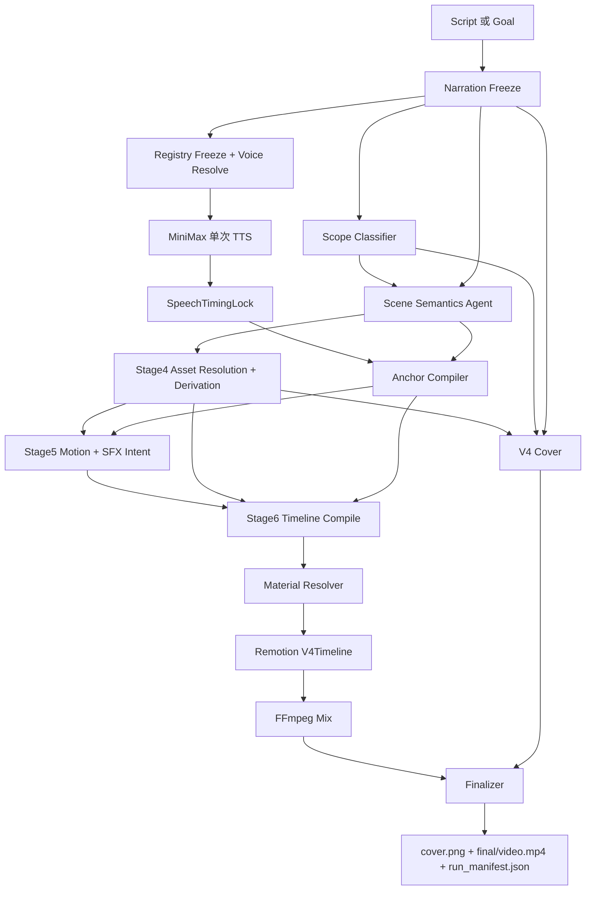

# Video Agent V4 Stage 7：生产主线切换、V3 删除与交付验收设计

状态：**设计初稿，待审查；禁止直接实施**

日期：2026-07-20
上游基线：Stage 0 Rev3、V4 架构 Rev3、Stage 1-6 已冻结设计与当前实现

## 1. 结论

Stage 6 已完成真实 MiniMax 语音、词级 Anchor、Remotion `V4Timeline` 和 FFmpeg 混音闭环。Stage 7 不再增加新的语义 Agent、素材体系或视觉效果，而是完成一次原子化生产切换：

1. 关闭 Stage 1 尚未完成的黄金语义一致性；
2. 移除 V4 对 `LegacyOrchestrator` 的依赖，直接生成 V4 文案与 `SpeechTimingLock`；
3. 将 Stage 1、4、Anchor、5、6 和封面交付编排成一个可恢复的 V4 DAG；
4. 将 `python main.py --script ...` 与 `python main.py --goal ...` 切到唯一 V4 生产入口；
5. 在同一切换边界删除 V3 Planner、V3 Timeline 和 `VerticalDemo` 生产路径；
6. 以 Stage 0 黄金场景、固定文案和 Goal 两种入口完成最终验收。

Stage 7 不建设 V3/V4 双写、运行时开关或兼容回退。需要回滚时只使用 Git checkpoint，不在产品中保留第二条视频系统。

## 2. 权威顺序

发生冲突时按以下顺序裁决：

1. 根目录 `AGENTS.md` 的 Timing 硬合同与素材边界；
2. `video_agent_v4_architecture_framework_rev3_20260717.md`；
3. `video_agent_v4_stage0_golden_scenario_rev3_20260718.md` 的黄金语义；
4. Stage 1-6 已冻结 Contract 与本设计的切换边界；
5. 当前 V3 行为只作为迁移输入，不是 V4 语义依据。

Stage 0 中关于 Pass B “尚未完成”的旧状态，以 `v4_implementation_progress.md` 和 Stage 6 Pass B ledger 为准：真实 MiniMax Pass B 已于 2026-07-20 闭合。

## 3. 当前实现事实

Stage 7 必须从真实代码现状出发：

| 区域 | 当前状态 | Stage 7 处理 |
|---|---|---|
| 公共生成入口 | `command_generate_video()` 调用 V3 `Orchestrator.run()` | 切到唯一 V4 Production Orchestrator |
| V4 Stage 1 | 通过 `LegacyOrchestrator` 生成 catalog、narration、V3 TimingLock，再投影为 V4 | 改为原生 V4 narration + speech frontend |
| V4 Stage 4 | 已使用 Stage 3 Repository、关系组和 Stage 5 派生执行器 | 保持语义，不旁路读取 legacy catalog |
| V4 Anchor | 已从 `SpeechTimingLock + SceneSemanticPlan` 生成不可变 `AnchoredTimingPlan` | 成为正式 DAG 节点，位于 Motion 前 |
| V4 Stage 5 | 已基于精确 scene span 分配 Motion/SFX | 保持；不得恢复比例时长 fallback |
| V4 Stage 6 | 已编译 `CompiledVideoTimeline`，渲染 `V4Timeline` 并混音 | 成为正式渲染出口 |
| Remotion | `VerticalDemo` 与 `V4Timeline` 并存 | 切换后删除 `VerticalDemo` 生产 composition |
| 封面 | 现有实现依赖 V3 运行产物 | 增加只读取 V4 冻结产物的适配层 |
| 固定片尾 | V3 后处理可能追加；V4 s010 已在语义时间线承接 | 只保留 s010 configured outro，不重复追加 |
| Resume | 各 Stage 有局部 manifest，尚无完整生产 DAG manifest | Stage 7 建立统一节点指纹与最终 manifest |

## 4. 范围

### 4.1 本阶段负责

- V4 原生固定文案与 Goal 文案入口；
- V4 原生 MiniMax 单次 TTS 和词级时间事实；
- Stage 1 黄金语义收口；
- 单一 V4 生产 DAG、节点指纹、Resume 和失败恢复；
- 公共 CLI 切换；
- 封面、固定片尾和最终交付目录收口；
- V3 业务执行路径和 Remotion 旧 composition 删除；
- README、架构说明和运维命令更新；
- Stage 0 黄金案例及两种入口验收。

### 4.2 本阶段不负责

- 新增场景类型、素材角色、关系组类型；
- 重做 Scope/Scene Agent 的职责划分；
- 新增动效、SFX、音色或 GPT Image 能力；
- AI 视觉审核或素材人工审核状态；
- 更换 SQLite、ObjectStore、Remotion 或 FFmpeg；
- 引入 Agent SDK、向量数据库或在线对象存储；
- 为历史 V3 Run 提供重新执行兼容层；
- 通过全局图片数、镜头时长或音效数限制代替具体能力约束。

## 5. 不可妥协的生产合同

### 5.1 Timing

每个语义 Cue 必须共享同一个词级 Anchor：

```text
FrozenNarration phrase
-> SpeechTimingLock token
-> AnchoredTimingPlan PhraseAnchor
-> visual hit / subtitle cue / emphasis / SFX peak
```

任何节点不得在 Anchor 生成后改写口播、短语、词序或时间事实。画面、字幕和 SFX 无法绑定时必须 fail-loud，不得用“看起来差不多”的时间兜底。

### 5.2 素材

- 生产选材只读取 Stage 3 Repository；
- 资产引用使用 `asset://Axxxx`、`group://Gxxxx` 和相对 `object_key`；
- 派生素材必须先注册、冻结血缘，再进入编译；
- 不读取 review/human_approved 字段；
- 不使用通用 IP 填充缺失场景；
- 网站截图重点只能来自持久化派生素材或效果元数据，不按旧坐标重画。

### 5.3 画布与渲染

- 固定 1080x1920、30 fps；
- 布局读取 `douyin_portrait_v1` 安全区；
- Effect 必须由 Registry 声明且有真实 V4 Adapter；
- Adapter 缺失时 fail-loud，不回退到 fade；
- 最终交付使用 Remotion 画面 + FFmpeg 音频混合。

## 6. 唯一生产入口

### 6.1 用户入口

只保留两种日常调用：

```powershell
python main.py --script .\文案.txt
python main.py --goal "柯幻熊猫文生图功能种草"
```

两种入口都自动：

1. 创建新 Case；
2. 创建新 Run；
3. 运行完整 V4 DAG；
4. 默认生成封面和固定片尾；
5. 返回最终视频、封面和 manifest 路径。

`generate_video` 可以作为内部 argparse handler 名称存在，但不作为 README 或用户工作流的一部分。

### 6.2 管理入口

以下不是第二条视频生产链，可保留：

- `v4-assets migrate/import/inspect/audit`；
- `inspect`；
- Case 视频导出和清理；
- 面向开发的 fixture/replay 命令。

`v4-stage1`、`v4-stage4`、`v4-stage5`、`v4-stage6` 不再作为生产入口。实施时二选一：

1. 删除 CLI 暴露，仅保留 Python Runner 和测试；或
2. 移入明确的 `dev` 命名空间。

禁止用户通过四个独立命令手工拼接生产 Run。

## 7. V4 Case 输入合同

Stage 7 不继续让 V3 `DurationPolicy`、`selected_asset_ids`、`ai_enabled` 等字段控制 V4。新增或替换为一个生产 Case Contract：

```json
{
  "schema_version": 4,
  "case_id": "video_20260720_120000_ab12",
  "input_mode": "script | goal",
  "goal": "柯幻熊猫文生图功能种草",
  "script_object_key": "input/source_script.txt",
  "platform_profile_id": "douyin_portrait_v1",
  "voice_profile_id": "configured_default",
  "sfx_profile_id": "normal",
  "random_seed": "auto-generated-and-frozen",
  "cover": {"enabled": true},
  "outro": {"enabled": true, "configured_asset_key": "default_outro"},
  "render": {"quality": "final", "postroll_frames": 0}
}
```

约束：

- `script` 模式必须复制原始 UTF-8 文本到 Case 输入目录并冻结哈希；
- `goal` 模式冻结原始 Goal 和最终生成文案，两者不能互相覆盖；
- 不配置正文目标时长；正文时长由最终口播决定；
- 默认 speed 来自 Voice Registry，不在 Case 中复制一套失真的音色参数；
- API Key 和本地 provider 配置不进入 Case 或 Run manifest；
- Case 与 Run 产物不得包含宿主机绝对路径。

## 8. 生产 DAG



### 8.1 节点顺序说明

Stage 5 Motion 需要精确 `AnchoredTimingPlan.scene_spans`，因此正式顺序是：

```text
Stage4 ResolvedAssetPlan
-> Anchor Compiler
-> Stage5 MotionAudioPlan
-> Stage6 Compile/Render
```

不得按旧阶段编号误写为“Stage4 -> Stage5 -> Stage6 Anchor”。Stage 编号表示实施里程碑，不表示生产串行顺序。

### 8.2 可并行部分

FrozenNarration 完成后，可以并行：

- Voice Resolve + MiniMax TTS；
- Scope Classifier。

封面 brief 可以在 `ResolvedAssetPlan + VideoScope + FrozenNarration` 完成后构造，但 `cover.png` 必须在 Finalizer 前成功落盘。除此以外，不为了并行而打破素材依赖或 Anchor 顺序。

## 9. 原生文案前端

### 9.1 Script 模式

```text
source_script.txt
-> 精确文本校验
-> FrozenNarration
```

规则：

- 不改字、不润色、不插入停顿标签；
- 允许归一化 UTF-8 BOM 和文件末尾空白，但冻结文本必须与用户可见正文一致；
- `source_fingerprint` 同时包含原文件哈希和冻结文本哈希；
- 不再生成 V3 Narration Beat 作为语义真相。

### 9.2 Goal 模式

```text
goal.txt
-> Goal Narration Generator
-> structured narration response
-> FrozenNarration
```

Goal Narration Generator 是条件 AI 能力，只负责得到最终口播文本。它不得选择素材、动效、SFX 或帧号。请求、响应、Prompt、模型配置和修正记录沿用 Stage 1 AI Runtime 五件套。

### 9.3 汇合点

两种模式从 `FrozenNarration` 起完全共用同一条链。后续模块不得通过 `input_mode` 选择不同 Planner、素材策略、Timing 或 Renderer。

## 10. V4 原生 Speech Frontend

当前 `_ensure_speech()` 先运行 V3 `stage_speech()` 再投影，这只是 Stage 6 前的桥接。Stage 7 必须改成：

```text
FrozenNarration
+ ResolvedVoiceProfile
-> MiniMax 一次完整 TTS 请求（subtitle_type=word）
-> audio/speech.wav
-> SpeechTimingLock
```

必须满足：

- 一份固定文案只调用一次完整 TTS；
- 直接解析 MiniMax word 时间戳，不创建 V3 `TimingLock`；
- `SpeechTimingLock` 不包含 phrase anchors；
- `voice_profile_id/version/content_sha256` 全部冻结；
- provider/base_url/model 配置进入输入指纹，API Key 不进入；
- token frame 使用 V4 统一 `timebase.py` 和 `ROUND_HALF_UP` 规则；
- 音频与 token 总时长不一致时 fail-loud；
- 默认不添加 PauseIntent；只有显式配置时才发送供应商支持的停顿标签。

可复用 MiniMax HTTP client、凭证加载和 word timestamp parser，但不得复用 V3 `TimingLock` Contract 或 Stage 编排。

## 11. Stage 1 黄金语义收口

Stage 1 当前只能标为“runtime complete / golden conformance partial”。切主线前必须关闭：

1. Stage 0 s001-s010 场景矩阵在真实 Scope/Scene Agent 下可稳定生成；
2. 参数流程为 `process`，成员角色为 base/stage/final；
3. 编辑流程为 `source_result -> editor_page -> edited_result`，modal 可选；
4. causal 场景不得用 `editor_page` 冒充 reference；
5. s005 独立查询文化墙结果，不复用 s002 Gallery 身份；
6. s006-s008 显式继承 s005 `primary_result`；
7. s010 必须使用 `outro + configured_asset(default_outro)`；
8. Agent 请求使用完整 Registry 投影，Run 落完整 `hub.freeze()` 快照；
9. `group_alias`、`pattern_id` 和成员角色符合 Stage 0/4 冻结语义；
10. 完整 FrozenNarration 被场景无重叠、无缺口地覆盖。

收口方式是 Prompt、示例、Contract Validator 和确定性修正，不允许为黄金案例写 case ID 或固定句子专用分支。

## 12. 统一 Production Orchestrator

新增单一 `V4ProductionOrchestrator`，只调用 V4 节点。它不继承、不包装 V3 `Orchestrator`。

### 12.1 节点定义

建议冻结以下节点 ID：

```text
narration
registry_voice
speech
scope
scene
assets
anchor
motion_audio
compile
render
cover
finalize
```

每个节点必须声明：

- 输入 artifact 及其 SHA256；
- Registry/Prompt/代码/provider 配置指纹；
- 输出 artifact 及其 SHA256；
- 依赖节点；
- started/completed/failed 状态和耗时；
- 可否 Resume；
- 失败错误码。

### 12.2 不允许的编排方式

- 不用目录中“文件存在”代替输入指纹校验；
- 不在 Stage 失败后自动调用 V3；
- 不在 Compile 阶段重新选择素材或动效；
- 不在 Render 后改字幕或 SFX 时间；
- 不让一个 Stage 覆盖另一个 Stage 的冻结 JSON；
- 不同时维护 `run_manifest.v3.json` 与 `run_manifest.v4.json`。

## 13. Resume 与失效传播

Resume 是 DAG 级别，不是线性 `--from-stage` 猜测。

### 13.1 命中条件

节点只有在以下条件全部满足时命中：

1. 节点状态为 completed；
2. 当前输入指纹与历史完全一致；
3. 输出文件存在且内容哈希一致；
4. 上游冻结快照可恢复；
5. 节点使用的 Prompt、代码、Registry 和 provider 配置指纹未变化。

### 13.2 失效规则

- FrozenNarration 改变：所有下游失效；
- Voice/Profile/模型改变：speech、anchor、motion_audio、compile、render、finalize 失效；
- Registry 改变：使用对应 Registry 的节点及其下游失效；
- Repository 查询结果或派生 handler 改变：assets 及其下游失效；
- Effect/SFX 配置改变：motion_audio 及其下游失效；
- Remotion/FFmpeg/平台配置改变：compile 或 render 及其下游失效；
- 仅 Cover Prompt 改变：cover 与 finalize 失效，不重跑正文。

节点失败后，只能从第一个无效节点继续。既有冻结产物不得原地修改；需要不同输入时创建新 Run。

## 14. 生产产物合同

新 Run 最少包含：

```text
frozen_narration.json
resolved_voice_profile.json
speech_timing_lock.json
video_scope.json
scene_semantic_plan.json
capability_registry.snapshot.json
resolved_asset_plan.json
asset_repository.snapshot.json
anchored_timing_plan.json
motion_audio_plan.json
compiled_video_timeline.json
stage6_validation.json
render/remotion.timeline.json
render/silent.mp4
render/final.mp4
cover/cover_brief.json
cover/cover.png
final/video.mp4
final/cover.png
run_manifest.json
agents/.../request.system.md
agents/.../request.input.json
agents/.../response.raw.json
agents/.../response.validated.json
agents/.../manifest.json
```

`render/final.mp4` 是渲染节点输出；Finalizer 校验后以原子复制或硬链接发布为 `final/video.mp4`。不得再用 V3 outro 后处理修改该文件。

### 14.1 统一 Run Manifest

```json
{
  "schema_version": "v4.run_manifest.1",
  "pipeline_version": "v4",
  "case_id": "video_...",
  "run_id": "20260720_...",
  "status": "completed",
  "input_mode": "script",
  "registry_snapshot_id": "registry-snapshot://...",
  "asset_snapshot_id": "asset-snapshot://...",
  "nodes": {
    "speech": {
      "status": "completed",
      "input_fingerprint": "sha256:...",
      "output_fingerprint": "sha256:...",
      "outputs": ["speech_timing_lock.json", "audio/speech.wav"]
    }
  },
  "deliverables": {
    "video": "final/video.mp4",
    "cover": "final/cover.png"
  }
}
```

规则：

- 所有路径相对于 Run 或 Case；
- manifest 只存内容指纹，不存 API Key；
- `latest_run.json` 只在 Finalizer 成功后标记 completed；
- 失败 Run 保留诊断产物，但不能覆盖上一条成功 Run；
- 一个新 V4 Run 不生成 V3 `visual_plan.json`、`video_project.json` 或旧 QA 产物。

## 15. 封面与片尾

### 15.1 封面

封面默认开启，输入必须是：

- 完整 `FrozenNarration`，不是首句；
- `VideoScope`；
- 主分类；
- `ResolvedAssetPlan` 中可代表视频主题的结果图候选；
- 固定 `assets/brand/kehuanxiongmao/logo/柯幻熊猫_LOGO.png`；
- `douyin_portrait_v1` 安全区。

封面禁止：

- 从客户案例结果图提取 Logo 作为网站品牌；
- 使用宿主机绝对路径；
- 使用尚未进入 ResolvedAssetPlan 的随机图片；
- 将封面插入正文第 0 帧。

建议冻结 `CoverBrief`：标题、辅助文案、代表素材 refs、品牌固定引用、模板/Prompt 指纹。封面引擎可以复用现有实现，但输入必须改为 V4 Contract。

封面启用时失败即整个 Production Run 失败；只有 Case 明确 `cover.enabled=false` 才能跳过。

### 15.2 固定片尾

固定片尾默认开启，但它已经是 s010 最后一条 CTA 的 configured asset：

```text
scene s010
-> asset_role=outro
-> configured_asset(default_outro)
-> 从 scene_start 显示到口播结束
```

禁止在 FFmpeg Finalizer 再追加同一片尾。仅显式 `postroll_frames > 0` 时允许保持无口播尾帧；这不是第二个片尾。

## 16. V3 删除边界

### 16.1 删除原则

删除必须依据 import graph 和产物依赖，而不是仅按目录名。每项归入三类：

| 类别 | 处理 |
|---|---|
| V3 业务语义 | 删除 |
| 可复用纯基础设施 | 提取到中立/V4 模块后删除 V3 调用方 |
| Provider/媒体/素材公共能力 | 保留并由 V4 直接调用 |

### 16.2 预期删除候选

最终 import audit 通过后，删除或清空生产引用：

- `video_agent/orchestrator.py` 的 V3 DAG；
- 旧 ActionScene/Visual Planner 与 asset selector 业务路径；
- V3 `VisualPlan`、`RenderPlan`、旧 `TimingLock.phrase_anchors` 生产 Contract；
- 旧 render-plan compiler 和 `video_agent/render/remotion.py`；
- Remotion `VerticalDemo` composition、旧 props 和只服务该 composition 的组件；
- `catalog -> narration -> speech -> scene -> prepare_assets -> visual -> compile -> render` 旧 stage 常量与 CLI；
- 只验证被删除行为的 V3 tests、fixtures 和旧文档；
- 确认无引用的 legacy bootstrap/config 双源。

候选不是机械删除清单。实施前必须运行 `rg`/import graph，先提取仍被 V4 使用的纯函数。

### 16.3 必须保留或迁移的能力

- MiniMax HTTP、凭证、本地音色配置和 word timestamps parser；
- GPT Image provider 与 Stage 5 Derivation executor；
- Stage 3 Repository、SQLite 和 ObjectStore；
- 现有 SFX WAV 与音频 probe/mix；
- 平台安全区配置；
- V4 可用的封面生成算法；
- Case 导出/清理和素材管理 CLI；
- 已冻结历史 Run 文件。

### 16.4 历史 Run

历史 V3 Run 保留为文件，不保证重新执行。`inspect` 可以按 manifest schema 读取基础信息，但不得因此保留 V3 Planner/Renderer。需要复现历史代码时使用 Git tag/commit。

## 17. 原子切换策略

Stage 7 开发可以分 Unit 提交，但正式切换必须在一个可回滚发布边界完成：

```text
切换前：公共 CLI -> V3
切换提交：公共 CLI -> V4，同时删除 V3 生产入口
切换后：不存在 runtime pipeline switch
```

禁止：

- 先让公共 CLI 写 V3/V4 两套产物；
- V4 失败后自动尝试 V3；
- 用环境变量长期保留 `PIPELINE_VERSION=v3|v4`；
- 为旧 Case Contract 建兼容转换层并永久保留。

发布前创建 Git checkpoint/tag。回滚使用 Git，不在运行时代码中保留兼容债。

## 18. 错误与日志

统一日志格式：

```text
HH:MM:SS | LEVEL | file.py:line | [V4][node_id] message
```

生产错误至少区分：

```text
narration_generation_failed
speech_provider_failed
speech_timing_invalid
scope_contract_failed
scene_contract_failed
golden_semantic_invariant_failed
asset_resolution_failed
derivation_failed
anchor_unresolved
motion_assignment_failed
adapter_coverage_missing
sfx_peak_tolerance_exceeded
render_failed
cover_failed
finalization_failed
resume_fingerprint_mismatch
```

失败信息必须包含 node、artifact、错误码和可操作原因，但不打印 API Key。禁止以 `LightSweep`、随机结果图或 V3 回退掩盖具体素材/关系/Anchor 错误。

## 19. 实施 Units 与 Git checkpoints

每个 Unit 独立检查 diff 并提交。

### Unit 0：冻结切换 Contract

- 冻结 V4 Case、Production DAG、Run Manifest 和 CoverBrief Contract；
- 修正 Stage 0 Pass B、Stage 6 和进度文档状态；
- 冻结 V3 删除审计表；
- 为 Stage 1 黄金语义补强建立 fixture/validator 入口。

提交建议：`docs(v4): freeze Stage7 production cutover contracts`

### Unit 1：原生 Narration 与 Speech

- 实现 script/goal -> FrozenNarration；
- 实现 MiniMax -> SpeechTimingLock 直连；
- 删除 V4 `LegacyOrchestrator` import；
- 固定 voice/provider/Prompt/code 指纹。

提交建议：`feat(v4): add native narration and speech frontend`

### Unit 2：Stage 1 黄金语义闭合

- 修 Prompt/示例/Validator；
- 关闭 s001-s010 关系、依赖、outro 和覆盖矩阵；
- 保证不是 case-specific 分支。

提交建议：`feat(v4): close Stage1 golden semantic conformance`

### Unit 3：统一 Production Orchestrator

- 实现节点 DAG、状态、指纹和 Resume；
- 接入 Stage 4、Anchor、Stage 5、Stage 6；
- 统一 `run_manifest.json`。

提交建议：`feat(v4): orchestrate the production DAG`

### Unit 4：封面与 Finalizer

- 用完整 FrozenNarration 构造 CoverBrief；
- 固定柯幻熊猫 Logo；
- 发布 `final/video.mp4` 与 `final/cover.png`；
- 禁止重复追加 outro。

提交建议：`feat(v4): finalize cover and production deliverables`

### Unit 5：公共 CLI 切换

- `--script` / `--goal` 调用 V4；
- README 只展示一条生产链；
- dev/admin 命令分离；
- 成功后更新 `latest_run.json`。

提交建议：`feat(v4): cut public generation over to V4`

### Unit 6：删除 V3

- 按冻结 import audit 删除 V3 Planner、Compiler、Renderer、CLI 和 Remotion composition；
- 提取共享 provider/media 代码；
- 删除死配置、fixtures、tests 和旧文档；
- `rg` 确认生产代码无 V3 fallback。

提交建议：`refactor: remove the V3 production pipeline`

### Unit 7：验收与文档收口

- 运行黄金案例、固定文案和 Goal；
- 更新 README/architecture/progress；
- 冻结验收 ledger；
- 确认干净工作区并创建切换 checkpoint/tag。

提交建议：`docs(v4): close production cutover acceptance`

## 20. 验收矩阵

### 20.1 结构验收

- [ ] `video_agent/v4/orchestrator.py` 不 import V3 `Orchestrator`；
- [ ] 公共 `--script` / `--goal` 只调用 V4 Production Orchestrator；
- [ ] 新 Run 不生成 V3 Planner/Render artifacts；
- [ ] `VerticalDemo` 不再注册为生产 composition；
- [ ] V4 production imports 中无 V3 `VisualPlan`、旧 `TimingLock` 或旧 effect 常量；
- [ ] Registry/Repository/Prompt/代码/provider 指纹进入统一 manifest；
- [ ] 新产物中没有宿主机绝对路径或密钥。

### 20.2 语义验收

- [ ] Stage 0 s001-s010 全部符合 Rev3 金标；
- [ ] s005 不复用 s002 Gallery 身份；
- [ ] s006-s008 继承同一 `primary_result`；
- [ ] 参数、编辑、causal 和 configured outro 关系正确；
- [ ] script 模式 FrozenNarration 与输入文案逐字一致；
- [ ] goal 模式只在文案冻结前分叉，之后走同一链路。

### 20.3 Timing 验收

- [ ] MiniMax 只进行一次完整 TTS；
- [ ] `SpeechTimingLock` 不含 phrase anchors；
- [ ] Gallery 每项在对应短语开始发音时首次出现；
- [ ] 单行字幕、高亮、画面和 SFX 共享 Anchor；
- [ ] SFX 实际峰值误差不超过 profile 容差；
- [ ] 完整时间线从 frame 0 覆盖到 `duration_frames`，无隐式补帧。

### 20.4 视觉与交付验收

- [ ] 1080x1920、30 fps；
- [ ] Remotion 使用 `V4Timeline`；
- [ ] 所有 effect 均有真实 Adapter；
- [ ] 固定片尾只出现一次并承接最后 CTA；
- [ ] Cover 使用完整文案、VideoScope、代表素材和官方柯幻熊猫 Logo；
- [ ] `final/video.mp4`、`final/cover.png`、`run_manifest.json` 同时存在；
- [ ] FFmpeg probe、音轨、帧数和最终编码符合配置。

### 20.5 入口与恢复验收

- [ ] `python main.py --script test.txt` 完整成功；
- [ ] `python main.py --goal "..."` 完整成功；
- [ ] 本地 `test.txt` 至 `test4.txt` 分别创建新 Case 并完成；
- [ ] 中断后 Resume 只重跑首个失效节点及其下游；
- [ ] Prompt/Registry/代码/素材/provider 配置改变可正确使相关节点失效；
- [ ] 失败 Run 不覆盖上一条成功 `latest_run.json`。

## 21. 最终 Definition of Done

Stage 7 只有在以下全部满足时完成：

1. 两种用户入口都走同一个 V4 Production DAG；
2. V4 不再引用 `LegacyOrchestrator`；
3. Stage 1 黄金语义一致性关闭；
4. 原生 MiniMax 直接产出 `SpeechTimingLock`；
5. Stage 4 -> Anchor -> Stage 5 -> Stage 6 顺序固定；
6. 封面默认生成且读取完整文案；
7. s010 固定片尾不被重复追加；
8. 统一 Run Manifest 和 Resume 指纹可恢复；
9. V3 业务执行路径和 `VerticalDemo` 已删除；
10. Stage 0、固定文案、Goal 和本地四份文本验收通过；
11. README 和架构文档只描述 V4 当前实现；
12. 所有实施 Unit 都有独立 Git checkpoint，最终工作区干净。

完成后，项目不再称为“V4 试验链”。V4 即唯一 Video Agent 生产主线。
